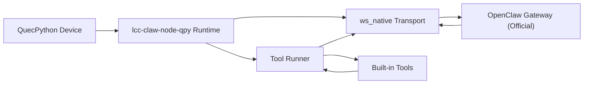
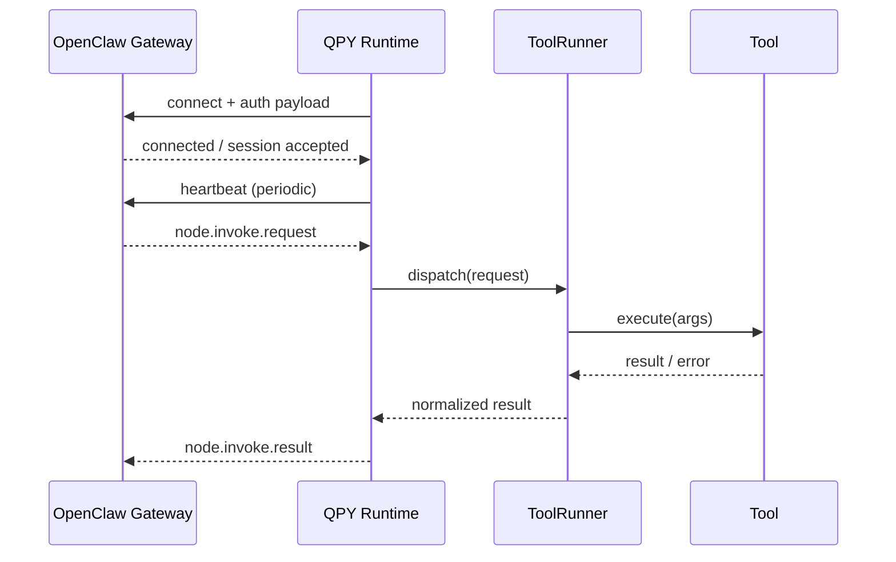
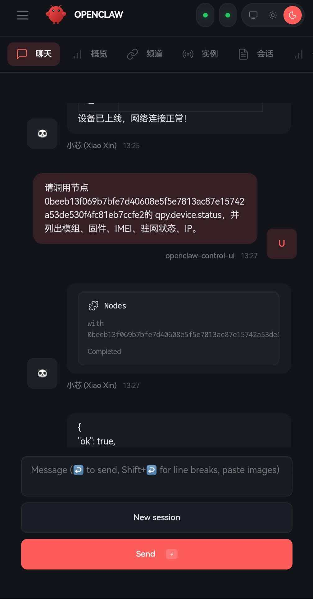
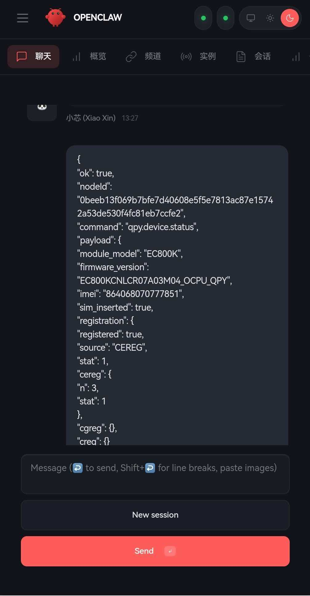
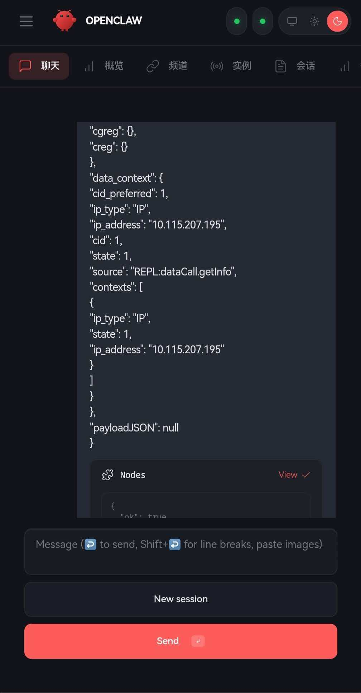
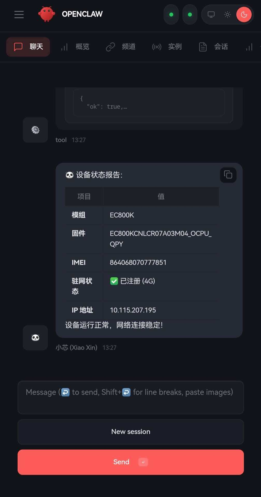

# lcc-claw-node-qpy

> QuecPython 设备连接 OpenClaw 的社区版运行时（零改官方 Gateway 基线）

**维护单位：芯寰云（上海）科技有限公司**

## 1. 项目定位

`lcc-claw-node-qpy` 是面向社区用户的 QuecPython 设备运行时，目标是让设备在不修改 OpenClaw Gateway 源码的前提下，完成稳定的控制面连接与命令执行闭环。

当前版本聚焦 `ws_native` 最小可用闭环：
1. 建链（WebSocket connect）
2. 保活（heartbeat）
3. 下发（invoke request）
4. 回执（invoke result）
5. 重连（reconnect）
6. 主动上报（heartbeat/telemetry/lifecycle/alert）
7. 只读工具目录（7 个内置工具）

已完成的真实联调结论：
1. 官方 OpenClaw Gateway 已验证可接入。
2. `remote_signer_http` 已验证可完成 challenge 回签。
3. 首次接入需要 Gateway pairing approval，批准后设备可稳定在线。
4. `qpy.runtime.status`、`qpy.tools.catalog` 已完成真实 `node.invoke` 往返。

## 2. 架构总览（图）



## 3. 执行链路（图）



## 4. 能力矩阵

| 能力域 | 设计目标 | 当前仓库状态 |
|---|---|---|
| 官方 OpenClaw 基线兼容 | 零改 Gateway 源码接入 | 已实现 `connect.challenge + connect + node/event` 主链路 |
| WebSocket 控制平面 | connect/auth/heartbeat/reconnect | 已实现文本帧握手、心跳、重连与 ACK 等待 |
| 双向命令闭环 | request -> tool -> result | 已实现 `node.invoke.request -> ToolRunner -> node.invoke.result` |
| 设备主动上报 | heartbeat/telemetry/alert/lifecycle | 已实现 heartbeat/telemetry/lifecycle，alert 可复用同一事件通道 |
| 首批只读工具 | 7 个只读诊断工具 | 已扩展到 `qpy.device.info/status/net.diag/sim.info/cell.info/runtime.status/tools.catalog` |
| 可选远程签名 | `remote_signer_http` | 已提供设备侧接入与 host 侧 signer helper |
| 本地仿真验证 | mock gateway smoke | 已有基础 smoke |
| 官方 Gateway 真实验证 | pairing + online + invoke | 已验证 `qpy.runtime.status` 与 `qpy.tools.catalog` |
| 脱敏与开源边界 | 白名单 + 关键词扫描 | 已具备 |
| 企业控制面增强 | 不纳入 OSS 首版 | 明确规划外 |

## 4.1 内置工具目录

| 工具 | 类别 | 作用 | 典型输出 |
|---|---|---|---|
| `qpy.device.info` | device | 读取设备基础身份、型号、固件与 SIM 概况 | `module_model/firmware_version/imei_masked` |
| `qpy.device.status` | device | 聚合设备、SIM、网络、PDP、运行时状态 | `registration/data_context/runtime` |
| `qpy.net.diag` | network | 输出网络注册、数据通道、小区与排障建议 | `registered/signal/advice` |
| `qpy.sim.info` | network | 读取 SIM 卡状态、IMSI、ICCID 等信息 | `status/imsi_masked/iccid_masked` |
| `qpy.cell.info` | network | 读取服务小区与邻区信息 | `serving_cell/neighbors` |
| `qpy.runtime.status` | runtime | 查看会话、重连、队列、错误与 signer 状态 | `online/reconnect_count/outbox_depth` |
| `qpy.tools.catalog` | runtime | 查看设备当前声明的全部工具和别名 | `tool_count/tools[]` |

## 4.2 主动事件目录

| 事件 | 触发时机 | 用途 |
|---|---|---|
| `heartbeat` | 在线期间按周期发送 | 在线证明、活性检测 |
| `telemetry` | 在线期间按周期发送 | 周期性设备状态快照 |
| `lifecycle` | 启动、上线、下线、异常恢复 | 生命周期审计与联调诊断 |
| `alert` | 业务或运行时异常阈值触发 | 主动告警，可接入上层告警中心 |

## 5. 使用环境说明

| 场景 | 说明 | 推荐 |
|---|---|---|
| 设备直连官方 OpenClaw | 社区默认路径 | 高 |
| 局域网联调（Mock Gateway） | 开发验证与回归 | 高 |
| 企业规模化控制平面 | 需内部架构增强 | 中（不在 OSS v1.0） |

第三方用户接入结论：
1. 如果用户自有 QuecPython 设备、自有官方 OpenClaw Gateway，且协议与鉴权条件满足，则本项目按设计可用于把设备接入到他们自己的 Gateway。
2. 如果目标 Gateway 强制设备身份签名，而设备本地无法完成签名，则仍坚持“零改 Gateway”，但需要外置 signer 等兼容补充能力。
3. 如果用户希望从 Gateway 调用 `qpy.*` 命令，需确认目标 Gateway 已为该平台补充 `gateway.nodes.allowCommands`。

## 6. 快速开始

### 6.1 接入步骤

1. 阅读 [docs/quickstart.md](docs/quickstart.md)。
2. 复制 [examples/config.ws_native.example.py](examples/config.ws_native.example.py) 并填写你的网关地址、token、`device_id`。
3. 保持默认 `OPENCLAW_CLIENT_ID="node-host"`，并不要额外添加浏览器 `Origin` 头。
4. 将 `usr_mirror/*` 部署到设备 `/usr`。
5. 首次接入如出现 `pairing required`，在 Gateway 侧批准 pending device pairing。
6. 如需从 Gateway 直接调用 `qpy.*`，先补充 `gateway.nodes.allowCommands`。
7. 运行 `/usr/_main.py` 并观察连接日志。
8. 使用 `tests/mock_gateway` 做本地闭环验证。

### 6.2 官方 Gateway 实测闭环

| 验证项 | 结果 | 说明 |
|---|---|---|
| 官方 Gateway challenge/connect | 通过 | 已完成 upstream 协议握手 |
| `remote_signer_http` | 通过 | challenge nonce 已完成真实签名 |
| 首次 pairing | 通过 | 批准 pending request 后设备成功上线 |
| 在线状态恢复 | 通过 | Gateway 重启后设备自动重连恢复 |
| `qpy.runtime.status` | 通过 | 已拿到结构化 `node.invoke.result` |
| `qpy.tools.catalog` | 通过 | 当前对外声明 7 个只读工具 |

运行时快照摘录：

| 指标 | 实测值 |
|---|---|
| `online` | `true` |
| `protocol` | `3` |
| `device_token_cached` | `true` |
| `connect_successes` | `3` |
| `reconnect_count` | `2` |

### 6.3 运行截图（示例）

> 以下为目标效果示例（来自集成联调环境）：命令下发 -> 原始结果 -> 状态卡片。
> 说明：截图只展示 `qpy.device.status` 的一个查询场景，不代表仓库能力上限。当前仓库已实现 7 个只读工具、`node.invoke.request/result` 闭环，以及 `heartbeat/telemetry/lifecycle/alert` 事件通道。









## 7. 仓库结构

```text
lcc-claw-node-qpy/
├── usr_mirror/
│   ├── _main.py
│   └── app/
│       ├── agent.py
│       ├── config.py
│       ├── transport_ws_openclaw.py
│       ├── tool_runner.py
│       └── tools/
├── examples/
├── docs/
│   ├── quickstart.md
│   ├── compatibility-matrix.md
│   ├── troubleshooting.md
│   ├── open-source-whitelist.md
│   ├── sanitization-rules.md
│   └── design/
├── tests/
├── tools/
│   └── remote_signer_http.mjs
└── .github/
```

## 8. 详细设计文档

| 文档 | 说明 |
|---|---|
| [docs/design/00-设计文档索引.md](docs/design/00-设计文档索引.md) | 设计文档总览与阅读顺序 |
| [docs/design/01-总体架构设计.md](docs/design/01-总体架构设计.md) | 分层架构、模块职责、部署模型 |
| [docs/design/02-连接鉴权与会话状态机.md](docs/design/02-连接鉴权与会话状态机.md) | 连接流程、鉴权模型、状态机 |
| [docs/design/03-工具执行与结果回传设计.md](docs/design/03-工具执行与结果回传设计.md) | 工具调度、错误模型、回执契约 |
| [docs/design/04-可靠性与安全设计.md](docs/design/04-可靠性与安全设计.md) | 重连策略、幂等、脱敏与风控 |
| [docs/design/05-Gateway双向通信详细设计.md](docs/design/05-Gateway双向通信详细设计.md) | 双向通信详细设计：下发、回执、主动事件、鉴权、幂等、告警 |
| [docs/design/06-OSS功能范围与第三方接入说明.md](docs/design/06-OSS功能范围与第三方接入说明.md) | 开源边界、第三方接入条件、零改 Gateway 语义 |

## 9. 安全与开源收口

发布前必须执行：
1. `python3 tools/sanitize_check.py --root .`
2. 对照 [docs/open-source-whitelist.md](docs/open-source-whitelist.md) 检查文件边界
3. 对照 [docs/sanitization-rules.md](docs/sanitization-rules.md) 检查日志与配置脱敏

## 10. 路线图

1. `v1.0`: `ws_native` 最小稳定闭环与只读诊断工具集（当前）。
2. `v1.1`: 真机回归矩阵、更多主动告警模板、远程签名部署脚本化。
3. `v1.2`: 更多设备型号验证与企业扩展边界说明。

## 11. 相关项目

1. [QuecPython Dev Skill](https://github.com/LiteChipCloud/quecpython-dev-skill)
2. [Windows SSH Control Skill](https://github.com/LiteChipCloud/windows-ssh-control-skill)

## 12. 许可证

本仓库采用 MIT License，详见 [LICENSE](LICENSE)。

## 13. 发布与验证资料

| 文档 | 说明 |
|---|---|
| [docs/github-release-kit.md](docs/github-release-kit.md) | GitHub `About`、Topics、首版标签与发布清单 |
| [docs/releases/v1.0.0-rc1.md](docs/releases/v1.0.0-rc1.md) | 首个公开候选版 Release Notes 草稿 |
| [docs/validation/72h-soak验证方案.md](docs/validation/72h-soak验证方案.md) | `72h soak` 稳定性验证方案与门禁 |
