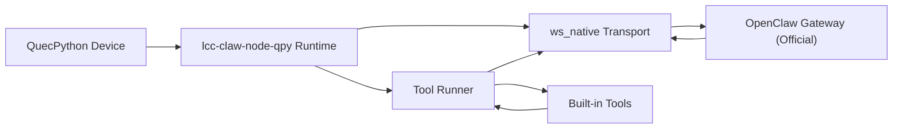
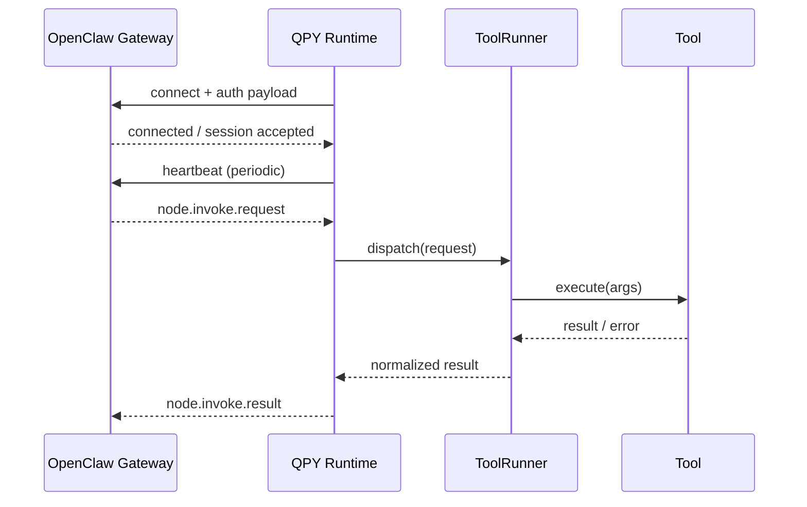

# lcc-claw-node-qpy

> QuecPython 设备连接 OpenClaw 的社区版运行时（零改官方 Gateway 基线）

**维护单位：芯寰云（上海）科技有限公司**

## 1. 项目定位

`lcc-claw-node-qpy` 是面向社区用户的 QuecPython 设备运行时，目标是让设备在不修改 OpenClaw Gateway 源码的前提下，完成稳定的控制面连接与命令执行闭环。

当前版本聚焦 `ws_native` 最小可用闭环：
1. 建链（WebSocket connect）
2. 保活（heartbeat）
3. 下发（invoke request）
4. 回执（invoke result）
5. 重连（reconnect）

## 2. 架构总览（图）



## 3. 执行链路（图）



## 4. 能力矩阵

| 能力域 | v1.0 状态 | 说明 |
|---|---|---|
| 官方 OpenClaw 基线兼容 | 已支持 | 不要求改造 Gateway 源码 |
| WebSocket 控制平面 | 已支持 | connect/heartbeat/reconnect |
| 工具调用闭环 | 已支持 | request -> tool -> result |
| 本地仿真验证 | 已支持 | mock gateway smoke |
| 脱敏与开源边界 | 已支持 | 白名单 + 关键词扫描 |
| 企业控制面增强 | 规划外 | 属于内部版路线 |

## 5. 使用环境说明

| 场景 | 说明 | 推荐 |
|---|---|---|
| 设备直连官方 OpenClaw | 社区默认路径 | 高 |
| 局域网联调（Mock Gateway） | 开发验证与回归 | 高 |
| 企业规模化控制平面 | 需内部架构增强 | 中（不在 OSS v1.0） |

## 6. 快速开始

1. 阅读 [docs/quickstart.md](docs/quickstart.md)。
2. 复制 [examples/config.ws_native.example.py](examples/config.ws_native.example.py) 并填写你的网关地址、token、device_id。
3. 将 `usr_mirror/*` 部署到设备 `/usr`。
4. 运行 `/usr/_main.py` 并观察连接日志。
5. 使用 `tests/mock_gateway` 做本地闭环验证。

## 7. 仓库结构

```text
lcc-claw-node-qpy/
├── usr_mirror/
│   ├── _main.py
│   └── app/
│       ├── agent.py
│       ├── config.py
│       ├── transport_ws_openclaw.py
│       ├── tool_runner.py
│       └── tools/
├── examples/
├── docs/
│   ├── quickstart.md
│   ├── compatibility-matrix.md
│   ├── troubleshooting.md
│   ├── open-source-whitelist.md
│   ├── sanitization-rules.md
│   └── design/
├── tests/
├── tools/
└── .github/
```

## 8. 详细设计文档

| 文档 | 说明 |
|---|---|
| [docs/design/00-设计文档索引.md](docs/design/00-设计文档索引.md) | 设计文档总览与阅读顺序 |
| [docs/design/01-总体架构设计.md](docs/design/01-总体架构设计.md) | 分层架构、模块职责、部署模型 |
| [docs/design/02-连接鉴权与会话状态机.md](docs/design/02-连接鉴权与会话状态机.md) | 连接流程、鉴权模型、状态机 |
| [docs/design/03-工具执行与结果回传设计.md](docs/design/03-工具执行与结果回传设计.md) | 工具调度、错误模型、回执契约 |
| [docs/design/04-可靠性与安全设计.md](docs/design/04-可靠性与安全设计.md) | 重连策略、幂等、脱敏与风控 |

## 9. 安全与开源收口

发布前必须执行：
1. `python3 tools/sanitize_check.py --root .`
2. 对照 [docs/open-source-whitelist.md](docs/open-source-whitelist.md) 检查文件边界
3. 对照 [docs/sanitization-rules.md](docs/sanitization-rules.md) 检查日志与配置脱敏

## 10. 路线图

1. `v1.0`: `ws_native` 最小稳定闭环（当前）。
2. `v1.1`: 工具能力扩展与错误模型细化。
3. `v1.2`: 增强回归矩阵与稳定性基线。

## 11. 相关项目

1. [QuecPython Dev Skill](https://github.com/LiteChipCloud/quecpython-dev-skill)
2. [Windows SSH Control Skill](https://github.com/LiteChipCloud/windows-ssh-control-skill)

## 12. 许可证

本仓库采用 MIT License，详见 [LICENSE](LICENSE)。
