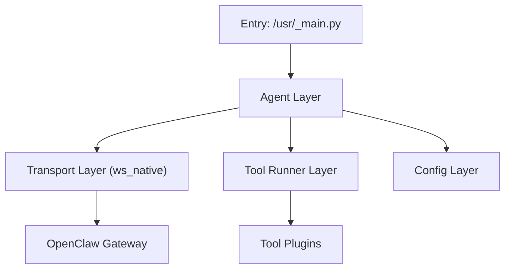

# 01 总体架构设计

## 1. 设计目标

1. 设备端可直接对接官方 OpenClaw Gateway。
2. 在资源受限的 QuecPython 环境下保持稳定连接与执行闭环。
3. 提供清晰的模块边界，便于社区二次扩展工具能力。

## 2. 分层架构

## 3. 模块职责

| 模块 | 文件 | 职责 |
|---|---|---|
| Entry | `usr_mirror/_main.py` | 初始化配置并启动主循环 |
| Agent | `usr_mirror/app/agent.py` | 协调连接、消息接收、工具调度 |
| Config | `usr_mirror/app/config.py` | 配置加载、默认值、参数校验 |
| Transport | `usr_mirror/app/transport_ws_openclaw.py` | 连接、重连、心跳、消息收发 |
| ToolRunner | `usr_mirror/app/tool_runner.py` | 请求解析、工具分发、结果规范化 |
| Tools | `usr_mirror/app/tools/*` | 业务工具实现 |

## 4. 关键设计决策

1. 单一主链路优先：v1.0 仅保留 `ws_native`。
2. 工具执行与传输解耦：Transport 不感知工具细节。
3. 错误统一归一：所有工具异常统一映射为可回传结构。
4. 配置显式化：配置项尽量通过示例文件展示，不隐式依赖私有环境。

## 5. 部署模型

部署原则：
1. 设备只承载运行时与必要配置。
2. 所有敏感参数以占位符示例给出，不直接入库真实值。

## 6. 可扩展点

1. 新增工具：在 `usr_mirror/app/tools/` 增加实现并注册。
2. 新增配置：在 `config.py` 定义并更新示例文件。
3. 新增协议形态：建议在 v1.x 之后独立评估，避免影响主闭环稳定性。
