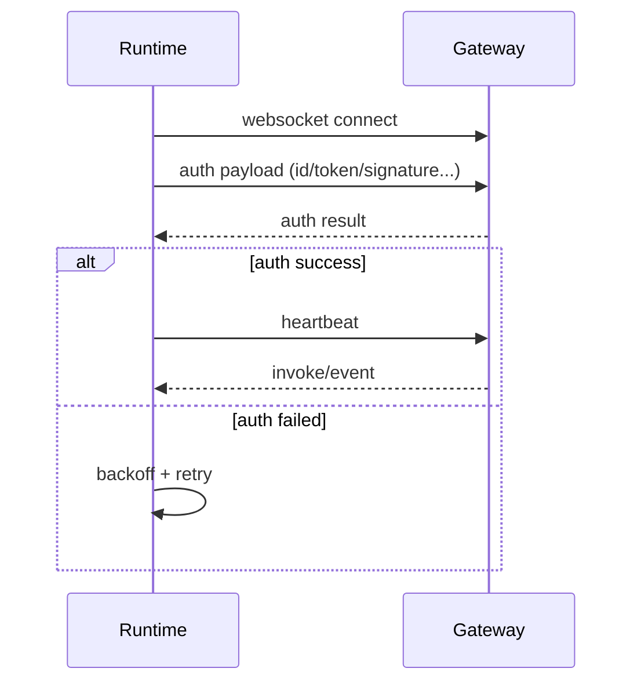
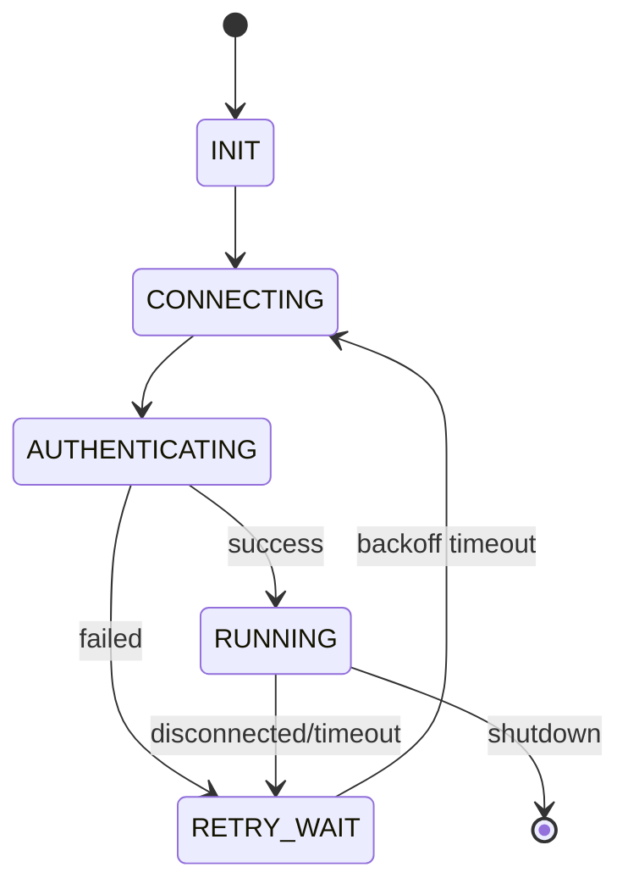

# 02 连接鉴权与会话状态机

## 1. 目标

定义设备与 OpenClaw Gateway 的连接、鉴权、保活和重连行为，保证在抖动网络下仍可恢复。

## 2. 连接与鉴权流程

## 3. 状态机

## 4. 关键时序参数

| 参数 | 说明 | 建议 |
|---|---|---|
| connect timeout | 建链超时 | 5-15s |
| heartbeat interval | 心跳间隔 | 20-60s |
| retry base | 首次重连等待 | 1-3s |
| retry max | 最大重连等待 | 30-120s |

## 5. 异常与恢复策略

1. 网络断开：进入 `RETRY_WAIT`，按退避重连。
2. 鉴权失败：记录错误码，延迟重试，避免高频击穿。
3. 心跳超时：主动断链并重连。
4. 长时间失败：输出可诊断日志，便于现场排障。

## 6. 设计边界

1. v1.0 不引入多路连接与多会话并发。
2. v1.0 不引入内部持久化队列，避免复杂度失控。
