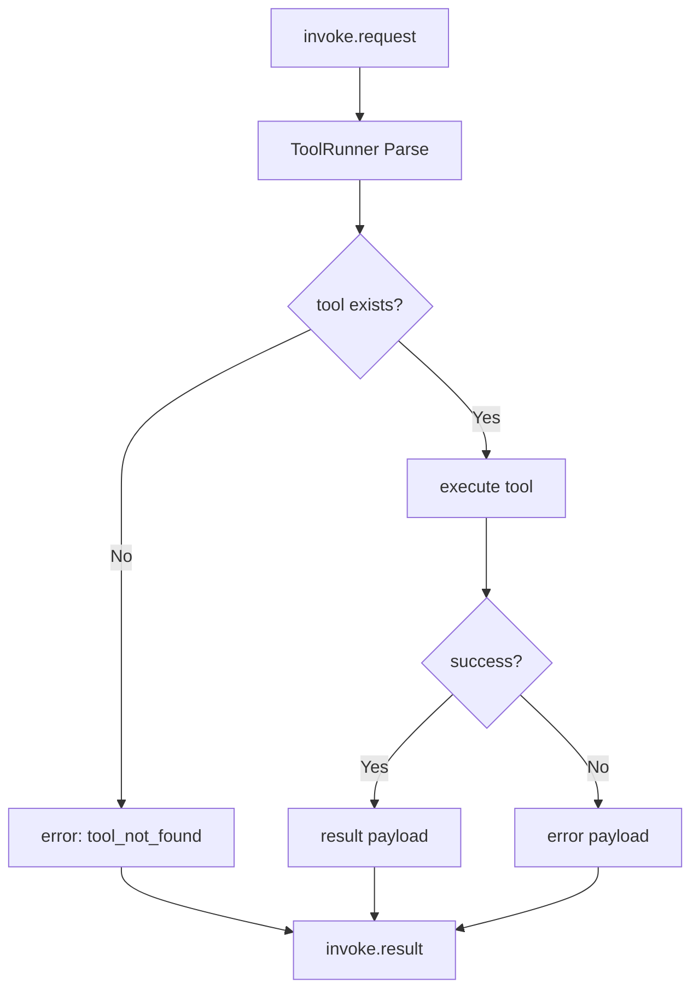

# 03 工具执行与结果回传设计

## 1. 设计目标

1. 把网关下发请求稳定映射到设备工具调用。
2. 对工具输出做统一结构化，方便上层消费。
3. 即使工具执行失败，也返回可诊断错误信息。

## 2. 执行流程

## 3. 回传结构建议

| 字段 | 类型 | 说明 |
|---|---|---|
| `request_id` | string | 对应请求 ID |
| `success` | bool | 执行是否成功 |
| `code` | string | 结果码（如 `ok` / `tool_error`） |
| `message` | string | 人类可读信息 |
| `data` | object | 业务结果（可选） |
| `elapsed_ms` | int | 执行耗时 |

## 4. 错误模型

| 类别 | code | 说明 |
|---|---|---|
| 请求格式错误 | `bad_request` | 参数缺失或类型错误 |
| 工具不存在 | `tool_not_found` | 未注册工具名 |
| 工具执行失败 | `tool_error` | 运行时异常 |
| 超时 | `timeout` | 超过工具执行预算 |

## 5. 幂等建议

1. 使用 `request_id` 做去重判断（如设备端缓存短窗口）。
2. 对具副作用工具，明确重复调用策略。
3. 在结果中返回 `request_id`，保证链路对账。

## 6. 可观测性建议

1. 记录请求进入、工具开始、工具结束三个关键点。
2. 错误日志保留 `request_id`、`tool`、`code`，避免打印敏感参数。
