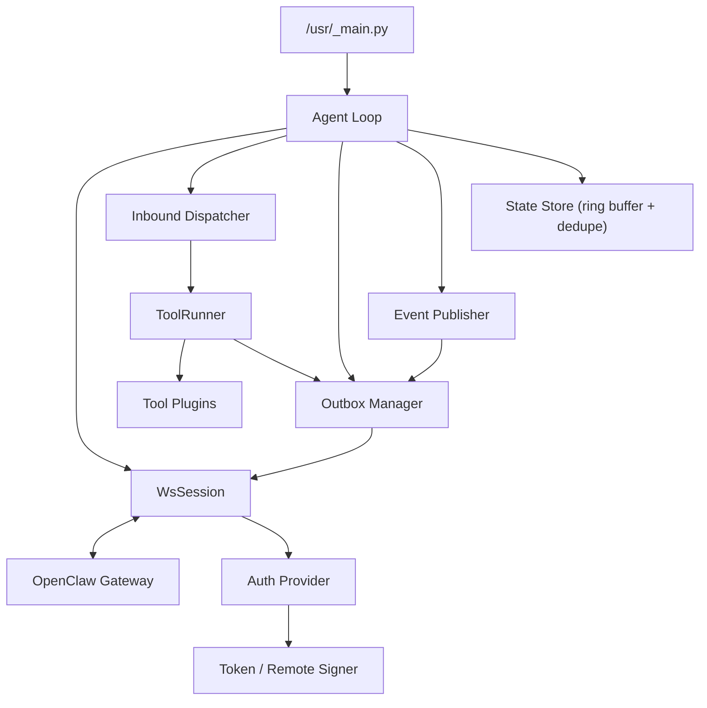
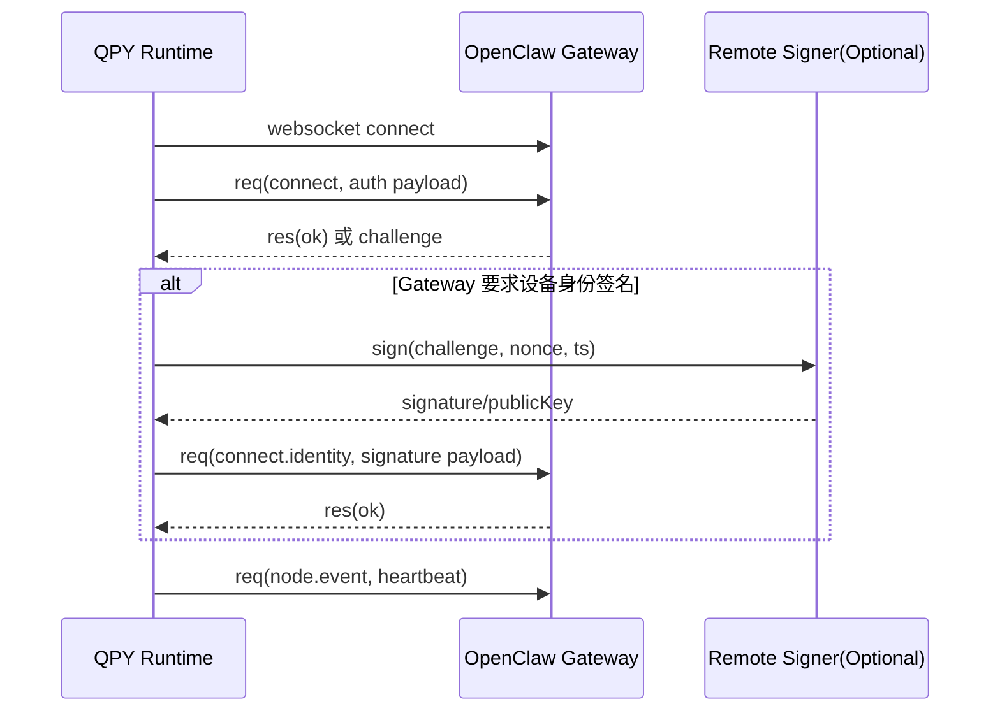
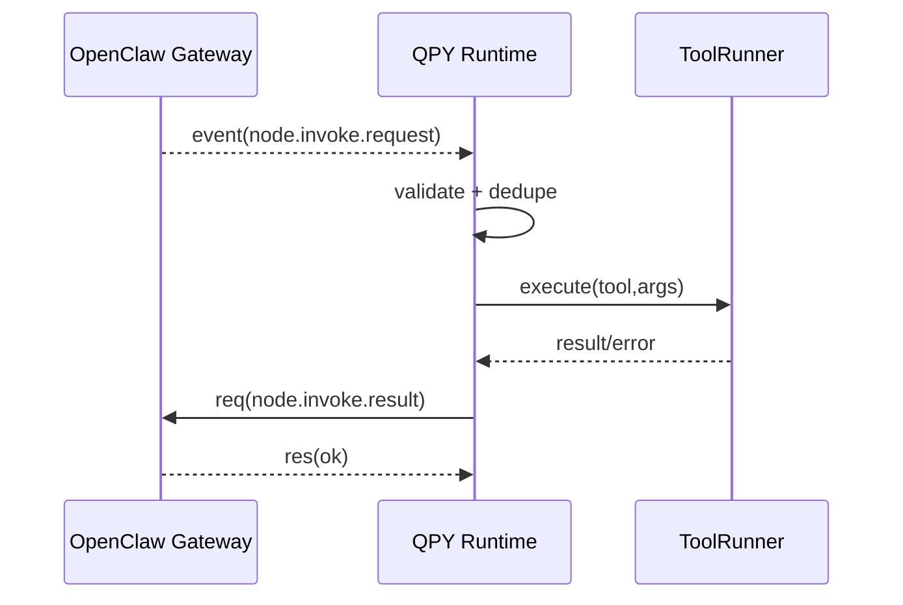
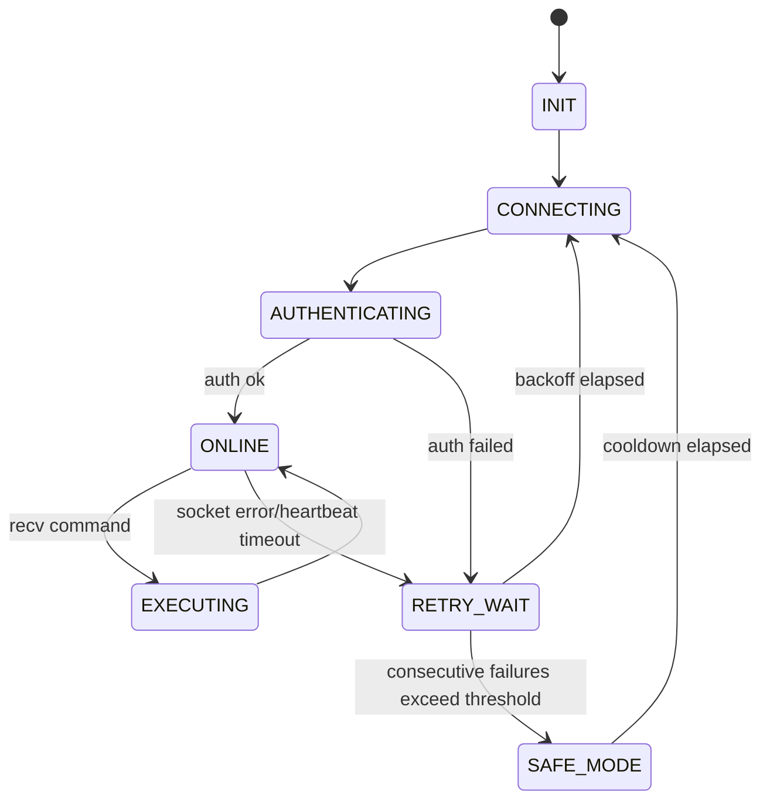

# 05 Gateway 双向通信详细设计

> 版本：`2026-03-12`  
> 适用范围：`lcc-claw-node-qpy OSS`  
> 设计目标：在不改造 OpenClaw Gateway 源码前提下，实现设备与 Gateway 的稳定双向通信。

## 0. 2026-03-12 真机联调结论

| 事项 | 结论 | 备注 |
|---|---|---|
| 官方 Gateway 握手 | 已打通 | 设备侧使用 `client.id=node-host` |
| 设备签名 | 已打通 | `remote_signer_http` 已完成真实 challenge 回签 |
| WebSocket `Origin` | 不能默认发送 | 否则会触发官方 Gateway 的 `origin not allowed` |
| 首次接入门禁 | 需要 pairing approval | 首次返回 `NOT_PAIRED` 属于上游正常行为 |
| 在线状态 | 已验证 | 真机拿到 `protocol=3`、`deviceToken`、`online=true` |
| `node.invoke` 回路 | 已验证 | `qpy.runtime.status`、`qpy.tools.catalog` 已拿到结果 |
| Gateway 白名单 | 需要补充 | `quectel/quecpython` 需配置 `gateway.nodes.allowCommands` 才能放行 `qpy.*` |

## 1. 目标与范围

本设计定义 `lcc-claw-node-qpy` 从 `rc0` 走向可用版时的双向通信能力边界：

1. 下行链路：Gateway -> 设备命令下发（`node.invoke.request`）。
2. 上行链路：设备 -> Gateway 执行回执（`node.invoke.result`）。
3. 上行链路：设备 -> Gateway 主动事件（`node.event`，含 heartbeat/telemetry/alert）。
4. 连接链路：断线重连、幂等防重、结果可追溯。

本文只覆盖设备侧设计与协议契约，不包含 Gateway 代码改造。

## 2. 非目标（当前阶段不做）

1. 不在 OSS 首版引入多通道并发（单连接优先）。
2. 不在设备侧引入重型持久化数据库（使用轻量 ring-buffer）。
3. 不在设备侧开放任意 Python 字符串执行。
4. 不将企业私有编排、审批系统耦合进 OSS 运行时。

## 3. `rc0` -> `v1.0` 收敛情况

| 维度 | `rc0` 现状 | `v1.0` 当前状态 |
|---|---|---|
| 连接 | 仅 TCP 可达性预检 | 已完成官方 Gateway challenge/connect 流程 |
| 下行接收 | `recv_cmd()` 返回 `None` | 已接收并处理 `node.invoke.request` |
| 上行回执 | `send_result()` 占位 | 已回传 `node.invoke.result` |
| 上行事件 | `send_event()` 占位 | 已支持 heartbeat/telemetry/lifecycle |
| 工具能力 | `tool_device_info/tool_net_diag` | 已扩展到 7 个只读工具 |
| 幂等与重放保护 | 未实现 | 已具备基础 outbox/result cache/去重窗口 |

## 4. 总体架构



架构原则：

1. 传输层与工具层解耦。
2. 所有上行消息统一走 `Outbox`，保证重连后可恢复发送。
3. 所有下行命令先过 `Dispatcher` 做契约校验与幂等判断，再进入工具执行。

## 5. 协议与消息契约

## 5.1 帧模型（与 OpenClaw 对齐）

1. Request：`{type:"req", id, method, params}`
2. Response：`{type:"res", id, ok, payload|error}`
3. Event：`{type:"event", event, payload}`

关键方法与事件：

1. 建链/鉴权：`connect`（按 Gateway 既有契约）。
2. 下发：`event=node.invoke.request`。
3. 回执：`req method=node.invoke.result`。
4. 主动上报：`req method=node.event`。

## 5.2 建链与鉴权时序



说明：

1. 若 Gateway 当前部署仅要求 token，可走 token 鉴权路径。
2. 若 Gateway 强制设备身份签名，设备侧采用外置 signer（`remote_signer`）路径，不改 Gateway 协议。
3. 官方 Gateway 对 node client 的 `client.id` 有枚举限制；QuecPython 设备侧应对齐为 `node-host`。
4. 设备侧默认不发送浏览器 `Origin` 头，否则官方 Gateway 会按 Control UI 安全策略做来源校验。

## 5.3 下行命令闭环时序



## 5.4 主动上行事件

事件类型定义（最小集）：

1. `heartbeat`：在线证明与基础健康。
2. `telemetry`：设备状态快照（可节流）。
3. `alert`：业务告警（如网络断开、注册异常、执行失败阈值触发）。
4. `lifecycle`：启动、重连、进入/退出安全模式。

建议 envelope：

```json
{
  "event_id": "evt_20260312_0001",
  "event_type": "alert",
  "severity": "warning",
  "device_id": "dev_xxx",
  "trace_id": "tr_xxx",
  "payload": {
    "code": "NET_RECONNECTING",
    "message": "network unstable"
  },
  "ts": 1773302400000,
  "idempotency_key": "evt_20260312_0001"
}
```

## 6. 命令与工具模型

## 6.1 下发命令标准化

设备内部统一 command 结构：

```json
{
  "cmd_id": "cmd_xxx",
  "tool": "qpy.device.status",
  "args": {},
  "deadline_ms": 10000,
  "trace_id": "tr_xxx"
}
```

## 6.2 首批工具集（OSS v1.0 冻结）

1. `qpy.device.info`
2. `qpy.device.status`
3. `qpy.net.diag`
4. `qpy.sim.info`
5. `qpy.cell.info`
6. `qpy.runtime.status`
7. `qpy.tools.catalog`

`qpy.device.status` 结果字段建议：

1. `module_model`
2. `firmware_version`
3. `imei`
4. `sim_inserted`
5. `registration`（`registered/source/stat/cereg/cgreg/creg`）
6. `data_context`（`ip_type/ip_address/cid/state`）

## 6.3 结果回执统一结构

```json
{
  "cmd_id": "cmd_xxx",
  "tool": "qpy.device.status",
  "status": "succeeded",
  "result_code": "OK",
  "data": {},
  "error": null,
  "duration_ms": 356
}
```

## 7. 可靠性设计

## 7.1 状态机



## 7.2 Outbox 与重发

1. `outbox`：缓存未确认的 `node.invoke.result` 与 `node.event`。
2. `inflight`：已发送待 `res` 的请求映射（`id -> payload/retry_count/sent_at`）。
3. `ack_timeout_ms` 超时后按指数退避重发，最大重试次数可配。
4. 重连成功后优先 flush `outbox`，保证断线期间关键告警不丢失。

## 7.3 幂等与防重

1. 下行去重键：`cmd_id + tool + nonce(optional)`。
2. 上行幂等键：`cmd_id`（回执）或 `event_id`（事件）。
3. 设备端维护有限窗口（例如最近 256 条）防重放。

## 8. 安全设计

## 8.1 鉴权模式

1. `token`：最小可用路径，便于 OSS 用户快速跑通。
2. `remote_signer`：当 Gateway 强制设备身份签名时启用。

## 8.2 远程签名安全约束

1. 签名请求必须绑定 `challenge + nonce + ts + device_id`。
2. 签名结果设置短时效（建议 <= 60 秒）。
3. signer 侧做设备白名单与调用频控。
4. signer 私钥仅驻留服务端 HSM/KMS 或等效安全介质，不下发到设备。

## 8.3 数据最小化与脱敏

1. 默认日志不打印完整 token/签名原文。
2. IMEI/ICCID 在日志层做掩码，业务 payload 按平台策略决定是否全量上送。
3. 开源仓库禁止提交真实设备标识与生产地址。

## 9. 配置项（新增/冻结建议）

| 配置项 | 默认值建议 | 说明 |
|---|---|---|
| `ACCESS_MODE` | `ws_native` | 当前聚焦模式 |
| `OPENCLAW_WS_URL` | `ws://127.0.0.1:18789` | Gateway 地址 |
| `OPENCLAW_CLIENT_ID` | `node-host` | 需满足官方 Gateway 的 node client id 枚举 |
| `OPENCLAW_CLIENT_MODE` | `node` | 与 node 角色对齐 |
| `OPENCLAW_CLIENT_PLATFORM` | `quectel` | 设备平台标识 |
| `OPENCLAW_CLIENT_DEVICE_FAMILY` | `quecpython` | 设备族标识 |
| `OPENCLAW_AUTH_TOKEN` | 占位符 | token 鉴权 |
| `OPENCLAW_DEVICE_AUTH_MODE` | `none` | `none/remote_signer_http` |
| `REMOTE_SIGNER_HTTP_URL` | 占位符 | HTTP signer 地址 |
| `REMOTE_SIGNER_HTTP_AUTH_TOKEN` | 占位符 | signer 访问令牌（可选） |
| `HEARTBEAT_INTERVAL_SEC` | `15` | 心跳周期 |
| `ACK_TIMEOUT_MS` | `5000` | 请求确认超时 |
| `OUTBOX_MAX` | `64` | 上行缓冲容量 |
| `DEDUPE_WINDOW` | `64` | 去重窗口 |
| `MAX_RETRY` | `3` | 单消息最大重试 |
| `SAFE_MODE` | `False` | 安全模式总开关 |

## 9.1 Gateway 侧补充约束

| 约束 | 处理方式 | 说明 |
|---|---|---|
| 首次接入 `NOT_PAIRED` | 审批 pending pairing | 上游安全门禁，不是设备异常 |
| `qpy.*` 命令被拒绝 | 配置 `gateway.nodes.allowCommands` | `quectel/quecpython` 默认落入 unknown 平台 allowlist |

## 10. 里程碑状态（2026-03-12）

| 里程碑 | 状态 | 说明 |
|---|---|---|
| `M1` WebSocket 帧编解码与 `connect`/heartbeat | 已完成 | 已完成官方 Gateway challenge/connect 与心跳闭环 |
| `M2` `node.invoke.request -> result` 闭环 | 已完成 | `qpy.runtime.status`、`qpy.tools.catalog` 已真机验证 |
| `M3` `node.event` 主动上报 | 已完成 | heartbeat/telemetry/lifecycle 已运行，alert 复用同一通道 |
| `M4` outbox/重发/去重/异常恢复 | 已完成 | 设备重连后可恢复发送，基础去重已落地 |
| `M5` `remote_signer_http` | 已完成 | challenge 回签已完成真实接入验证 |
| `M6` 长稳与发版门禁 | 进行中 | 仍需补充更长时间 soak 与发布自检证据 |

## 11. 验收标准（建议）

1. 命令成功率 >= 99.0%（短任务场景）。
2. P95 端到端命令时延 <= 3s（局域网基线）。
3. 断线恢复时间 <= 30s（常规网络抖动）。
4. 幂等正确率 = 100%（重复命令不重复执行）。
5. 高风险命令误放行 = 0。
6. 审计字段完整率 = 100%（`trace_id/cmd_id/tool/result_code/duration_ms`）。

## 12. 与现有系统关系

1. 本方案不影响现有 MQTT/TCP/UDP 设备链路。
2. 本方案不要求改造 OpenClaw Gateway 源码。
3. 若目标环境强制签名且当前设备无法本地 Ed25519，采用 `remote_signer` 或 host-side adapter，二者均保持 Gateway 协议兼容。

## 13. 后续收敛事项

1. `qpy.device.status` 是否继续保持默认脱敏，还是允许通过参数返回更完整标识。
2. `alert` 事件是否要求“必达”，若要求则需要更大的 outbox 与更强持久化。
3. `SAFE_MODE` 触发阈值是否按不同模组/网络环境分层配置。
4. 首版是否增加 `wss` 证书校验的更明确样例与门禁。
5. 是否把 `M6` 的 72h 长稳结果作为开源发版前的硬门槛。
