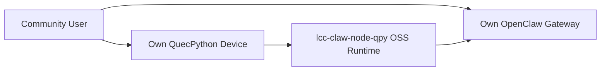

# 06 OSS 功能范围与第三方接入说明

> 文档定位：回答两个问题  
> 1. 这个开源版到底做什么。  
> 2. 其他拥有 QuecPython 设备的用户，能否把设备接到他们自己的 OpenClaw Gateway。

## 1. 设计基线

`lcc-claw-node-qpy OSS` 的首要约束已经冻结：

1. 以官方 OpenClaw Gateway 基线为目标，不要求用户改 Gateway 源码。
2. 以 QuecPython 设备直连 Gateway 为主路径，不把企业内部 `lcc-server` 作为前置依赖。
3. 以 `ws_native` 为首发主通道，不把 `mqtt_fleet`、adapter、告警中心作为 OSS 首版门槛。

换句话说，社区用户的接入方式应该是：

## 2. 开源版要实现的功能

OSS 版本面向“单设备或少量设备直连官方 Gateway”的场景，功能范围如下。

## 2.1 控制面连接能力

1. WebSocket 建链。
2. 鉴权接入。
3. 心跳保活。
4. 断线重连。
5. 会话恢复后的消息续发。

## 2.2 双向通信能力

1. 接收 Gateway 下发的 `node.invoke.request`。
2. 在设备侧执行工具命令。
3. 回传 `node.invoke.result`。
4. 主动上报 `node.event`。

## 2.3 主动上报能力

首版主动上报至少包含：

1. `heartbeat`：设备在线状态。
2. `telemetry`：基础状态快照。
3. `alert`：设备主动告警，例如：
   - 网络反复重连
   - SIM 未注册
   - 业务命令执行失败达到阈值
4. `lifecycle`：启动、掉线、恢复、安全模式切换。

## 2.4 首批工具能力

OSS 首版建议冻结为只读、安全、易复现的工具集：

1. `qpy.device.info`
2. `qpy.device.status`
3. `qpy.net.diag`
4. `qpy.sim.info`
5. `qpy.cell.info`
6. `qpy.runtime.status`
7. `qpy.tools.catalog`

说明：
1. 这些工具足以覆盖“看设备是否在线、看固件/IMEI/注册/IP、做基本联网诊断、看运行时状态、看设备当前声明的工具集”。
2. 首版不引入高风险写操作工具，避免社区用户直接拿去做不可控远程变更。

## 2.5 开发与排障能力

1. 提供示例配置。
2. 提供 mock gateway 验证脚本。
3. 提供常见错误排障文档。
4. 提供脱敏检查与开源发布门禁。

## 3. 明确不在 OSS 首版中的能力

以下能力不是 `lcc-claw-node-qpy OSS v1.0` 的交付范围：

1. 海量设备接入治理。
2. 企业级 MQTT fleet 编排。
3. 企业告警中心、审批中心、审计中心。
4. 公司内部 `lcc-server` 微服务能力。
5. 任意 Python 代码远程执行。
6. 依赖专有 adapter 才能跑通的链路。

这部分能力属于企业版路线，不应作为社区用户接入官方 Gateway 的前置条件。

## 4. 第三方用户是否能接入自己的 Gateway

结论：可以，但有前提条件。

适用对象：

1. 用户自己有可联网的 QuecPython 设备。
2. 用户自己部署的是官方 OpenClaw Gateway，或者至少保持官方协议兼容。
3. 用户能够提供设备可访问的 `ws/wss` 地址与鉴权信息。

在这些前提下，社区用户使用该项目后，理论上可以把自己的 QuecPython 设备接到自己的 Gateway。

## 5. 第三方接入成立的前提

## 5.1 必要条件

1. 设备支持 QuecPython，并能把运行时文件部署到 `/usr`。
2. 设备具备网络能力，能够访问目标 Gateway。
3. Gateway 使用官方 WebSocket 控制平面契约。
4. 用户具备合法的鉴权信息。

## 5.2 推荐条件

1. Gateway 版本尽量使用官方稳定版。
2. 优先使用局域网环境完成首轮联调。
3. 首轮仅启用只读工具。

## 5.3 不保证直接成立的场景

以下场景不能承诺“拿来即连”：

1. 用户的 Gateway 改过协议或改过鉴权流程。
2. 用户的 Gateway 强制设备侧完成 Ed25519 身份签名，而设备自身做不到。
3. 用户设备型号、固件、网络栈与已验证矩阵差异过大。
4. 用户希望直接从 Gateway 调用自定义 `qpy.*` 命令，但 Gateway 没有为该平台补充 `gateway.nodes.allowCommands`。

## 6. 对“强制签名 Gateway”的处理原则

这是第三方接入里最关键的边界。

如果第三方用户的 Gateway：

1. 只要求 token 或兼容的轻量鉴权。  
结论：OSS 直连路径成立。

2. 强制设备身份签名，而 QuecPython 设备本地又无法完成 Ed25519。  
结论：仍然坚持“Gateway 不改动”，但需要可选的外置 signer 能力；这不是改 Gateway，而是给设备补齐签名能力。

因此，“零改 Gateway”不等于“设备什么都不用补”。  
它的准确含义是：

1. 不要求社区用户修改 Gateway 源码。
2. 允许通过设备侧或设备外侧的兼容扩展，满足 Gateway 既有安全要求。

## 7. 社区用户能得到什么实际效果

如果第三方用户的环境满足前述条件，这个项目最终应让他们得到以下效果：

1. 设备在自己的 OpenClaw 中显示在线。
2. 用户可以从 Gateway 对设备发起状态查询。
3. 设备返回结构化结果。
4. Gateway/上层界面可将结果渲染为状态卡片或原始 JSON。
5. 设备可主动上报告警与生命周期事件。

## 7.1 官方 Gateway 约束说明

第三方用户需要额外理解 4 个上游约束：

1. 设备首次接入官方 Gateway 时，可能先返回 `pairing required`，需要在 Gateway 侧批准一次。
2. 设备侧 node client 需要使用官方接受的 `client.id`，当前默认对齐为 `node-host`。
3. 设备侧不应默认发送浏览器 `Origin` 头，否则会触发官方 Gateway 的来源校验。
4. `quectel/quecpython` 这类未进入默认平台映射的设备，若要从 Gateway 调用 `qpy.*`，需在 `gateway.nodes.allowCommands` 中显式放行。

这也是当前截图所体现的目标效果。

## 8. 对第三方用户的价值

对拥有 QuecPython 设备的其他用户，这个项目的价值不是“绑定你们公司平台”，而是：

1. 给他们一个面向官方 OpenClaw 的设备侧运行时。
2. 帮他们减少自己适配 Gateway 协议的工作量。
3. 让他们在自己的环境里复用同一套设备控制模型。
4. 保持和官方 Gateway 生态兼容，而不是引导他们走私有闭环。

## 9. 发布时应向社区讲清楚的兼容边界

对外文档必须明确写清楚：

1. 本项目目标是“OpenClaw Upstream Compatible”。
2. 默认不要求改造 Gateway 源码。
3. 是否可直接接入，取决于目标 Gateway 的鉴权要求与用户设备能力。
4. 对“强制签名”的 Gateway，需启用可选 signer 方案，而不是要求用户改 Gateway。
5. 企业级 MQTT fleet、海量设备治理不在 OSS 首版承诺内。

## 10. 设计结论

本次设计结论可以收敛为一句话：

`lcc-claw-node-qpy OSS` 不是公司私有平台插件，而是一个面向官方 OpenClaw Gateway 的 QuecPython 设备运行时。

对其他拥有 QuecPython 设备的用户来说，只要他们的 Gateway 保持官方协议兼容、网络可达、鉴权条件满足，他们就可以使用该项目把设备接入到自己的 Gateway；如果他们的 Gateway 启用了更强的设备身份签名要求，则需要在设备侧补上兼容的 signer 能力，但仍然不需要修改 Gateway 源码。
