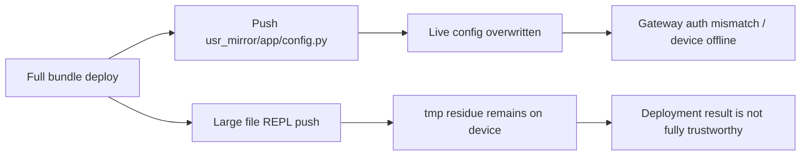
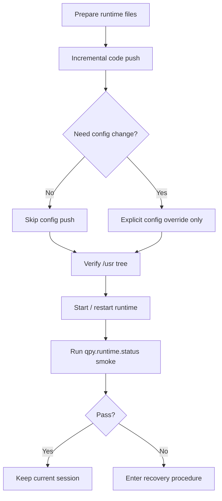

# 07 Windows 部署与现场运维设计

> 版本：`2026-03-13`  
> 适用范围：`lcc-claw-node-qpy OSS` 的 Windows 主机联调、现场部署与恢复  
> 设计目标：把“能部署”收敛成“能安全部署、能重复部署、能恢复部署”

## 1. 背景

`lcc-claw-node-qpy` 的设备运行时已经完成官方 OpenClaw Gateway 的直连闭环，但 `2026-03-13` 的真机验证同时暴露了一个新的交付面问题：

1. Windows staging bundle 的 `deploy_to_device.ps1` 曾经会把占位 `config.py` 直接覆盖到设备 `/usr/app/config.py`。
2. 加入配置保护后，live config 被误覆盖的问题已经收口。
3. 但“整包 REPL 下发”对大文件仍不稳定，验证现场会遗留 `.tmp` 文件。

因此，本设计不再把“部署”视为单一步骤，而是拆成多个职责清晰的运维动作。

## 2. 设计目标

1. 默认保护设备 live config，不允许再因示例文件覆盖导致设备掉线。
2. 把“代码下发”“配置变更”“运行时启动”“恢复处置”拆分成独立动作。
3. 为开源用户提供可复用的部署原则，不依赖公司内部私有平台。
4. 明确当前适合的部署方式和当前不适合的部署方式。

## 3. 现场问题抽象

问题本质不是“Windows 不能部署”，而是当前单脚本同时承担了过多职责：

1. 目录准备
2. 代码下发
3. 配置下发
4. 运行时启动
5. 失败恢复

一旦这 5 类动作耦合在一起，就会出现“某一步失败，整体状态不透明”的问题。

## 4. 推荐部署模型

## 5. 部署动作分层

| 动作 | 目标 | 默认策略 | 适用场景 |
|---|---|---|---|
| 冷启动全量部署 | 首次把运行时放到设备 `/usr` | 允许，但仅限首次安装或大版本切换 | 新设备、空白设备、灾后重装 |
| 增量代码部署 | 仅更新变更过的 `.py` 文件 | 推荐默认路径 | 日常联调、故障修复、频繁迭代 |
| 配置覆盖部署 | 明确推送一份运行时配置 | 仅允许显式 override | 切换 Gateway、切换 signer、切换 device_id |
| 启动/重启运行时 | 执行 `/usr/_main.py` 或软重启 | 必须独立成单步 | 所有场景 |
| 恢复处置 | 面向 `.tmp`、在线状态异常、误配置 | 只做显式恢复，不做隐式清理 | 部署失败后 |

## 6. 强制规则

## 6.1 配置文件规则

1. `usr_mirror/app/config.py` 在开源仓库中默认视为示例文件，不应自动覆盖设备 live config。
2. 只有用户显式提供 override 文件时，部署流程才允许写入 `/usr/app/config.py`。
3. 如果部署脚本检测到占位值，应默认跳过配置推送并给出警告。

## 6.2 代码部署规则

1. 高频开发场景优先使用“增量代码下发”，不要反复执行整包覆盖。
2. 大文件下发失败时，不能默认判定“设备已更新成功”。
3. 任何整包下发动作都必须带后置验证，例如：
   - `/usr` 目录核对
   - `qpy.runtime.status`
   - `qpy.tools.catalog`

## 6.3 运行时启动规则

1. 运行时启动必须是独立步骤，不能与配置写入、代码下发隐式耦合。
2. 启动后至少执行一次轻量 smoke，例如 `qpy.runtime.status`。
3. 如果目标环境是公网 Gateway，建议追加 `node.list` 或等价在线验证。

## 6.4 恢复规则

1. 发现 `.tmp` 文件时，不自动删除 live 文件，也不自动覆盖整包。
2. 先记录残留文件名、大小和时间点，再决定是否单文件重推。
3. 恢复优先级是：
   - 保住 live config
   - 恢复在线状态
   - 确认命令闭环
   - 最后再处理残留 `.tmp`

## 7. 推荐操作模式

| 模式 | 推荐级别 | 描述 | 风险 |
|---|---|---|---|
| 模式 A：首次安装全量部署 | 中 | 下发 `_main.py + app/* + tools/*` | 大文件传输失败时状态不透明 |
| 模式 B：增量代码部署 | 高 | 只推送改过的运行时代码文件 | 需要维护变更文件清单 |
| 模式 C：显式配置覆盖 | 高 | 指定一份真实配置覆盖 `/usr/app/config.py` | 若误用错误配置会立即影响在线状态 |
| 模式 D：仅启动/重启 | 高 | 不改文件，只重启运行时 | 无法修复文件层问题 |
| 模式 E：失败后整包重试 | 低 | 把整包 REPL 下发当通用恢复手段 | 容易再次触发 `.tmp` 或误覆盖问题 |

当前建议：

1. 对开源用户，文档默认推荐 `模式 B + 模式 C + 模式 D` 组合。
2. `模式 A` 只作为首次安装文档保留。
3. `模式 E` 不应再作为日常联调默认路径。

## 8. 验证门禁

| 验证项 | 通过标准 | 说明 |
|---|---|---|
| live config 保护 | 部署前后 `/usr/app/config.py` 未被示例文件覆盖 | 当前已实机通过 |
| 运行时在线 | `qpy.runtime.status` 成功返回 | 当前已实机通过 |
| 工具目录可读 | `qpy.tools.catalog` 成功返回 | 当前已实机通过 |
| 大文件整包下发稳定性 | 不遗留 `.tmp` 且文件校验一致 | 当前未通过 |
| 恢复流程可重复 | 失败后按单文件修复可恢复在线 | 需下一轮补充 |

## 8.1 已落地工具

| 交付物 | 位置 | 作用 |
|---|---|---|
| manifest 增量部署器 | `host_tools/qpy_incremental_deploy.py` | 按 `runtime_manifest.json` 做目录准备、增量推送、配置保护、目录校验和 `.tmp` 检查 |
| 运行时文件清单 | `host_tools/runtime_manifest.json` | 显式定义 `_main.py`、`app/*`、`app/tools/*` 的推送目标 |
| 设备文件系统 CLI | `host_tools/qpy_device_fs_cli.py` | 基础 `/usr` 目录操作、文件推送与脚本执行 |
| Windows 部署入口 | `scripts/deploy_to_device.ps1` | PowerShell 包装层，支持 `QPY_FILES`、`QPY_PUSH_CONFIG`、`QPY_CONFIG_FILE` |
| 独立启动入口 | `scripts/start_runtime.ps1` | 把运行时启动从部署步骤中拆出来 |
| 独立快照入口 | `scripts/debug_snapshot.ps1` | 部署后快速确认运行时在线与状态 |

## 9. 对开源用户的文档承诺

开源仓库应把以下信息说清楚：

1. 仓库提供的是设备运行时，不承诺“任意 Windows 一键整包部署器”已经完全稳定。
2. 示例配置默认只用于参考，不代表应该被直接覆盖到现场设备。
3. 对官方 OpenClaw Gateway 的兼容目标不变，但现场部署流程必须显式区分“代码”和“配置”。
4. 高频联调请走增量部署；首次安装或灾后恢复才走整包安装。

## 10. 下一步实施建议

| 步骤 | 动作 | 预期结果 |
|---|---|---|
| 1 | 维持 `config.py` 占位检测与默认跳过 | 不再误覆盖 live config |
| 2 | 为代码部署建立增量清单 | 日常发布不再依赖整包推送 |
| 3 | 为配置更新建立独立参数入口 | 配置变更可审计、可复现 |
| 4 | 为运行时启动建立独立步骤 | 部署失败时更容易定位 |
| 5 | 为 `.tmp` 残留建立检查与修复流程 | 提高现场恢复效率 |

## 11. 设计结论

`lcc-claw-node-qpy` 当前已经具备“安全保护 live config”的基础，但还不具备“把整包 REPL 下发作为稳定部署主路径”的条件。

因此，Windows/Host 侧的正式策略应收敛为：

1. 首次安装允许全量部署。
2. 日常联调默认增量代码下发。
3. 配置文件必须显式 override。
4. 启动与验证独立执行。
5. `.tmp` 残留按恢复流程处理，而不是继续放任整包脚本承担全部职责。
