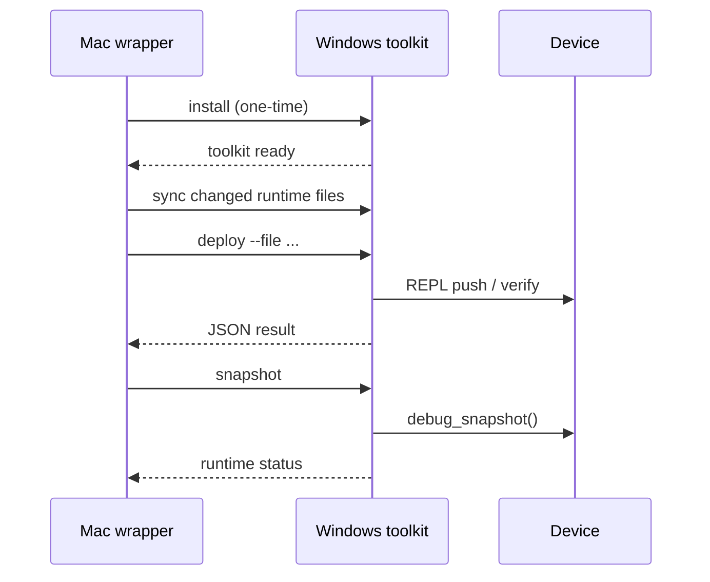

# 08 Windows 常驻 Toolkit 与 SSH 执行模型

> 版本：`2026-03-14`  
> 适用范围：`Mac -> Windows -> QuecPython device` 联调链路  
> 目标：减少重复同步 host tools 的成本，把高频动作收敛成固定入口

## 1. 背景

在当前联调模式下，QuecPython 设备物理连接在 Windows 串口侧，因此：

1. 真正触达设备 REPL / `/usr` 文件系统的动作必须在 Windows 上执行。
2. `quecpython-dev skill` 提供的是工作流和脚本规范，不是常驻在 Windows 上的 agent。
3. 如果每次都把 `host_tools/*.py` 临时复制到 Windows 用户目录，再执行一次性命令，虽然能工作，但会有三个问题：
   - 调试动作显得零散
   - 每轮都会重复同步相同工具
   - 协作上下文里频繁出现“传文件”步骤

因此，本设计把“Windows 侧执行能力”收敛为常驻 toolkit。

## 2. 目标

1. 把 `host_tools` 固化到 Windows 固定目录，而不是每轮同步到临时位置。
2. 把高频动作收敛成固定入口：`install / deploy / start / snapshot / cleanup-tmp / fs`。
3. 把“工具安装”和“运行时代码同步”区分开，避免每轮都重复传相同文件。
4. 保留现有 `winctl.sh` 与 SSH 免密基线，不引入新的远控协议。

## 3. 执行架构

## 4. 职责分层

| 层级 | 组件 | 职责 | 是否常驻 |
|---|---|---|---|
| 工作流层 | `quecpython-dev skill` | 规定 deploy/debug/REPL 的正确做法 | 否 |
| Mac 入口层 | `scripts/windows_qpyctl.sh` | 统一本地调用、必要时只同步变更文件 | 是（仓库内） |
| Windows 执行层 | `scripts/windows_qpyctl.ps1` + `host_tools/*` | 真正调用串口、推送 `/usr`、抓取快照 | 是（Windows 固定目录） |
| 设备侧 | `usr_mirror/*` | 运行时业务代码 | 否（按需同步） |

## 5. 目录模型

推荐固定目录如下：

| 目录 | 默认值 | 作用 |
|---|---|---|
| Windows toolkit 目录 | `D:/litechiptech/embedded/tools/lcc-qpy-host-tools` | 常驻 `qpy_incremental_deploy.py`、`qpy_device_fs_cli.py` 等 host tools |
| Windows runtime staging 目录 | `D:/litechiptech/embedded/staging/lcc-claw-node-qpy/usr_mirror` | 临时保存本次需要下发到设备的运行时代码 |
| 设备运行时目录 | `/usr` | 设备实际执行目录 |

## 6. 核心流程

## 7. 命令模型

| 命令 | 作用 | 是否同步文件 |
|---|---|---|
| `./scripts/windows_qpyctl.sh install` | 一次性安装或升级 Windows 常驻 toolkit | 会同步 toolkit；默认可顺带同步当前 runtime |
| `./scripts/windows_qpyctl.sh sync-runtime --file ...` | 只同步变更的运行时代码到 Windows staging | 只同步指定 runtime 文件 |
| `./scripts/windows_qpyctl.sh deploy --file ...` | 同步指定 runtime 后，调用 Windows 侧增量部署器 | 只同步指定 runtime 文件 |
| `./scripts/windows_qpyctl.sh start` | 只启动设备运行时 | 不同步 |
| `./scripts/windows_qpyctl.sh snapshot` | 读取设备 `debug_snapshot()` | 不同步 |
| `./scripts/windows_qpyctl.sh cleanup-tmp --json` | 扫描历史 `.tmp` / `.upload_*.tmp` 残留，默认只出报告 | 不同步 |
| `./scripts/windows_qpyctl.sh fs ...` | 直接透传设备文件系统 CLI | 不同步 |

## 8. 设计结论

这个模型减少的是“重复同步 host tools”的成本，而不是完全消灭所有文件传输。

需要明确两点：

1. Windows 常驻 toolkit 安装完成后，`snapshot/start/fs` 这类动作不再需要重复拷脚本。
2. 只要我们在 Mac 上改了 `usr_mirror` 里的运行时代码，仍然需要把变更文件同步到 Windows staging，随后才能由 Windows 串口侧下发到设备。

因此，优化后的真实收益是：

1. 高频运维动作不再重复搬运工具。
2. 代码变更时只同步 runtime 变更文件，而不是每次都同步整套 host tools。
3. 对话与操作入口更稳定，token 消耗和人工解释成本都会下降。

## 9. 下一步

| 步骤 | 动作 | 预期结果 |
|---|---|---|
| 1 | 实机安装 Windows 常驻 toolkit | 后续调试不再依赖用户目录散文件 |
| 2 | 用 `deploy/start/snapshot` 做一轮真机回归 | 验证新入口没有破坏现有链路 |
| 3 | 把该入口写入 README / quickstart | 开源用户能直接复用 |

## 10. 结论

`quecpython-dev skill` 负责“怎么做对”，`Windows resident toolkit` 负责“在 Windows 上稳定执行”，两者是互补关系，不是替代关系。

对当前这套联调环境，最佳实践就是：

1. Windows 固化常驻 toolkit。
2. Mac 侧只保留一个统一 SSH 入口。
3. 代码变更只同步必要 runtime 文件。
4. 历史部署残留统一先走 `cleanup-tmp` 做 report-only 检查，再决定是否执行 `--apply`。
5. 日常调试统一走 `install / deploy / start / snapshot / cleanup-tmp / fs`。
