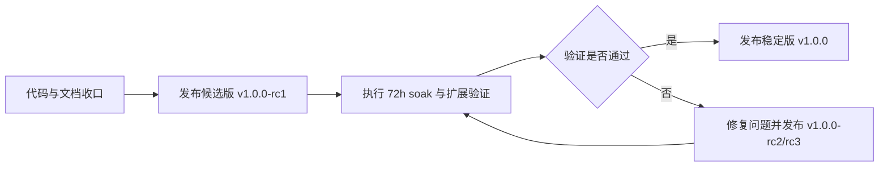

# GitHub 开源发布材料包

> 适用仓库：`lcc-claw-node-qpy`  
> 当前建议：先发布 `v1.0.0-rc1`，待 `72h soak` 与扩展验证通过后再升格为 `v1.0.0`

## 1. 发布目标

本材料包用于收敛 GitHub 首次公开发布所需的关键元数据和发布策略，覆盖：

1. 仓库 `About` 描述
2. Topics
3. 首版标签策略
4. Release Notes
5. 发布前检查清单

## 2. 首发节奏

## 3. GitHub About 建议

| 字段 | 建议值 | 说明 |
|---|---|---|
| Repository name | `lcc-claw-node-qpy` | 与当前仓库保持一致 |
| Description | `QuecPython 设备直连 OpenClaw Gateway 的开源运行时，支持双向命令、主动事件与可选远程签名。` | 建议使用中文，贴合当前仓库定位 |
| Website | 暂不填写 | 当前没有独立公开站点时，宁可留空，不要放内部地址 |
| Social preview | 建议使用设备状态卡片图 | 可选用 `docs/images/e2e/step-04-status-card.jpg` 为参考素材重新裁切 |
| Default branch | `main` | GitHub 对外发布建议统一使用 `main` |

备用英文描述：

`Open-source QuecPython runtime for direct OpenClaw Gateway connectivity with bidirectional commands, events, and optional remote signing.`

## 4. Topics 建议

GitHub Topics 需使用小写英文和连字符，建议首发配置如下：

| Topic | 用途 |
|---|---|
| `quecpython` | 设备运行时生态识别 |
| `quectel` | 模组厂商识别 |
| `openclaw` | 对接生态识别 |
| `iot` | 通用物联网分类 |
| `iot-device` | 设备侧定位 |
| `embedded-python` | 嵌入式 Python 运行时 |
| `websocket` | 控制面传输方式 |
| `ed25519` | 设备身份签名能力 |
| `remote-signing` | 可选远程签名路径 |
| `diagnostics` | 诊断工具集定位 |
| `lte` | 蜂窝网络设备场景 |
| `control-plane` | 控制面双向交互定位 |

## 5. 首版标签策略

| 版本标签 | 是否现在推荐 | 定位 |
|---|---|---|
| `v1.0.0-rc1` | 是 | 首个公开发布候选版，适合现在对外开源 |
| `v1.0.0` | 否 | 需等待 `72h soak`、更多模组矩阵和发布门禁通过 |
| `v1.0.0-rc2` | 视情况 | 如果 `72h soak` 或开放试用中发现问题，用于迭代候选版 |

建议的首发 Release 标题：

`v1.0.0-rc1 | QuecPython 直连 OpenClaw Gateway 首个公开候选版`

## 6. Release Assets 建议

| 资产 | 是否建议 | 说明 |
|---|---|---|
| GitHub 自动源码包 | 是 | 默认即可 |
| `usr_mirror/` 运行时压缩包 | 是 | 方便设备侧用户直接部署 |
| `examples/` 配置示例压缩包 | 是 | 降低首次接入门槛 |
| Release Notes Markdown | 是 | 建议直接粘贴到 GitHub Release 正文 |
| Windows/Host 辅助脚本单独压缩包 | 可选 | 如需突出 `remote_signer_http` 可单独附带 |

## 7. 首发 Release Notes 结构

建议使用以下结构：

1. 发布定位
2. 本版亮点
3. 已实现能力
4. 与官方 Gateway 的兼容边界
5. 已验证内容
6. 已知限制
7. 下一步计划

对应草稿见：

- [docs/releases/v1.0.0-rc1.md](./releases/v1.0.0-rc1.md)

## 8. 发布前检查清单

| 检查项 | 要求 |
|---|---|
| README/QuickStart/设计文档 | 已更新且无敏感信息 |
| `python3 tools/sanitize_check.py --root .` | 必须通过 |
| `tests/mock_gateway/tcp_reachability_smoke.py` | 必须通过 |
| `node --check tools/remote_signer_http.mjs` | 必须通过 |
| GitHub About/Topics | 已按本文件配置 |
| Release Notes | 已使用 `docs/releases/v1.0.0-rc1.md` 收口 |
| `72h soak` | 通过前不升格稳定版 `v1.0.0` |

## 9. 结论

当前最稳妥的 GitHub 首发策略是：

1. 先发布 `v1.0.0-rc1`
2. 用它承接社区公开试用
3. 将 `72h soak` 与扩展验证作为稳定版 `v1.0.0` 的发布门禁

## 10. 下一步

1. 按本文件设置 GitHub 仓库 `About` 与 Topics
2. 使用 `docs/releases/v1.0.0-rc1.md` 发布首个 Release
3. 独立推进 `72h soak` 任务，完成后再打稳定标签
