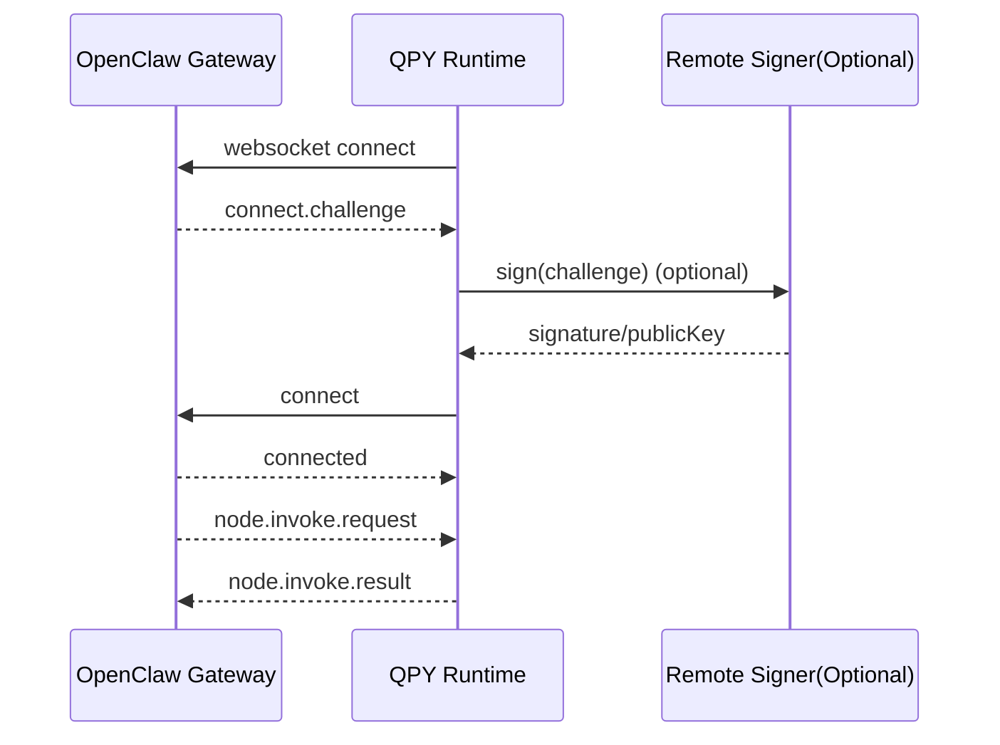

# v1.0.0-rc1 Release Notes

> 发布定位：`lcc-claw-node-qpy` 首个公开候选版  
> 推荐标签：`v1.0.0-rc1`

## 1. 本版亮点

1. QuecPython 设备已可在 **不修改官方 OpenClaw Gateway 源码** 的前提下完成接入。
2. 已实现设备与 Gateway 的双向命令闭环：`node.invoke.request -> tool -> node.invoke.result`。
3. 已内置 `7` 个只读诊断工具，覆盖设备、SIM、网络、小区、运行时状态。
4. 已提供 `remote_signer_http` 可选方案，兼容设备本地无法完成 Ed25519 的场景。
5. 已完成官方 Gateway 真机验证与本地 Mock Gateway smoke。

## 2. 已实现能力

| 能力域 | 当前状态 | 说明 |
|---|---|---|
| WebSocket 建链 | 已实现 | `connect.challenge -> connect` |
| 心跳与重连 | 已实现 | heartbeat / reconnect / ACK |
| 双向命令回路 | 已实现 | `node.invoke.request/result` |
| 主动事件上报 | 已实现 | heartbeat / telemetry / lifecycle / alert |
| 诊断工具目录 | 已实现 | 当前共 `7` 个只读工具 |
| 远程签名 | 已实现 | `remote_signer_http` |
| 本地仿真 | 已实现 | mock gateway smoke 已通过 |

## 3. 当前工具目录

| 工具 | 用途 |
|---|---|
| `qpy.device.info` | 读取设备基础身份、型号、固件与 SIM 概况 |
| `qpy.device.status` | 聚合设备、SIM、网络、PDP、运行时状态 |
| `qpy.net.diag` | 输出网络注册、数据通道、小区与排障建议 |
| `qpy.sim.info` | 读取 SIM 卡状态、IMSI、ICCID 等信息 |
| `qpy.cell.info` | 读取服务小区与邻区信息 |
| `qpy.runtime.status` | 查看会话、重连、队列与错误状态 |
| `qpy.tools.catalog` | 查看设备当前声明的工具和别名 |

## 4. 官方 Gateway 兼容边界

接入时需要注意：

1. 设备侧默认使用 `client.id=node-host`
2. 设备侧默认不发送浏览器 `Origin` 头
3. 首次接入官方 Gateway 可能先返回 `pairing required`
4. 若要在 Gateway 侧调用 `qpy.*`，需为 `quectel/quecpython` 补充 `gateway.nodes.allowCommands`

## 5. 已验证内容

| 项目 | 结果 |
|---|---|
| 官方 Gateway challenge/connect | 通过 |
| `remote_signer_http` challenge 回签 | 通过 |
| 首次 pairing approval | 通过 |
| 在线状态恢复 | 通过 |
| `qpy.runtime.status` | 通过 |
| `qpy.tools.catalog` | 通过 |
| `python3 tools/sanitize_check.py --root .` | 通过 |
| `python3 tests/mock_gateway/tcp_reachability_smoke.py` | 通过 |

## 6. 已知限制

| 项目 | 说明 |
|---|---|
| 稳定版门禁 | `72h soak` 尚未完成，因此本版仍建议作为 `rc` 发布 |
| 工具范围 | 首版仅提供只读工具，不包含高风险写操作 |
| 平台放行 | `qpy.*` 依赖 Gateway 配置 `allowCommands` |
| 模组矩阵 | 仍需补充更多 QuecPython 模组与固件版本验证 |

## 7. 升级与部署提醒

1. 请从 `examples/config.ws_native.example.py` 生成自己的设备配置。
2. 不要把真实 token、私钥或生产地址提交到仓库。
3. `remote_signer_http` 默认把本地身份状态写入主机用户目录，而不是仓库目录。

## 8. 下一步

1. 执行 `72h soak` 稳定性验证
2. 扩展更多模组与固件版本矩阵
3. 通过门禁后发布稳定版 `v1.0.0`
