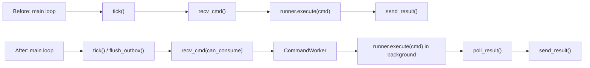

# 72h soak P0 修复实施记录

> 仓库：`lcc-claw-node-qpy`  
> 关联问题：`WP#700` / `WP#721` / `GitLab Issue #2` / `GitLab Issue #3`  
> 日期：`2026-03-13`

## 1. 本轮目标

本轮不做正式 `72h soak` 重跑，先落地最关键的 `P0` 修复，降低“长命令或主动事件把连接主循环拖死”的风险。

本轮目标：

1. 给运行时补可观测性，避免再次只能靠 Gateway 超时现象反推问题。
2. 把 `node.invoke` 命令执行从主循环中拆出去，让 `tick/recv/outbox` 持续运行。
3. 收敛 `outbox` 一次失败就主动断线的策略，避免瞬时抖动被放大。
4. 将周期性 `telemetry` 从全量设备探测改为轻量运行时快照，避免主循环周期性自阻塞。

## 2. 结构变化

## 3. 已实施改动

| 改动项 | 文件 | 实施内容 | 预期收益 |
|---|---|---|---|
| 后台命令执行 worker | `usr_mirror/app/command_worker.py` | 新增 `CommandWorker`，用 `_thread` 在后台执行 `runner.execute(cmd)` | 长命令执行期间主循环仍能继续 `tick/recv/flush_outbox` |
| 主循环解耦 | `usr_mirror/app/agent.py` | 主循环改为 `poll_result -> recv_cmd -> submit/pump` 模式 | 避免 `qpy.device.status` 这类慢命令直接阻塞连接泵 |
| 运行时埋点 | `usr_mirror/app/runtime_state.py` | 增加 `last_tick_ms / last_close_reason / last_outbox_error / inflight_cmd / worker_status` | `qpy.runtime.status` 可直接暴露关键诊断信息 |
| outbox 退避重试 | `usr_mirror/app/transport_ws_openclaw.py` | 增加 `next_attempt_ms`、退避重试和 fatal/non-fatal 区分 | 单次 ACK 抖动不再立即触发 `close(outbox-failed)` |
| 轻量 telemetry | `usr_mirror/app/tools/tool_probe.py`、`usr_mirror/app/transport_ws_openclaw.py` | 主动 `telemetry` 改为发送运行时快照，不再在 `tick()` 中同步构建全量设备状态 | 避免主循环因周期性主动上报再次被重型探测卡住 |
| 配置显式化 | `usr_mirror/app/config.py` | 新增 `OUTBOX_RETRY_BACKOFF_MS=1000` | 方便后续根据现场链路质量调优 |

## 4. 变更说明

### 4.1 命令执行从主循环剥离

此前 `agent.py` 是严格串行模型：

1. `tick()`
2. `recv_cmd()`
3. `runner.execute(cmd)`
4. `send_result()`

现在改为：

1. 主循环持续运行 `tick()`
2. 若 worker 空闲，则消费一个待执行命令并提交给 worker
3. worker 在后台执行 `runner.execute(cmd)`
4. 主循环继续 `recv_cmd(can_consume=False)` 维持泵和积压队列
5. worker 产出结果后，主循环再发 `node.invoke.result`

### 4.2 主动 telemetry 改为轻量快照

此前主动 `telemetry` 直接复用 `build_device_status()`，这会同步读取：

- modem
- SIM
- 网络注册
- PDP
- 小区信息
- 运行时状态

这类全量采集适合按需命令，不适合放在 `tick()` 的固定周期里。  
本轮把主动 `telemetry` 改成 `build_runtime_telemetry()`，只发送运行时与连接相关快照；完整设备状态仍由 `qpy.device.status` 提供。

## 5. 本地自检结果

| 检查项 | 结果 | 说明 |
|---|---|---|
| QuecPython 兼容性检查 | 通过 | `check_quecpython_compat.py` 扫描 `usr_mirror/app`，`Issues found: 0` |
| Python 语法编译 | 通过 | 使用 `PYTHONPYCACHEPREFIX=/tmp/codex-pycache python3 -m py_compile ...` |
| 真机/Gateway 回归 | 通过（Phase 3 short-window） | 公网 Gateway 恢复后，`qpy.runtime.status=461ms`、`qpy.device.status=16.88s`、`qpy.tools.catalog=438ms` |
| soak probe 工具回归 | 通过 | 修复了 `burnin --command` 重复叠加默认命令、以及工具结果信封层未解包的问题 |

## 6. 当前边界

| 项目 | 状态 | 说明 |
|---|---|---|
| `P0` 主循环阻塞风险 | 已通过 short-window 回归 | 公网环境已恢复 `runtime/device/catalog` 闭环，但还未完成长稳与重启恢复门禁 |
| `P0` outbox 放大断线 | 已实现第一轮修复 | 仍需实测确认 fatal/non-fatal 分类是否合适 |
| `P1` connect 路径优化 | 部分覆盖 | 已移除 connect 阶段的全量 telemetry，但尚未做更多分层优化 |
| `P1` `qpy.device.status` 细分耗时 | 未完成 | 还没有对子步骤打点 |
| `P1` `alert/node.event` 直观证据链 | 未完成 | 需要下一轮验证补齐 |
| 环境一致性 | 未完成 | 公网 Gateway token 与本地凭证库存漂移，Windows staging bundle 仍保留占位 `config.py` |

## 7. Phase 3 真机回归摘要

新增证据：

- [phase3-summary.json](/Volumes/M2T/LiteChipTech/business/lcc-system/lcc-projects/opensource/lcc-claw-node-qpy/docs/validation/evidence/20260313-phase3/phase3-summary.json)
- [public-gateway-burnin.json](/Volumes/M2T/LiteChipTech/business/lcc-system/lcc-projects/opensource/lcc-claw-node-qpy/docs/validation/evidence/20260313-phase3/public-gateway-burnin.json)

| 检查项 | 结果 | 说明 |
|---|---|---|
| 设备运行时 | 通过 | `debug_snapshot()` 返回 `online=true`、`protocol=3`、`connect_successes=1` |
| `remote_signer_http` | 通过 | `last_signer` 有值，说明 challenge 回签路径正常 |
| `node.list` | 通过 | 节点已恢复 `connected=true`、`deviceFamily=quecpython` |
| `qpy.runtime.status` | 通过 | operator 往返 `461ms`，工具执行耗时 `2ms` |
| `qpy.device.status` | 通过但偏慢 | operator 往返 `16.88s`，工具执行耗时 `16.343s` |
| `qpy.tools.catalog` | 通过 | operator 往返 `438ms`，`tool_count=7` |
| 环境风险 | 未关闭 | 公网 Gateway `gateway.auth.token` 当前仍与本地凭证库存不一致 |

## 8. 下一步验证

1. 把公网 Gateway 凭证配置与本地凭证库存收口，避免验证结果不可复现。
2. 修改 Windows 部署脚本，阻止占位 `config.py` 再次覆盖设备。
3. 在公网环境重跑一次 `Gateway restart recovery-check`，验证是否回到 `<=30s`。
4. 继续观察 `qpy.device.status` 的耗时分布，再决定是否重开正式 `72h soak`。
