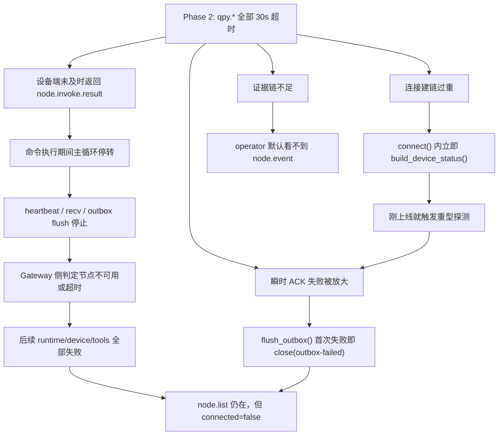
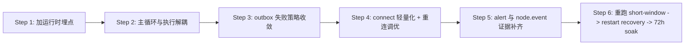

# 72h soak 故障定位与修复优先级

> 仓库：`lcc-claw-node-qpy`  
> 关联阶段记录：`docs/validation/72h-soak阶段执行记录.md`  
> 关联追踪：`WP#721` / `GitLab Issue #3`  
> 日期：`2026-03-13`

## 1. 结论

当前不应开启正式 `72h soak` 窗口，也不能据此发布稳定版 `v1.0.0`。

补充说明：`2026-03-13` 在公网 Gateway 环境完成 `P0` 修复回归后，`qpy.runtime.status / qpy.device.status / qpy.tools.catalog` 的短窗口已经恢复，说明修复方向有效；但由于公网 Gateway 存在 token 配置漂移，且 `restart recovery-check` 尚未重跑，所以正式 `72h` 仍保持 `NO-GO`。

基于现有代码和 Phase 1 / Phase 2 证据，当前最值得优先处理的不是 Gateway 参数，而是设备端运行时的三个结构性问题：

1. `P0`：主循环是串行的，命令执行期间不会继续 `tick()`、收包或发心跳，长命令会直接挤占连接维持窗口。
2. `P0`：`outbox` 发送 ACK 一次失败就会主动 `close()`，把瞬时链路抖动放大成断线。
3. `P1`：连接成功后立即构建完整 `telemetry`，会把重型探测压在最脆弱的建链阶段。
4. `P1`：当前缺少 `node.event` 的直观证据链，导致 `heartbeat / telemetry / lifecycle / alert` 只能靠旁证判断。

其中第 1 条是当前最强假设。它与 `qpy.device.status` 在 Phase 1 中耗时约 `20.854s` 的观测高度相关，而当前默认心跳周期仅 `15s`。

## 2. 故障树

## 3. 关键证据

| 证据 | 来源 | 说明 |
|---|---|---|
| `qpy.runtime.status=322ms` | `docs/validation/evidence/20260313-phase1/phase1-summary.json` | 轻量命令在 Phase 1 可快速成功 |
| `qpy.device.status=20854ms` | `docs/validation/evidence/20260313-phase1/phase1-summary.json` | 单次设备状态探测已经长于 `15s` 心跳周期 |
| `qpy.runtime.status/qpy.device.status/qpy.tools.catalog` 均在 `30000ms` 超时 | `docs/validation/evidence/20260313-phase2/phase2-summary.json` | Phase 2 已从“偏慢”退化为“完全失去响应” |
| `node.list connected=false` | `docs/validation/evidence/20260313-phase2/phase2-summary.json` | 节点未消失，但已退化为断连态 |
| operator 仅观测到 `connect.challenge / health / tick` | `docs/validation/evidence/20260313-phase1/phase1-summary.json` 与 `phase2-summary.json` | 当前无法直接证明 `node.event` 是否持续送达 |
| `HEARTBEAT_INTERVAL_SEC=15` | `usr_mirror/app/config.py:28` | 与 `qpy.device.status=20.854s` 明显冲突 |

## 4. 故障定位清单

| 编号 | 假设 | 代码位置 | 证据与推断 | 证实方式 | 优先级 |
|---|---|---|---|---|---|
| 1 | 主循环串行导致心跳饥饿 | `usr_mirror/app/agent.py:47-64` | `runner.execute(cmd)` 期间没有 `tick()`、`recv_cmd()`、`flush_outbox()`；而 Phase 1 的 `qpy.device.status` 已达 `20.854s`，超过 `15s` 心跳周期 | 给运行时增加 `tool_exec_started_ms/tool_exec_finished_ms/last_tick_ms`，并在长命令期间观察是否出现连续缺失心跳 | `P0` |
| 2 | ACK 失败被放大为主动断线 | `usr_mirror/app/transport_ws_openclaw.py:129-159` | `flush_outbox()` 内一次异常就 `close(\"outbox-failed\")`，只有超过最大重试才丢弃消息；这会让瞬时发送抖动演化为 session 中断 | 区分 `send failed`、`ack timeout`、`socket closed`，记录 close reason 统计；复现时看是否先出现 `OUTBOX_SEND_FAILED` 再 `connected=false` | `P0` |
| 3 | connect 阶段过重 | `usr_mirror/app/transport_ws_openclaw.py:55-66` | 刚 `connect` 成功就构建完整 `build_device_status()`，该函数会同步读取 modem/SIM/网络/小区/PDP/运行时等数据 | 在 connect 阶段增加耗时埋点，比较“仅 lifecycle”与“附带 telemetry”两种模式的连上耗时和恢复时延 | `P1` |
| 4 | `qpy.device.status` 本身是重型工具 | `usr_mirror/app/tools/tool_probe.py:368-394` | 单个工具会串行执行 `gather_modem_info/gather_sim_info/gather_network_info/gather_data_context/gather_cell_info`，天然较慢 | 给各 gather 函数增加分段耗时，找出最慢子步骤；必要时拆成“快照版”和“全量版” | `P1` |
| 5 | 重连节奏不利于 `<=30s` 恢复门槛 | `usr_mirror/app/agent.py:49-56`、`usr_mirror/app/config.py:30-33` | 断线后默认回退 `5s`，连接超时 `8s`，再叠加建链期重探测，很容易把恢复拖过 `30s` | 记录每次 `close -> connect start -> challenge -> connect ok` 的阶段耗时分布 | `P1` |
| 6 | 当前可观测性不足，无法确认 `node.event` 是否真丢失 | `usr_mirror/app/transport_ws_openclaw.py:85-95`、`:321-340` | 设备端会排队 `heartbeat/telemetry`，但 operator 侧只看到 `connect.challenge/health/tick`，证据断层仍在 | 增加设备端本地环形日志，或在 Gateway 增加 `node.event` 落盘/转存通道 | `P1` |
| 7 | 当前没有把命令超时和会话存活分离 | `usr_mirror/app/tool_runner.py:82-122`、`usr_mirror/app/transport_ws_openclaw.py:121-159` | 工具执行慢时，当前没有“超时返回失败但继续保持连接”的隔离机制 | 为执行线程或执行状态机增加软超时，超时时返回失败结果，但主循环保持存活 | `P1` |

## 5. 修复优先级

| 优先级 | 修复项 | 涉及文件 | 建议动作 | 验证门槛 |
|---|---|---|---|---|
| `P0` | 让命令执行与 WebSocket 泵分离 | `usr_mirror/app/agent.py`、`usr_mirror/app/transport_ws_openclaw.py` | 把 `runner.execute(cmd)` 改为后台 worker 执行，主循环持续做 `tick/recv/flush_outbox`；若设备环境不适合线程，则改成显式状态机并拆分重型工具 | `qpy.device.status` 执行期间仍能持续产生 heartbeat；Phase 2 不再出现“三条命令一起超时” |
| `P0` | 放宽 `outbox` 首次失败的断线策略 | `usr_mirror/app/transport_ws_openclaw.py` | 对非致命 ACK 失败只记错并保留连接，按退避重试；仅在 `WsClosed/socket closed` 等硬错误时断线 | 瞬时异常后节点仍保持 `connected=true`，不会因单次 ACK 失败掉线 |
| `P1` | 轻量化 connect 路径 | `usr_mirror/app/transport_ws_openclaw.py`、`usr_mirror/app/tools/tool_probe.py` | 建链成功后先发 `lifecycle:online`，把完整 `telemetry` 延后到首个稳定窗口或拆成轻量版 | Gateway 重启恢复进入 `runtime.status` 成功的时间回落到 `<=30s` |
| `P1` | 给 `device.status` 做分段耗时埋点与快慢分层 | `usr_mirror/app/tools/tool_probe.py` | 保留全量版，同时新增轻量版状态视图，避免日常探针每次都拉全量数据 | `qpy.device.status` P95 明确、快照版满足小于 `5s~10s` 目标 |
| `P1` | 增加 close reason / last_tick / inflight command 可观测性 | `usr_mirror/app/runtime_state.py`、`usr_mirror/app/agent.py`、`usr_mirror/app/transport_ws_openclaw.py` | 在 `runtime.status` 中暴露 `close_reason`、`last_tick_ms`、`inflight_cmd_tool`、`last_outbox_error` | 能把“卡死”“断网”“ACK 失败”“Gateway 重启”几类失稳路径明确区分 |
| `P1` | 调整重连节奏 | `usr_mirror/app/config.py`、`usr_mirror/app/agent.py` | 首轮失败用短退避，后续再指数退避；避免所有重试都固定 `5s` | Gateway 受控重启后，`recovery-check <=30s` 通过 |
| `P2` | 补 `alert` 主动注入验证 | 验证脚本与设备端诊断入口 | 设计可控的告警触发，例如网络断开、SIM 状态异常、工具执行失败 | 在 soak 期间拿到一条可复核的 `alert` 证据链 |
| `P2` | 补 Windows 串口/REPL 旁证 | Windows Lab 环境与 skill 流程 | 一旦串口可见，就补采设备侧日志，与 Gateway journal 对齐时间线 | 出现失稳时能快速判定是“设备没跑”还是“链路没通” |

## 6. 推荐实施顺序

## 7. 建议的验证门禁

| 验证项 | 当前状态 | 通过标准 |
|---|---|---|
| `qpy.runtime.status` | Phase 3 short-window 已恢复（约 `461ms`） | 连续 `30` 次样本成功，且 `P95 <= 5s` |
| `qpy.device.status` | Phase 3 short-window 已恢复（约 `16.88s`），但仍偏慢 | 连续 `10` 次样本成功，给出 `P50/P95`，且不再拖垮连接 |
| `qpy.tools.catalog` | Phase 3 short-window 已恢复（约 `438ms`） | 连续 `30` 次样本成功，`P95 <= 5s` |
| Gateway 重启恢复 | `35.162s` 或直接失败 | `recovery-check <= 30s`，至少重复 `3` 次 |
| `node.event` 证据链 | 仅旁证 | 能保存至少 `heartbeat + telemetry + lifecycle` 各一条直观证据 |
| `alert` 主动验证 | 未完成 | 至少 1 条带时间戳的主动告警闭环 |

## 8. 下一步

1. 先不要开正式 `72h soak`，先落地 `P0` 两项修复。
2. 修复前先补埋点，否则下一轮即使恢复，也无法证明根因是否真的被消除。
3. `P0/P1` 收敛后，先重跑 `short-window` 和 `restart recovery`，通过后再开 `72h`。
4. 本轮 `P0` 代码实施记录见：`docs/validation/72h-soak-P0修复实施记录.md`。
