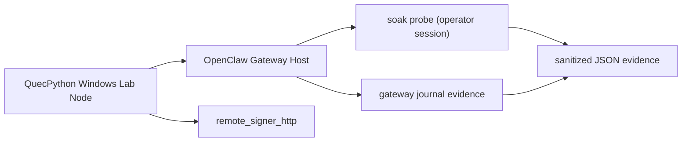
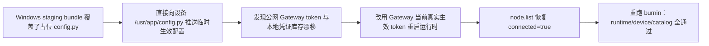
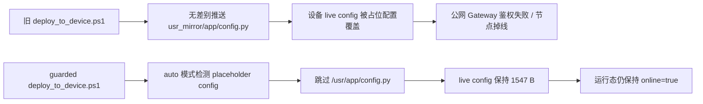
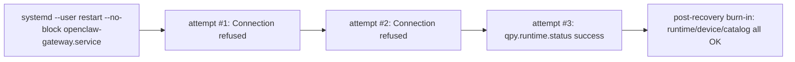
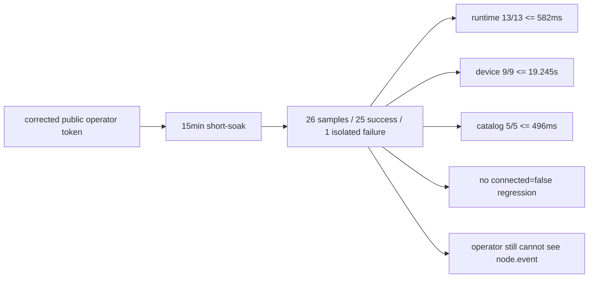
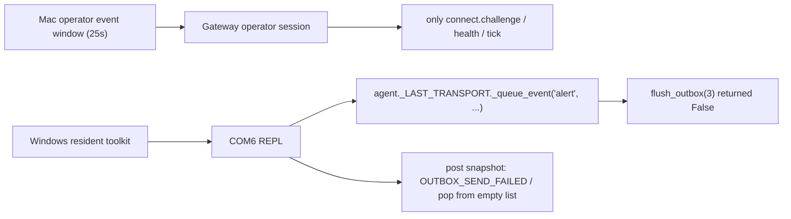
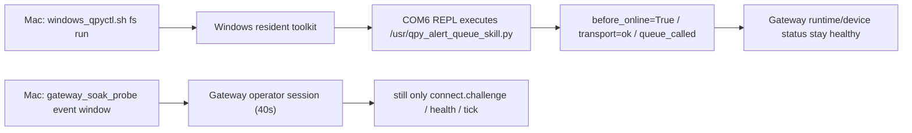
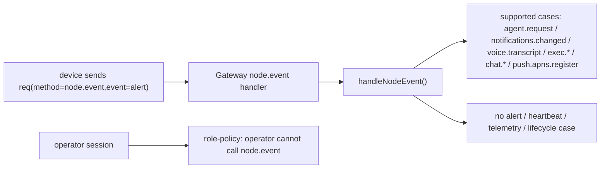
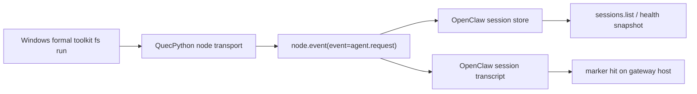
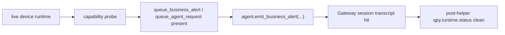

# 72h soak 阶段执行记录

> 仓库：`lcc-claw-node-qpy`  
> 阶段：`Phase 1 / preflight + first burn-in`，`Phase 2 / formal soak short-window + recovery recheck`，`Phase 3 / public gateway recovery short-window`，`Phase 4 / corrected-token public short-soak`，`Phase 5 / corrected-token public 6h soak long-window`  
> 执行日期：`2026-03-13 ~ 2026-03-14`

## 1. 本阶段目标

本阶段只聚焦 `72h soak` 独立验证，不混入 GitHub 发布材料整理，目标是：

1. 确认可复用的 Gateway / signer / 设备环境是否真实在线。
2. 建立可长期复用的自动采样脚本与证据目录。
3. 完成首轮 `heartbeat / telemetry / lifecycle / alert` 相关旁证收集。
4. 完成 `qpy.runtime.status`、`qpy.device.status`、`qpy.tools.catalog` 首轮调用。
5. 完成一次受控 Gateway 重启后的自动恢复验证。

## 2. 当前验证拓扑



## 3. 自动采样方案

### 3.1 仓库内新增脚本

- 脚本：`tools/gateway_soak_probe.py`
- 目标：使用 Python 标准库直接完成 WebSocket 握手、`connect`、`node.list`、`node.describe`、`node.invoke`、长周期 `soak` 采样与 `recovery-check`。
- 输出：默认输出脱敏 JSON，可直接落到仓库证据目录，也适合在远端 Gateway 主机本地落盘后回收。

推荐命令：

```bash
python3 tools/gateway_soak_probe.py burnin \
  --url ws://127.0.0.1:18789 \
  --token-file /path/to/gateway-token.txt \
  --iterations 3 \
  --sleep-sec 30 \
  --event-window-sec 95 \
  --invoke-timeout-ms 30000 \
  --json-output docs/validation/evidence/20260313-phase1/phase1-summary.json
```

```bash
python3 tools/gateway_soak_probe.py soak \
  --url ws://127.0.0.1:18789 \
  --token-file /path/to/gateway-token.txt \
  --connected-only \
  --output-dir docs/validation/evidence/20260313-phase2 \
  --duration-sec 259200 \
  --runtime-interval-sec 300 \
  --device-interval-sec 900 \
  --catalog-interval-sec 1800 \
  --event-window-sec 95 \
  --invoke-timeout-ms 30000
```

```bash
python3 tools/gateway_soak_probe.py recovery-check \
  --url ws://127.0.0.1:18789 \
  --token-file /path/to/gateway-token.txt \
  --connected-only \
  --deadline-sec 120 \
  --poll-sec 5 \
  --target-ms 30000 \
  --invoke-timeout-ms 30000
```

### 3.2 证据采集分层

| 层级 | 采集内容 | 本阶段结论 |
|---|---|---|
| Gateway 配置 | `qpy.* allowCommands`、Gateway 进程、`remote_signer_http` | 已确认 |
| Operator 采样 | `node.list`、`node.describe`、`node.invoke` | 已确认 |
| Gateway 日志 | `node.invoke` 耗时与超时记录 | 已确认 |
| Device 主动事件 | `heartbeat / telemetry / lifecycle / alert` | 仅完成旁证，未拿到直观事件流 |

### 3.3 长稳执行节奏

| 阶段 | 周期 | 动作 |
|---|---|---|
| `T0~T0+2h` | `5min` | 调用 `qpy.runtime.status`，记录 `online/reconnect_count/outbox_depth` |
| `T0~T0+72h` | `15min` | 调用 `qpy.device.status`，记录耗时与关键字段完整性 |
| `T0~T0+72h` | `30min` | 调用 `qpy.tools.catalog`，确认工具集未漂移 |
| `T0+12h`、`T0+36h`、`T0+60h` | 人工 | 核对 Gateway journal 与异常窗口 |
| `T0+36h` | 一次 | 受控 Gateway 重启并记录恢复时延 |
| 全程 | 持续 | 记录 `node.invoke` 超时、重连计数、signer 可用性 |

## 4. 首轮执行结果

首轮执行的机器可读摘要见：

- [phase1-summary.json](/Volumes/M2T/LiteChipTech/business/lcc-system/lcc-projects/opensource/lcc-claw-node-qpy/docs/validation/evidence/20260313-phase1/phase1-summary.json)

### 4.1 环境就绪度

| 检查项 | 结果 | 说明 |
|---|---|---|
| Gateway 在线 | 通过 | 远端 Gateway 进程与监听口正常 |
| `remote_signer_http` 在线 | 通过 | 进程存在，`runtime.status` 也返回 signer 状态 |
| `qpy.* allowCommands` | 通过 | 已放行 `runtime/device/tools` 等命令 |
| QuecPython 节点在线 | 通过 | `quectel/quecpython` 节点已配对且在线 |

### 4.2 命令结果

| 命令 | 结果 | 关键观察 |
|---|---|---|
| `qpy.runtime.status` | 通过 | 返回在线、`remote_signer_http` 生效、`reconnect_count=2` |
| `qpy.device.status` | 通过但偏慢 | 耗时约 `20.8s`，超过首轮 burn-in 里的 `15s` 超时窗口 |
| `qpy.tools.catalog` | 通过 | `tool_count=7`，工具目录完整 |

### 4.3 事件观测

| 观测窗口 | 结果 | 解释 |
|---|---|---|
| `95s` operator 订阅窗口 | 只见 `connect.challenge / health / tick` | 说明普通 operator 会话默认不直接暴露设备 `node.event` |
| `runtime.status` 旁证 | 通过 | 返回 `heartbeat_interval_sec=15`、`telemetry_interval_sec=90`、`last_signer` 有值 |
| Gateway journal | 通过 | 可观测 `node.invoke` 成功/超时耗时，但未直接打印 `node.event` |

### 4.4 Gateway 重启恢复

| 检查项 | 结果 | 说明 |
|---|---|---|
| Gateway 进程重启 | 通过 | PID 从 `36199` 切换到 `45852` |
| 节点重新连回 | 通过 | 重启后再次成功返回 `qpy.runtime.status` |
| 恢复时延门槛 `<=30s` | 未通过 | 从恢复轮询起算到成功返回约 `35.2s` |

### 4.5 Phase 2：formal soak 短窗口结果

本阶段新增机器可读证据：

- [phase2-summary.json](/Volumes/M2T/LiteChipTech/business/lcc-system/lcc-projects/opensource/lcc-claw-node-qpy/docs/validation/evidence/20260313-phase2/phase2-summary.json)
- [soak_summary.json](/Volumes/M2T/LiteChipTech/business/lcc-system/lcc-projects/opensource/lcc-claw-node-qpy/docs/validation/evidence/20260313-phase2/soak_summary.json)
- [sample-0001](/Volumes/M2T/LiteChipTech/business/lcc-system/lcc-projects/opensource/lcc-claw-node-qpy/docs/validation/evidence/20260313-phase2/samples/0001-qpy_runtime_status+qpy_device_status+qpy_tools_catalog.json)
- [recovery-check-after-restart](/Volumes/M2T/LiteChipTech/business/lcc-system/lcc-projects/opensource/lcc-claw-node-qpy/docs/validation/evidence/20260313-phase2/recovery_check_after_restart.json)
- [node-list-after-restart](/Volumes/M2T/LiteChipTech/business/lcc-system/lcc-projects/opensource/lcc-claw-node-qpy/docs/validation/evidence/20260313-phase2/node_list_after_restart.json)

| 检查项 | 结果 | 说明 |
|---|---|---|
| `tools/gateway_soak_probe.py soak` 首轮样本 | 未通过 | `qpy.runtime.status`、`qpy.device.status`、`qpy.tools.catalog` 全部在 `30s` 窗口超时 |
| 事件窗口 `95s` | 旁证仍有限 | 仍只见 `connect.challenge / health / tick`，没有直接 `node.event` |
| `remote_signer_http` 进程 | 通过 | 进程仍在，但未能转化为成功的 `runtime.status` 结果 |
| 首轮超时后的单次 `runtime.status` | 未通过 | 随后直接返回 `node not connected` |
| Gateway 重启后 `recovery-check` | 未通过 | `30s` 内共 `6` 次轮询，均为 `no node matched the requested filters` |
| 重启后 `node.list` | 未通过 | 节点仍然存在，但 `connected=false`，`version/deviceFamily` 也不再返回 |

### 4.6 Phase 2 关键信号

| 时间 | 信号 | 解释 |
|---|---|---|
| `2026-03-13 18:54:54` | Gateway journal 记录 `qpy.runtime.status` 超时 `~30003ms` | 已从 Phase 1 的“可成功但偏慢”退化为直接超时 |
| `2026-03-13 18:55:24` | Gateway journal 记录 `qpy.device.status` 超时 `~30002ms` | `30s` 窗口也无法拿到设备状态 |
| `2026-03-13 18:55:54` | Gateway journal 记录 `qpy.tools.catalog` 超时 `~30002ms` | 工具目录查询也已失去响应 |
| `2026-03-13 19:00:27` | Gateway `node wake done ... connected=false` | 节点从“connected but unresponsive”进入明确断连态 |
| `2026-03-13 19:05:12` | Gateway 重启后仍返回 `node not connected` | 当前恢复路径未能把节点拉回可调用状态 |

### 4.7 Phase 3：公网 Gateway 恢复短窗口

本阶段新增机器可读证据：

- [phase3-summary.json](/Volumes/M2T/LiteChipTech/business/lcc-system/lcc-projects/opensource/lcc-claw-node-qpy/docs/validation/evidence/20260313-phase3/phase3-summary.json)
- [public-gateway-burnin.json](/Volumes/M2T/LiteChipTech/business/lcc-system/lcc-projects/opensource/lcc-claw-node-qpy/docs/validation/evidence/20260313-phase3/public-gateway-burnin.json)

说明：

1. 本节记录的是 `2026-03-13` 当天的历史短窗口恢复结果。
2. 截至 `2026-03-14`，我们已经重新证明“设备侧运行时在线”依旧成立，但**尚未重新拿到公网主机的有效 SSH 登录入口**，因此无法把这里的“恢复原因”继续视为当下已复核的主机侧事实。
3. 换句话说，本节可以作为“曾观察到的恢复现象”证据使用，但不能单独当作“公网主机配置已再次核实”的结论。

本阶段恢复动作：



| 检查项 | 结果 | 说明 |
|---|---|---|
| Windows deploy 覆盖占位配置 | 已确认 | `deploy_to_device.ps1` 会把 bundle 中的 `usr_mirror/app/config.py` 直接推到设备 |
| 公网 Gateway 鉴权配置漂移 | 历史现象成立，当前未复核 | `2026-03-13` 的恢复过程显示“设备 live token / 本地库存 / operator 鉴权面”存在漂移；但截至 `2026-03-14`，由于还未重新进入公网主机读取 `openclaw.json`，不能把漂移原因继续固化为某一个已核实字段 |
| 设备运行时恢复 | 通过 | 设备侧 `debug_snapshot()` 已恢复 `online=true`、`protocol=3`、`last_signer` 有值 |
| `node.list connected=true` | 通过 | 公网 Gateway 已再次显示 `quectel/quecpython` 节点在线 |
| `qpy.runtime.status` | 通过 | `461ms`，设备侧工具执行时长 `2ms` |
| `qpy.device.status` | 通过但仍偏慢 | `16.88s`，设备侧工具执行时长 `16.343s` |
| `qpy.tools.catalog` | 通过 | `438ms`，设备侧工具执行时长 `1ms`，`tool_count=7` |
| `gateway_soak_probe.py` 摘要修正 | 已完成 | 修复了 `burnin --command` 重复叠加默认命令、以及工具结果信封层未解包的问题 |

### 4.8 Phase 3：Windows 部署脚本安全收口验证

新增证据：

- [deploy-guard-summary.json](/Volumes/M2T/LiteChipTech/business/lcc-system/lcc-projects/opensource/lcc-claw-node-qpy/docs/validation/evidence/20260313-phase3/deploy-guard-summary.json)
- [deploy_to_device.guarded.ps1](/Volumes/M2T/LiteChipTech/business/lcc-system/lcc-projects/opensource/lcc-claw-node-qpy/docs/validation/evidence/20260313-phase3/deploy_to_device.guarded.ps1)



| 检查项 | 结果 | 说明 |
|---|---|---|
| 脚本备份 | 通过 | Windows staging bundle 中原脚本已备份为 `deploy_to_device.20260313-guarded.bak.ps1` |
| 占位配置保护 | 通过 | 脚本实机输出 `Skip placeholder /usr/app/config.py in auto mode...` |
| live config 保持不变 | 通过 | `/usr/app/config.py` 大小保持 `1547`，未再被占位配置覆盖 |
| 运行态保持在线 | 通过 | 回归后 `debug_snapshot()` 仍为 `online=true`、`protocol=3` |
| 整包 REPL 下发稳定性 | 未通过 | 大文件推送仍会遗留 `.tmp`，例如 `command_worker.py.tmp`、`runtime_state.py.tmp`、`transport_ws_openclaw.py.tmp`、`tool_probe.py.tmp` |
| 风险拆分 | 已完成 | 已把“配置误覆盖”与“整包 REPL 下发不稳”拆成两个独立问题 |

### 4.9 Phase 4.5：transport outbox 修复后的回归取证

新增证据：

- [after-fix-transport-summary.json](/Volumes/M2T/LiteChipTech/business/lcc-system/lcc-projects/opensource/lcc-claw-node-qpy/docs/validation/evidence/20260314-alert-injection-after-fix/after-fix-transport-summary.json)
- [device-status-after-fix.json](/Volumes/M2T/LiteChipTech/business/lcc-system/lcc-projects/opensource/lcc-claw-node-qpy/docs/validation/evidence/20260314-alert-injection-after-fix/device-status-after-fix.json)
- [device-status-after-fix-2.json](/Volumes/M2T/LiteChipTech/business/lcc-system/lcc-projects/opensource/lcc-claw-node-qpy/docs/validation/evidence/20260314-alert-injection-after-fix/device-status-after-fix-2.json)
- [operator-event-window-after-fix.json](/Volumes/M2T/LiteChipTech/business/lcc-system/lcc-projects/opensource/lcc-claw-node-qpy/docs/validation/evidence/20260314-alert-injection-after-fix/operator-event-window-after-fix.json)
- [windows-com6-open-no-dtr.txt](/Volumes/M2T/LiteChipTech/business/lcc-system/lcc-projects/opensource/lcc-claw-node-qpy/docs/validation/evidence/20260314-alert-injection-after-fix/windows-com6-open-no-dtr.txt)
- [windows-com6-open-with-dtr.txt](/Volumes/M2T/LiteChipTech/business/lcc-system/lcc-projects/opensource/lcc-claw-node-qpy/docs/validation/evidence/20260314-alert-injection-after-fix/windows-com6-open-with-dtr.txt)
- [windows-repl-echo-probe.txt](/Volumes/M2T/LiteChipTech/business/lcc-system/lcc-projects/opensource/lcc-claw-node-qpy/docs/validation/evidence/20260314-alert-injection-after-fix/windows-repl-echo-probe.txt)

| 检查项 | 结果 | 说明 |
|---|---|---|
| 源码级并发回归测试 | 通过 | `tests/test_transport_outbox_race.py` 继续通过 |
| Windows host tool 串口兼容修复 | 通过 | `qpy_device_fs_cli.py` 已移除 `repl_send_lines()` 里的强制 `DTR/RTS` |
| `COM6` 无 `DTR/RTS` 打开 | 通过 | `OPEN_OK` |
| `COM6` 强制 `DTR/RTS` 打开 | 未通过 | 立即返回 “device not functioning” |
| 修复后 runtime 第一次状态 | 通过 | `last_outbox_error=''`、`last_error_code=''`、`sent_frames=106` |
| 修复后 runtime 第二次状态 | 通过 | `last_outbox_error=''`、`last_error_code=''`、`sent_frames=114` |
| runtime 计数器前进 | 通过 | `sent_frames +8`、`received_frames +14`、`last_ack_ms` 前进 |
| operator 观察窗 | 未通过 | 仍只见 `connect.challenge / health / tick`，没有 `node.event` / `alert` |
| 设备侧 live alert 再注入 | 未完成 | 当前 `REPL-silent`，`snapshot` 与手工 `print()` 仅返回 `<empty>` |

补充判断：
1. 这一轮最关键的变化是：**旧的 `OUTBOX_SEND_FAILED / pop from empty list` 已不再出现。** 设备侧 `runtime` 两次都给出空的 `last_outbox_error` 与 `last_error_code`，且发送/ack 计数持续前进。
2. 这让我们可以把问题进一步拆开：`transport outbox` 并发错误路径已基本收口，但 `operator` 默认仍拿不到 `node.event`，所以“看不到主动事件”这个表象仍然存在。
3. 新引入的阻塞不是 transport 回归，而是设备重新上下电后出现的 `REPL-silent` 现象：`COM6` 可以打开，但 SSH 场景下没有任何 REPL 文本回显。
4. 因此 Phase 4 之后的下一步不再是继续追 `pop from empty list`，而是先恢复 Windows 定向注入能力，再补事件链证据。

### 4.10 Phase 4.6：`quecpython-dev` skill 标准工具复核

新增证据：

- [device-smoke-skill.json](/Volumes/M2T/LiteChipTech/business/lcc-system/lcc-projects/opensource/lcc-claw-node-qpy/docs/validation/evidence/20260314-alert-injection-after-fix/device-smoke-skill.json)
- [device-smoke-skill.log](/Volumes/M2T/LiteChipTech/business/lcc-system/lcc-projects/opensource/lcc-claw-node-qpy/docs/validation/evidence/20260314-alert-injection-after-fix/device-smoke-skill.log)
- [device-info-probe-skill.json](/Volumes/M2T/LiteChipTech/business/lcc-system/lcc-projects/opensource/lcc-claw-node-qpy/docs/validation/evidence/20260314-alert-injection-after-fix/device-info-probe-skill.json)
- [device-fs-skill-ls.json](/Volumes/M2T/LiteChipTech/business/lcc-system/lcc-projects/opensource/lcc-claw-node-qpy/docs/validation/evidence/20260314-alert-injection-after-fix/device-fs-skill-ls.json)

| skill 工具 | 结果 | 说明 |
|---|---|---|
| `device_smoke_test.py --risk-mode safe --auto-ports` | 未通过 | `AT probe`、`REPL probe`、`REPL env snapshot`、`REPL ls /usr` 全部在 `Open()` 即失败 |
| `qpy_device_info_probe.py --at-port COM7 --repl-port COM6 --json` | 未通过 | 标准 AT batch 同样在 `Open()` 即失败 |
| `qpy_device_fs_cli.py --json --port COM6 --ls-via repl ls --path /usr` | 未通过 | 标准 skill `/usr` REPL 列目录入口也返回相同错误 |

补充判断：
1. 这一步非常重要，因为它把现场问题从“自定义探针可能有偏差”切换成了“官方 `quecpython-dev` skill 工具链也复现同一驱动错误”。  
2. 也就是说，当前 `REPL-silent / Open()` 异常已经是**经 skill 标准流程复核**的问题，而不是排障方法不规范导致的假象。  
3. 后续恢复 Windows 注入面时，应继续围绕 skill 工具链推进，而不是回到 ad hoc 串口脚本。  
4. 由于 skill 工具同样失败，当前可以更有把握地把剩余工作拆成两条线：  
   - Windows/驱动/设备现场恢复 `Open()` / REPL 回显  
   - Gateway 侧补 `node.event` 可观测证据面

## 5. 风险清单

| 级别 | 风险 | 当前状态 |
|---|---|---|
| `P0` | `6h soak run2` 已出现后半程回归：`qpy.device.status` 自 `sample-0016` 起连续 `5` 次超时，当前不能把 `checkpoint-0012` 的稳定外推到 `24h / 72h` | 未关闭 |
| `P1` | `qpy.device.status` 实际耗时约 `20.8s`，当前 `15s` 窗口会误判失败 | 未关闭 |
| `P1` | `sample-0033` 虽然 `qpy.runtime.status` 成功，但 `last_error_code=OUTBOX_SEND_FAILED` 再次出现，说明 runtime 已不再处于 clean 状态 | 未关闭 |
| `P1` | Gateway 重启后的可复核恢复时延未达到 `<=30s` | 已缓解（`5.4` 已在修正 token 面后通过） |
| `P1` | `remote_signer_http` 进程存活并不等于 `qpy.runtime.status` 可成功返回，当前 signer 与节点命令链路之间仍有失稳缺口 | 未关闭 |
| `P1` | `heartbeat/telemetry/lifecycle` 只能拿到旁证，尚无直接 `node.event` 证据链 | 未关闭 |
| `P2` | `alert` 路径虽然已有历史注入，但修复后的 live 再注入被 `REPL-silent` 阻塞 | 未关闭 |
| `P2` | 当前 Windows 主机已重新识别串口，但 `COM6` 处于“可打开、无回显”的 `REPL-silent` 状态 | 未关闭 |
| `P2` | `quecpython-dev` skill 标准工具链也在 `Open()` 即失败，说明问题已超出自定义探针层 | 未关闭 |
| `P1` | Windows `deploy_to_device.ps1` 的整包 REPL 下发对大文件仍不稳定，容易遗留 `.tmp` 文件 | 未关闭 |

### 5.1 Phase 3 风险状态更新

| 风险 | Phase 3 更新 | 状态 |
|---|---|---|
| “`node.invoke timeout -> connected=false`” 退化路径 | 在 `P0` 修复 + 运行时配置纠偏后，公网环境已恢复短窗口闭环，说明此前问题不再稳定复现 | 缓解中 |
| 公网 Gateway operator 鉴权面漂移 | 该风险在 `5.2` 阶段暴露，已于 `5.3` 通过主机侧核对收口：正确来源是公网主机 `gateway.auth.token`，不是设备 live token | 已收口 |
| Windows bundle 占位配置覆盖 | 仍然存在，后续再次执行 `deploy_to_device.ps1` 会把问题重新带回设备 | 未关闭 |
| `qpy.device.status` 耗时 | 仍在 `16s~17s` 区间，虽然短窗通过，但长稳期间仍需观察分布和偶发尖峰 | 未关闭 |
| Windows 整包 REPL 部署稳定性 | live config 保护已生效，但整包下发仍会留下 `.tmp`，说明当前脚本不适合作为高频可靠部署入口 | 未关闭 |

### 5.3 Phase 4.5 风险状态更新

| 风险 | Phase 4.5 更新 | 状态 |
|---|---|---|
| `transport outbox pop from empty list` | 修复后未再复现；两次 `qpy.device.status.runtime` 都显示 `last_outbox_error=''`、`last_error_code=''` | 已显著缓解 |
| `node.event` 观测缺口 | 修复后 operator 观察窗仍然只见 `connect.challenge / health / tick` | 未关闭 |
| Windows 串口控制面 | 串口已恢复枚举，且 `COM6` 在无 `DTR/RTS` 时可以 `OPEN_OK` | 已部分恢复 |
| Windows 定向注入能力 | 设备重新上下电后出现 `REPL-silent`，暂时无法继续 live alert 再注入 | 未关闭 |
| `quecpython-dev` skill 标准工具链 | `device_smoke_test.py`、`qpy_device_info_probe.py`、`qpy_device_fs_cli.py` 全部复现 `Open()` 驱动错误 | 未关闭 |

### 5.2 2026-03-14 cleanup 后补充复核

| 项目 | 结果 | 说明 |
|---|---|---|
| Windows resident toolkit `cleanup-tmp --json` | 通过 | 当前设备 `delete_candidates=0`，`scan_errors=[]` |
| Windows resident toolkit `cleanup-tmp --apply --json` | 通过 | clean state 下执行 no-op apply，`deleted=0`、`delete_failed=0` |
| Windows resident toolkit `snapshot` | 通过 | 设备 `online=true`、`protocol=3`、`last_exec_status=succeeded` |
| 公网 Gateway operator 复核 | 阻塞 | `gateway_soak_probe.py node-invoke ...` 返回 `AUTH_TOKEN_MISMATCH` |
| live 设备 token 提取与公网专用复核 | 阻塞未解 | 设备 live `OPENCLAW_AUTH_TOKEN` 与本地库存不同，但即使使用 live token，CLI/operator 仍返回 `AUTH_TOKEN_MISMATCH` |

补充判断：
1. 这次补充复核说明设备侧 resident toolkit 入口已经足够稳定，可以作为后续 `cleanup / snapshot / soak preflight` 的固定执行面。
2. 该时刻的阻塞点确实收敛到了“公网 Gateway 的 operator 鉴权面仍未收口”，而不是“设备运行时仍不在线”。
3. 当时新增证据说明问题不能简单理解为“本地 token 库存过期”；必须进入公网主机读取真实配置，才能把 operator token 面彻底收口。
4. 因为在这个时间点 operator 侧仍无法建立可复核入口，所以当时 `72h soak` 的 `NO-GO` 结论仍然成立。

### 5.3 2026-03-14 主机侧核对后收口

新增证据：

- [public-host-token-meta.json](/Volumes/M2T/LiteChipTech/business/lcc-system/lcc-projects/opensource/lcc-claw-node-qpy/docs/validation/evidence/20260314-public-host-inspection/public-host-token-meta.json)
- [public-gateway-burnin-after-host-sync.json](/Volumes/M2T/LiteChipTech/business/lcc-system/lcc-projects/opensource/lcc-claw-node-qpy/docs/validation/evidence/20260314-public-host-inspection/public-gateway-burnin-after-host-sync.json)
- [public-gateway-recovery-summary.json](/Volumes/M2T/LiteChipTech/business/lcc-system/lcc-projects/opensource/lcc-claw-node-qpy/docs/validation/evidence/20260314-public-host-inspection/public-gateway-recovery-summary.json)

| 项目 | 结果 | 说明 |
|---|---|---|
| 公网主机 `openclaw.json` 只读核对 | 通过 | `/home/openclaw/.openclaw/openclaw.json` 中 `gateway.auth.token` 存在，`gateway.remote.token` 未显式配置 |
| 主机 token 指纹与公网专用 token 文件对齐 | 通过 | `gateway-token-public.txt` 已同步为主机当前 `gateway.auth.token` 指纹 |
| operator burn-in | 通过 | `qpy.runtime.status=2ms`、`qpy.device.status=18917ms`、`qpy.tools.catalog=2ms` |
| 节点在线状态 | 通过 | `QuecPython Windows Lab Node` 再次显示 `connected=true` |

补充判断：
1. 这次主机侧核对已经把“operator token 到底来自哪里”讲清楚了：**公网 operator 使用的是主机 `gateway.auth.token`，不是设备 live `OPENCLAW_AUTH_TOKEN`。**
2. `gateway.remote.token` 当前未显式配置，因此此前的 `AUTH_TOKEN_MISMATCH` 不是“远端 token 单独错配”，而是本地公网专用 operator token 文件漂移。
3. 公网 operator 入口已经恢复，可重复验证性重新建立。
4. 但 `72h soak` 仍不能立刻改成 `GO`，因为正式长稳窗口、重启恢复门槛和事件链证据还没有在修正后的 token 面上重跑。

### 5.4 2026-03-14 公网 Gateway restart recovery-check

新增证据：

- [recovery-check.json](/Volumes/M2T/LiteChipTech/business/lcc-system/lcc-projects/opensource/lcc-claw-node-qpy/docs/validation/evidence/20260314-public-recovery-check/recovery-check.json)
- [recovery-summary.json](/Volumes/M2T/LiteChipTech/business/lcc-system/lcc-projects/opensource/lcc-claw-node-qpy/docs/validation/evidence/20260314-public-recovery-check/recovery-summary.json)
- [post-recovery-burnin.json](/Volumes/M2T/LiteChipTech/business/lcc-system/lcc-projects/opensource/lcc-claw-node-qpy/docs/validation/evidence/20260314-public-recovery-check/post-recovery-burnin.json)



| 项目 | 结果 | 说明 |
|---|---|---|
| 受控重启方式 | 通过 | 以 `openclaw` 用户 `systemd --user` 服务执行 `restart --no-block` |
| Gateway PID 切换 | 通过 | `86354 -> 114535` |
| `recovery-check` | 通过 | 前两次 `Connection refused`，第 3 次成功 |
| `<=30s` 门槛 | 通过 | 脚本内测 `10.338s`，按 restart 请求近似计 `11.592s` |
| 重启后 burn-in | 通过 | `qpy.runtime.status=2ms`、`qpy.device.status=17098ms`、`qpy.tools.catalog=1ms` |

补充判断：
1. 这次 `recovery-check` 明确覆盖到了 Gateway 真正不可用的时间窗，而不是“服务一直在线导致的伪成功”。
2. `qpy.runtime.status` 恢复结果里已经能看到设备侧 `reconnect_count=1`、`connect_successes=2`，与“经历过一次真实 Gateway 重启”一致。
3. 因此，“公网 Gateway 重启后能否在 `<=30s` 内恢复可调用”这一门槛，在修正 token 面之后已经通过。

### 5.5 2026-03-14 corrected token plane 下的 15min short-soak

新增证据：

- [soak_summary.json](/Volumes/M2T/LiteChipTech/business/lcc-system/lcc-projects/opensource/lcc-claw-node-qpy/docs/validation/evidence/20260314-phase4-short-soak/soak_summary.json)
- [phase4-short-summary.json](/Volumes/M2T/LiteChipTech/business/lcc-system/lcc-projects/opensource/lcc-claw-node-qpy/docs/validation/evidence/20260314-phase4-short-soak/phase4-short-summary.json)
- [checkpoint-0012.json](/Volumes/M2T/LiteChipTech/business/lcc-system/lcc-projects/opensource/lcc-claw-node-qpy/docs/validation/evidence/20260314-phase4-short-soak/checkpoints/checkpoint-0012.json)
- [failed-sample-0002](/Volumes/M2T/LiteChipTech/business/lcc-system/lcc-projects/opensource/lcc-claw-node-qpy/docs/validation/evidence/20260314-phase4-short-soak/samples/0002-qpy_runtime_status.json)



| 项目 | 结果 | 说明 |
|---|---|---|
| short-soak 时长 | 通过 | `2026-03-14 04:28:40 +08:00 -> 04:43:40 +08:00`，完整跑满 `900s` |
| 总样本 | 通过 | `26` 个样本，`25` 成功、`1` 失败，未触发连续失败熔断 |
| `qpy.runtime.status` | 通过 | `13/13` 成功，`p95=504ms`，最大 `582ms` |
| `qpy.device.status` | 通过 | `9/9` 成功，`p95=19.245s`，仍明显慢于其他命令但未触发 `30s` 门槛 |
| `qpy.tools.catalog` | 通过 | `5/5` 成功，`p95=496ms` |
| 失效模式回归 | 通过 | 未再出现 `node.invoke timeout -> connected=false` |
| 单次异常样本 | 已识别 | `2026-03-14 04:30:12 +08:00` 出现一次孤立 `WsError: websocket closed: 1000:`，后续样本全部恢复 |
| operator 事件可见性 | 未通过 | `62` 个观测事件仍只见 `connect.challenge / health / tick`，没有直接 `node.event` |

补充判断：
1. corrected token plane 下，`Phase 2` 中那条“`node.invoke timeout -> connected=false`”退化路径在本次 `15min` 窗口里没有复现，说明 `P0` 风险已从“稳定复现”降为“需要继续观察是否偶发”。
2. 这次唯一失败样本是 operator 会话级的单次 `websocket closed: 1000`，其后 `runtime/device/catalog` 都继续成功，当前更像 operator 连接瞬断，而不是设备运行时失稳。
3. `qpy.device.status` 在 corrected token plane 下分布稳定在 `16.0s ~ 19.2s`，因此正式长稳窗口仍应保留 `30s` 调用预算，不能回退到更紧的门槛。
4. `node.event` 不可见问题在 token 面修正后仍然存在，说明它更像 Gateway/operator 授权或观测模型限制，而不是本次 token 漂移引起的副作用。

### 5.6 2026-03-14 受控 alert 注入与 operator 可见性复核

新增证据：

- [alert-visibility-summary.json](/Volumes/M2T/LiteChipTech/business/lcc-system/lcc-projects/opensource/lcc-claw-node-qpy/docs/validation/evidence/20260314-alert-injection/alert-visibility-summary.json)
- [operator-event-window.json](/Volumes/M2T/LiteChipTech/business/lcc-system/lcc-projects/opensource/lcc-claw-node-qpy/docs/validation/evidence/20260314-alert-injection/operator-event-window.json)
- [operator-event-window-retry.json](/Volumes/M2T/LiteChipTech/business/lcc-system/lcc-projects/opensource/lcc-claw-node-qpy/docs/validation/evidence/20260314-alert-injection/operator-event-window-retry.json)
- [windows-alert-inject-retry.txt](/Volumes/M2T/LiteChipTech/business/lcc-system/lcc-projects/opensource/lcc-claw-node-qpy/docs/validation/evidence/20260314-alert-injection/windows-alert-inject-retry.txt)



| 项目 | 结果 | 说明 |
|---|---|---|
| 设备侧 transport 存在性 | 通过 | REPL 输出 `transport=ok`，且 `before_online=True` |
| 受控 alert 注入 | 通过 | 第二次重试已执行到 `queue_called`、`alert_injected_retry` |
| operator 观察窗 | 未通过 | 两次 `25s` 观察窗都没有看到 `alert` 或 `node.event` |
| 第二次 operator 窗口事件 | 未通过 | 仅见 `connect.challenge / health / tick / health` |
| 注入后设备在线性 | 通过 | 注入后 snapshot 仍为 `online=true`、`outbox_depth=0` |
| 注入后设备错误状态 | 未通过 | snapshot 出现 `last_error_code=OUTBOX_SEND_FAILED`、`last_error=pop from empty list` |

补充判断：
1. 这次实验已经把“没看到 `alert`”拆成两个层面：一是 operator 观察窗确实没有收到 `alert/node.event`；二是设备侧在发送 `node.event` 过程中还命中了 `OUTBOX_SEND_FAILED / pop from empty list`。
2. 因为设备在注入后仍保持 `online=true`、`outbox_depth=0`，所以当前不是“发送 alert 后直接掉线”，而是“事件发送路径存在错误，但没有打垮主链路”。
3. 本地源码线索继续支持“operator 默认不可见 `node.event`”这一判断：`lcc-team/openclaw/src/gateway/role-policy.test.ts` 明确断言 `operator` 对 `node.event` 未授权。
4. 但仅凭 operator 授权限制还不足以解释设备侧的 `OUTBOX_SEND_FAILED / pop from empty list`，因此当前需要并行推进两条线：`Gateway 观测面` 和 `QuecPython transport outbox 错误路径`。

### 5.7 2026-03-14 使用正式 skill/toolkit 路径复做 alert queue 注入

新增证据：

- [skill-alert-queue-summary.json](/Volumes/M2T/LiteChipTech/business/lcc-system/lcc-projects/opensource/lcc-claw-node-qpy/docs/validation/evidence/20260314-alert-injection-after-fix/skill-alert-queue-summary.json)
- [alert-queue-skill-push.json](/Volumes/M2T/LiteChipTech/business/lcc-system/lcc-projects/opensource/lcc-claw-node-qpy/docs/validation/evidence/20260314-alert-injection-after-fix/alert-queue-skill-push.json)
- [alert-queue-skill-run.json](/Volumes/M2T/LiteChipTech/business/lcc-system/lcc-projects/opensource/lcc-claw-node-qpy/docs/validation/evidence/20260314-alert-injection-after-fix/alert-queue-skill-run.json)
- [runtime-status-after-skill-queue-2.json](/Volumes/M2T/LiteChipTech/business/lcc-system/lcc-projects/opensource/lcc-claw-node-qpy/docs/validation/evidence/20260314-alert-injection-after-fix/runtime-status-after-skill-queue-2.json)
- [device-status-after-skill-queue-2.json](/Volumes/M2T/LiteChipTech/business/lcc-system/lcc-projects/opensource/lcc-claw-node-qpy/docs/validation/evidence/20260314-alert-injection-after-fix/device-status-after-skill-queue-2.json)
- [operator-event-window-after-skill-queue-2.json](/Volumes/M2T/LiteChipTech/business/lcc-system/lcc-projects/opensource/lcc-claw-node-qpy/docs/validation/evidence/20260314-alert-injection-after-fix/operator-event-window-after-skill-queue-2.json)



| 项目 | 结果 | 说明 |
|---|---|---|
| 正式 queue 脚本下发 | 通过 | `/usr/qpy_alert_queue_skill.py` 成功推送，远端大小 `1373B` |
| queue 脚本执行 | 通过 | 设备回显 `before_online=True`、`transport=ok`、`queue_called` |
| 注入后 runtime 健康度 | 通过 | `online=true`、`outbox_depth=0`、`last_outbox_error=''`、`last_error_code=''` |
| 注入后 device 计数器 | 通过 | `sent_frames=237`、`last_ack_ms=3807949`，说明发送链路继续前进 |
| operator 40s 观察窗 | 未通过 | 没有直接 `node.event` / `alert`，仍只见 `connect.challenge / health / tick` |

补充判断：
1. 这次用仓库正式入口复做后，旧的 `OUTBOX_SEND_FAILED / pop from empty list` 没有再次出现，说明它不再是当前主线 blocker。
2. 设备侧 `queue_event('alert', ...)` 已经拿到正向证据，且注入后 `runtime/device status` 都保持健康，因此“事件根本没有进入 transport”这一判断可以暂时降级。
3. 当前最强结论已经变成：**设备侧 queue 路径健康，但 operator 观测窗仍看不到 `node.event`**，后续应把主力放到 Gateway 观测面，而不是继续在 device transport 上原地打转。

### 5.8 2026-03-14 Gateway 源码取证后的收敛

新增证据：

- [gateway-source-alignment.json](/Volumes/M2T/LiteChipTech/business/lcc-system/lcc-projects/opensource/lcc-claw-node-qpy/docs/validation/evidence/20260314-alert-injection-after-fix/gateway-source-alignment.json)



| 项目 | 结果 | 说明 |
|---|---|---|
| `operator` 是否授权 `node.event` | 否 | `openclaw/src/gateway/role-policy.test.ts` 明确断言 `operator` 对 `node.event` 未授权 |
| `node.event` 是否只是节点入口方法 | 是 | `openclaw/src/gateway/server-methods/nodes.ts` 只把 payload 转给 `handleNodeEvent()` |
| 官方 Gateway 是否支持 raw `alert` | 否 | `openclaw/src/gateway/server-node-events.ts` 没有 `alert` case |
| 官方 Gateway 当前支持的上行事件 | 已确认 | `agent.request / voice.transcript / notifications.changed / chat.* / exec.* / push.apns.register` |

补充判断：
1. 这次源码取证已经把“operator 看不到 alert”从实验现象提升为设计边界：**stock Gateway 根本不消费 raw `alert`。**
2. 因此，前面那轮 `queue_called + runtime/device status 仍健康 + operator 无 event` 的组合，已经可以被完整解释，不需要再继续怀疑 device transport。
3. 对 OSS 开源版来说，默认兼容策略应改为：业务主动上报走 `agent.request`；raw `heartbeat / telemetry / lifecycle / alert` 作为扩展能力保留，但默认关闭。

### 5.9 2026-03-14 `agent.request` stock Gateway 兼容性补证

本阶段新增机器可读证据：

- [agent-request-validation-summary.json](/Volumes/M2T/LiteChipTech/business/lcc-system/lcc-projects/opensource/lcc-claw-node-qpy/docs/validation/evidence/20260314-agent-request-validation/agent-request-validation-summary.json)
- [host-precheck-lowlevel.json](/Volumes/M2T/LiteChipTech/business/lcc-system/lcc-projects/opensource/lcc-claw-node-qpy/docs/validation/evidence/20260314-agent-request-validation/host-precheck-lowlevel.json)
- [host-postcheck-lowlevel.json](/Volumes/M2T/LiteChipTech/business/lcc-system/lcc-projects/opensource/lcc-claw-node-qpy/docs/validation/evidence/20260314-agent-request-validation/host-postcheck-lowlevel.json)
- [public-runtime-before.json](/Volumes/M2T/LiteChipTech/business/lcc-system/lcc-projects/opensource/lcc-claw-node-qpy/docs/validation/evidence/20260314-agent-request-validation/public-runtime-before.json)
- [public-runtime-after.json](/Volumes/M2T/LiteChipTech/business/lcc-system/lcc-projects/opensource/lcc-claw-node-qpy/docs/validation/evidence/20260314-agent-request-validation/public-runtime-after.json)



| 检查项 | 结果 | 说明 |
|---|---|---|
| 设备侧 low-level `agent.request` 注入 | 通过 | `transport=ok`、`has_enqueue=True`，说明 live transport 可以直接发送 `node.event(event=\"agent.request\")` |
| Gateway session store 是否新增会话 | 通过 | 主机侧新增 `agent:main:qpy-stock-proof-20260314t165136` |
| Gateway transcript 是否命中 marker | 通过 | `TEST_AGENT_REQUEST_LOWLEVEL_20260314T165136` 命中 `5f9abe63-1a9a-4ab6-8bb3-2f2e8c0db9db.jsonl` |
| 会话键大小写规范化 | 已确认 | Gateway 存储时把 session key 规范化为小写，需要按不区分大小写方式核对 |
| 注入后设备运行态 | 通过但有遗留告警 | `qpy.runtime.status` 仍为 `online=true`，但 `last_error_code=OUTBOX_SEND_FAILED` |

补充判断：
1. 这轮补证已经把“stock Gateway 兼容的主动业务上行”从设计假设推进到实机事实：**官方 Gateway 确实会消费设备发出的 `agent.request`。**
2. 因此，上一阶段“必须补做一次 `agent.request` 验证”的动作已经完成，raw `alert` 不是 stock 路径、`agent.request` 才是 stock 路径，这个结论已经闭环。
3. 当前仍未收口的是设备侧即时 `flush_outbox(1)` 的错误表现。即使 Gateway 已经写入 session transcript，设备侧这一轮仍留下了 `socket timeout / OUTBOX_SEND_FAILED`，说明 live runtime 的 helper/flush 行为仍需进一步 harden。

### 5.10 2026-03-14 live transport 对齐后的 helper 路径复核

本阶段新增机器可读证据：

- [runtime-capability-after-align.json](/Volumes/M2T/LiteChipTech/business/lcc-system/lcc-projects/opensource/lcc-claw-node-qpy/docs/validation/evidence/20260314-agent-request-validation/runtime-capability-after-align.json)
- [helper-precheck.json](/Volumes/M2T/LiteChipTech/business/lcc-system/lcc-projects/opensource/lcc-claw-node-qpy/docs/validation/evidence/20260314-agent-request-validation/helper-precheck.json)
- [helper-probe-summary.json](/Volumes/M2T/LiteChipTech/business/lcc-system/lcc-projects/opensource/lcc-claw-node-qpy/docs/validation/evidence/20260314-agent-request-validation/helper-probe-summary.json)
- [public-runtime-after-helper.json](/Volumes/M2T/LiteChipTech/business/lcc-system/lcc-projects/opensource/lcc-claw-node-qpy/docs/validation/evidence/20260314-agent-request-validation/public-runtime-after-helper.json)



| 检查项 | 结果 | 说明 |
|---|---|---|
| live runtime capability 对齐 | 通过 | `agent_has_emit_business_alert=true`、`transport_has_queue_business_alert=true`、`transport_has_queue_agent_request=true` |
| helper 预检 | 通过 | 执行前 `helper-precheck.json` 未命中旧 session，便于排除历史残留干扰 |
| 高层 helper 调用 | 通过 | `agent.emit_business_alert(...)` 返回 `emit_ok=true`，执行后 `after_outbox=1` |
| Gateway transcript 命中 | 通过 | 命中会话键 `agent:main:qpy-helper-proof-20260314t171959` 与 transcript `cf1f6671-90c9-4c2d-a689-bd03f37a8b90.jsonl` |
| helper 后运行态 | 通过 | `qpy.runtime.status` 返回 `online=true`、`last_error_code=''`、`outbox_depth=0` |

补充判断：
1. 补充排查已经确认，上一节 low-level probe 发生时，live 设备上的 `transport_ws_openclaw.py` 仍落后于当前仓库版本；在把当前版本重新下发并对齐后，`queue_business_alert / queue_agent_request` helper 能力已经在 live runtime 中恢复可用。
2. 这意味着“stock Gateway 能不能消费主动业务上行”与“live helper 是否能稳定触发主动上行”两个问题，现在都已经拿到正向证据。
3. `helper-probe-summary.json` 与 `public-runtime-after-helper.json` 共同表明：**当前 live runtime 下，高层 helper 路径已经不再留下 `socket timeout / OUTBOX_SEND_FAILED` 假阴性。**
4. 因此，本阶段剩余门槛已经从“修 helper/flush”收敛为“补足连续长窗证据”，也就是重新验证更长时间下是否仍保持同样的 clean runtime 状态。

### 5.11 2026-03-14 Phase 5 preflight 与 6h soak 启动

本阶段新增机器可读证据：

- [phase5-preflight-summary.json](/Volumes/M2T/LiteChipTech/business/lcc-system/lcc-projects/opensource/lcc-claw-node-qpy/docs/validation/evidence/20260314-phase5-preflight/phase5-preflight-summary.json)
- [runtime-capability-run.json](/Volumes/M2T/LiteChipTech/business/lcc-system/lcc-projects/opensource/lcc-claw-node-qpy/docs/validation/evidence/20260314-phase5-preflight/runtime-capability-run.json)
- [runtime-capability-summary.json](/Volumes/M2T/LiteChipTech/business/lcc-system/lcc-projects/opensource/lcc-claw-node-qpy/docs/validation/evidence/20260314-phase5-preflight/runtime-capability-summary.json)
- [preflight-burnin-summary.json](/Volumes/M2T/LiteChipTech/business/lcc-system/lcc-projects/opensource/lcc-claw-node-qpy/docs/validation/evidence/20260314-phase5-preflight/preflight-burnin-summary.json)
- [run2-start-status.json](/Volumes/M2T/LiteChipTech/business/lcc-system/lcc-projects/opensource/lcc-claw-node-qpy/docs/validation/evidence/20260314-phase5-6h-soak-run2/run2-start-status.json)
- [soak_summary.json](/Volumes/M2T/LiteChipTech/business/lcc-system/lcc-projects/opensource/lcc-claw-node-qpy/docs/validation/evidence/20260314-phase5-6h-soak-run2/soak_summary.json)
- [sample-0001](/Volumes/M2T/LiteChipTech/business/lcc-system/lcc-projects/opensource/lcc-claw-node-qpy/docs/validation/evidence/20260314-phase5-6h-soak-run2/samples/0001-qpy_runtime_status+qpy_device_status+qpy_tools_catalog.json)


| 检查项 | 结果 | 说明 |
|---|---|---|
| Windows SSH `doctor` | 通过 | 免密登录可用，Windows 控制面正常 |
| live runtime capability probe | 通过 | `transport_py_size=25116`、`queue_business_alert=true`、`queue_agent_request=true`、`last_error_code=''` |
| preflight burn-in | 通过 | `2` 轮 `runtime/device/catalog` 全成功 |
| burn-in 耗时分布 | 通过 | `runtime=440~768ms`、`device=17156~17523ms`、`catalog=437~470ms` |
| `goFor6hSoak` 判定 | 通过 | `phase5-preflight-summary.json` 返回 `true` |
| `6h soak` 启动方式 | 已切换 | 首次后台启动样本 `0001` 超时后废弃；当前以受控 session `run2` 作为正式窗口 |
| `6h soak run2` 首样本 | 通过 | `sample 0001` 成功，`runtime=371ms`、`device=16922ms`、`catalog=506ms` |
| `run2` 运行态 | 运行中 | 控制 session `24424`，本机 Python 进程 `46733` 仍在 |

补充判断：
1. Phase 5 preflight 已经把“能不能开长窗”这个问题收口成明确答案：**可以开，而且当前门槛已通过。**
2. 首次后台 `nohup` 尝试没有保留住稳定控制面，`sample 0001` 在 `selectedNode` 之前就超时，因此不把它计入正式 `6h soak`；当前正式窗口以 `run2` 为准。
3. `run2` 的首样本已同时证明三件事：operator 会话可用、设备仍在线、`remote_signer_http` 已被 runtime 观察到。
4. 当前 `attentionFlags` 只剩下 `node.event` 在 operator 侧默认不可见，这与前面 Phase 4 的源码级判断一致，不构成启动 `6h soak` 的新 blocker。

### 5.12 2026-03-14 `6h soak run2` 中段状态（checkpoint-0004 后）

本阶段新增机器可读证据：

- [checkpoint-0004.json](/Volumes/M2T/LiteChipTech/business/lcc-system/lcc-projects/opensource/lcc-claw-node-qpy/docs/validation/evidence/20260314-phase5-6h-soak-run2/checkpoints/checkpoint-0004.json)
- [checkpoint-0004-summary.json](/Volumes/M2T/LiteChipTech/business/lcc-system/lcc-projects/opensource/lcc-claw-node-qpy/docs/validation/evidence/20260314-phase5-6h-soak-run2/checkpoint-0004-summary.json)
- [sample-0004](/Volumes/M2T/LiteChipTech/business/lcc-system/lcc-projects/opensource/lcc-claw-node-qpy/docs/validation/evidence/20260314-phase5-6h-soak-run2/samples/0004-qpy_device_status.json)
- [sample-0005](/Volumes/M2T/LiteChipTech/business/lcc-system/lcc-projects/opensource/lcc-claw-node-qpy/docs/validation/evidence/20260314-phase5-6h-soak-run2/samples/0005-qpy_runtime_status.json)

| 检查项 | 结果 | 说明 |
|---|---|---|
| 当前总样本 | 通过 | `5/5` 成功，`0` 失败，`consecutiveFailures=0` |
| `checkpoint-0004` | 通过 | 已生成 checkpoint 文件，说明窗口已跨过首批稳定性观察点 |
| `qpy.runtime.status` | 通过 | `4/4` 成功，`p95=803ms`，无阈值突破 |
| `qpy.device.status` | 通过 | `2/2` 成功，`p95=17628ms`，保持在既有 `16s~18s` 区间 |
| `qpy.tools.catalog` | 通过 | `1/1` 成功，`506ms` |
| reconnect 计数 | 通过 | `reconnectCountSeries` 持续为 `0`，未出现重连或 `connected=false` 回退 |
| runtime 健康度 | 通过 | `last_error_code=''`、`last_outbox_error=''`、`outbox_depth=0` |
| signer 观测 | 通过 | `remoteSignerObserved=true` 持续成立 |
| operator 事件面 | 未变化 | 仍只见 `connect.challenge / health / tick` |

补充判断：
1. 这轮中段结果说明 `run2` 已经从“首样本成功”进入“连续样本稳定”状态，至少当前没有看到 Phase 2 那种 `node.invoke timeout -> connected=false` 退化路径。
2. `qpy.device.status` 的耗时分布继续稳定在预期区间，没有靠近 `30s` 门槛，这支持继续维持当前 `invoke-timeout-ms=30000` 配置。
3. 当前唯一持续存在的 `attentionFlag` 仍然是 `node.event` 对 operator 默认不可见；这是既有设计边界，不代表本轮 `soak` 回退。
4. 因此，当前窗口应判断为：**运行中且中段稳定，可继续观察到更长时段，再决定是否扩展到 `24h / 72h`。**

### 5.13 2026-03-14 `6h soak run2` 后续状态（checkpoint-0008 后）

本阶段新增机器可读证据：

- [checkpoint-0008.json](/Volumes/M2T/LiteChipTech/business/lcc-system/lcc-projects/opensource/lcc-claw-node-qpy/docs/validation/evidence/20260314-phase5-6h-soak-run2/checkpoints/checkpoint-0008.json)
- [checkpoint-0008-summary.json](/Volumes/M2T/LiteChipTech/business/lcc-system/lcc-projects/opensource/lcc-claw-node-qpy/docs/validation/evidence/20260314-phase5-6h-soak-run2/checkpoint-0008-summary.json)
- [sample-0007](/Volumes/M2T/LiteChipTech/business/lcc-system/lcc-projects/opensource/lcc-claw-node-qpy/docs/validation/evidence/20260314-phase5-6h-soak-run2/samples/0007-qpy_tools_catalog.json)
- [sample-0008](/Volumes/M2T/LiteChipTech/business/lcc-system/lcc-projects/opensource/lcc-claw-node-qpy/docs/validation/evidence/20260314-phase5-6h-soak-run2/samples/0008-qpy_device_status.json)
- [sample-0009](/Volumes/M2T/LiteChipTech/business/lcc-system/lcc-projects/opensource/lcc-claw-node-qpy/docs/validation/evidence/20260314-phase5-6h-soak-run2/samples/0009-qpy_runtime_status.json)

| 检查项 | 结果 | 说明 |
|---|---|---|
| 当前总样本 | 通过 | `9/9` 成功，`0` 失败，`consecutiveFailures=0` |
| `checkpoint-0008` | 通过 | 已跨过第二个 checkpoint，窗口已进入更长时段连续运行 |
| `qpy.runtime.status` | 通过 | `6/6` 成功，`p95=843ms`，仍显著低于 `5s` 门槛 |
| `qpy.device.status` | 通过 | `3/3` 成功，`p95=17628ms`，分布继续稳定 |
| `qpy.tools.catalog` | 通过 | `2/2` 成功，`p95=506ms` |
| reconnect 计数 | 通过 | `reconnectCountSeries` 截至当前仍全部为 `0` |
| runtime 健康度 | 通过 | `last_error_code=''`、`last_outbox_error=''`、`outbox_depth=0` 持续保持 |
| signer 观测 | 通过 | `remoteSignerObserved=true` 持续成立 |
| operator 事件面 | 有新增但不改主结论 | 现在已能稳定观察到 `heartbeat`，但仍看不到 raw `node.event` |

补充判断：
1. `checkpoint-0008` 之后，当前窗口已经可以明确归类为“连续稳定运行”，而不只是“中段无异常”。
2. `qpy.runtime.status` 虽然从最初的 `300~600ms` 上升到 `800ms` 级别，但仍远低于 `5s` 阈值，且没有出现失败样本，不构成风险升级。
3. operator 侧第一次稳定看到了 `heartbeat`，这说明“上位事件面并非完全静默”；更准确的描述应是：**operator 可以看到 Gateway 自身可见事件，但仍看不到设备 raw `node.event`。**
4. 截至这一观察点，`run2` 仍未复现 `connected=false`、未触发 reconnect、未出现 `OUTBOX_SEND_FAILED` 回归，因此当前最合理动作仍是继续跑满更长窗口，再决定是否提升到 `24h / 72h`。

### 5.14 2026-03-14 `6h soak run2` 持续推进（checkpoint-0012 后）

本阶段新增机器可读证据：

- [checkpoint-0012.json](/Volumes/M2T/LiteChipTech/business/lcc-system/lcc-projects/opensource/lcc-claw-node-qpy/docs/validation/evidence/20260314-phase5-6h-soak-run2/checkpoints/checkpoint-0012.json)
- [checkpoint-0012-summary.json](/Volumes/M2T/LiteChipTech/business/lcc-system/lcc-projects/opensource/lcc-claw-node-qpy/docs/validation/evidence/20260314-phase5-6h-soak-run2/checkpoint-0012-summary.json)
- [sample-0011](/Volumes/M2T/LiteChipTech/business/lcc-system/lcc-projects/opensource/lcc-claw-node-qpy/docs/validation/evidence/20260314-phase5-6h-soak-run2/samples/0011-qpy_runtime_status.json)
- [sample-0012](/Volumes/M2T/LiteChipTech/business/lcc-system/lcc-projects/opensource/lcc-claw-node-qpy/docs/validation/evidence/20260314-phase5-6h-soak-run2/samples/0012-qpy_device_status.json)
- [sample-0013](/Volumes/M2T/LiteChipTech/business/lcc-system/lcc-projects/opensource/lcc-claw-node-qpy/docs/validation/evidence/20260314-phase5-6h-soak-run2/samples/0013-qpy_runtime_status.json)

| 检查项 | 结果 | 说明 |
|---|---|---|
| 当前总样本 | 通过 | `13/13` 成功，`0` 失败，`consecutiveFailures=0` |
| `checkpoint-0012` | 通过 | 已跨过第三个 checkpoint，窗口继续推进 |
| `qpy.runtime.status` | 通过 | `9/9` 成功，`p95=843ms`，未见阈值突破 |
| `qpy.device.status` | 通过 | `4/4` 成功，`p95=17628ms`，继续稳定在 `16s~18s` |
| `qpy.tools.catalog` | 通过 | `2/2` 成功，`p95=506ms` |
| reconnect 计数 | 通过 | `reconnectCountSeries` 截至当前仍全部为 `0` |
| runtime 健康度 | 通过 | `last_error_code=''`、`last_outbox_error=''`、`outbox_depth=0` 继续保持 |
| signer 观测 | 通过 | `remoteSignerObserved=true` 继续成立 |
| operator 事件面 | 稳定 | 累计可见 `connect.challenge / health / heartbeat / tick`，但仍无 raw `node.event` |

补充判断：
1. `checkpoint-0012` 之后，当前窗口已经具备“长时间连续成功”的趋势信号，而不是只靠前两个 checkpoint 支撑。
2. `qpy.runtime.status` 的耗时分布在 `345ms ~ 843ms` 之间波动，整体仍非常健康，没有向阈值方向漂移。
3. `qpy.device.status` 的耗时继续稳定在 `16s~18s` 区间，没有出现长尾扩张，这对后续是否扩到 `24h / 72h` 是正面信号。
4. 截至这一观察点，`run2` 仍未出现任何失败样本、reconnect 回退或 `connected=false` 退化；因此当前策略仍应是继续保持窗口运行，而不是提前收束。

### 5.15 2026-03-14 `6h soak run2` 后半程回归（checkpoint-0032 后）

本阶段新增机器可读证据：

- [checkpoint-0032.json](/Volumes/M2T/LiteChipTech/business/lcc-system/lcc-projects/opensource/lcc-claw-node-qpy/docs/validation/evidence/20260314-phase5-6h-soak-run2/checkpoints/checkpoint-0032.json)
- [checkpoint-0032-summary.json](/Volumes/M2T/LiteChipTech/business/lcc-system/lcc-projects/opensource/lcc-claw-node-qpy/docs/validation/evidence/20260314-phase5-6h-soak-run2/checkpoint-0032-summary.json)
- [sample-0016](/Volumes/M2T/LiteChipTech/business/lcc-system/lcc-projects/opensource/lcc-claw-node-qpy/docs/validation/evidence/20260314-phase5-6h-soak-run2/samples/0016-qpy_device_status.json)
- [sample-0032](/Volumes/M2T/LiteChipTech/business/lcc-system/lcc-projects/opensource/lcc-claw-node-qpy/docs/validation/evidence/20260314-phase5-6h-soak-run2/samples/0032-qpy_device_status.json)
- [sample-0033](/Volumes/M2T/LiteChipTech/business/lcc-system/lcc-projects/opensource/lcc-claw-node-qpy/docs/validation/evidence/20260314-phase5-6h-soak-run2/samples/0033-qpy_runtime_status.json)


| 项目 | 结果 | 说明 |
|---|---|---|
| 当前总样本 | 回归 | 截至 `2026-03-14 20:07:47 +08:00`，`33` 个样本中 `27` 成功、`6` 失败 |
| `checkpoint-0032` | 未通过 | `sample-0032` 把失败数推到 `6`，且 `attentionFlags` 已新增 `qpy.device.status failures observed` / `latency breached 30000ms` |
| `qpy.runtime.status` | 通过但不再 clean | `20/20` 成功、`p95=855ms`；`sample-0033` 仍成功，但 `last_error_code` 再次变为 `OUTBOX_SEND_FAILED` |
| `qpy.device.status` | 未通过 | 从 `sample-0016` 开始，连续 `5` 次设备状态调用都在 `30011ms ~ 30020ms` 超时 |
| `qpy.tools.catalog` | 通过 | `5/5` 成功、`p95=833ms`，未出现漂移或超时 |
| 节点连接态 | 通过但不能视为健康 | 失败样本里 `selectedNode.connected` 始终为 `true`，`reconnectCountSeries` 截至 `sample-0033` 仍全部为 `0` |
| operator 事件面 | 未变化 | 继续只能看到 `connect.challenge / health / heartbeat / tick`，没有 raw `node.event` |

补充判断：
1. `checkpoint-0012` 之前的稳定性结论不能再外推到 `24h / 72h`。新的证据表明，`run2` 在后半程出现了明确的命令级回归。
2. 这次回归不是“整条链路掉线”。从样本看，`runtime.status` 与 `tools.catalog` 仍能稳定返回，节点也始终处于 `connected=true`；更像是 `qpy.device.status` 这一条执行路径卡在了设备侧收集或 worker/inflight 收口阶段。这一条属于基于样本的推断。
3. `sample-0033` 说明窗口尚未彻底坍塌，operator 会话和 runtime 探针都还活着；但它同时暴露 `last_error_code=OUTBOX_SEND_FAILED` 已重新出现，因此当前不能把它解释成“系统已经自愈”。
4. 因此，当前更合理的动作不是直接扩展到 `24h / 72h`，而是先把“为什么只有 `qpy.device.status` 在长窗后半程持续超时”定位清楚。

### 5.16 2026-03-14 Windows `QPYcom` 重部署恢复与对外复核

本阶段新增机器可读证据：

- [qpycom-redeploy-summary.json](/Volumes/M2T/LiteChipTech/business/lcc-system/lcc-projects/opensource/lcc-claw-node-qpy/docs/validation/evidence/20260314-qpycom-redeploy-recovery/qpycom-redeploy-summary.json)
- [public-gateway-recheck-after-foreground-run.json](/Volumes/M2T/LiteChipTech/business/lcc-system/lcc-projects/opensource/lcc-claw-node-qpy/docs/validation/evidence/20260314-qpycom-redeploy-recovery/public-gateway-recheck-after-foreground-run.json)


| 检查项 | 结果 | 说明 |
|---|---|---|
| stopped-state REPL deploy 失败定性 | 已定位 | `runtime_state.py` 的失败由 `150s` 总体超时触发，不是 fresh OOM |
| `QPYcom.exe` 发现链路 | 通过 | Windows toolkit 已能从 VSCode 扩展与本地 skill 工具目录自动发现 `QPYcom.exe` |
| `runtime_state.py` 重部署 | 通过 | `/usr/app/runtime_state.py` 已对齐到 `7439` |
| `tool_runner.py` 重部署 | 通过 | `/usr/app/tool_runner.py` 已对齐到 `4853` |
| Windows staging `tool_probe.py` 漂移纠偏 | 通过 | staging 从 `12814` 更新到 `13633` 后重新下发 |
| `tool_probe.py` 重部署 | 通过 | `/usr/app/tools/tool_probe.py` 已对齐到 `13633` |
| foreground run 后公网 operator 复核 | 通过 | `qpy.runtime.status=2ms`、`qpy.device.status=21739ms`、`qpy.tools.catalog=1ms` |
| 新诊断字段对外可见 | 通过 | `qpy.device.status.runtime` 已出现 `last_probe_tool=qpy.runtime.status`、`last_probe_duration_ms=2`、`last_probe_timings={}` |

补充判断：
1. 这一步已经把“Windows 执行面失控”从 blocker 列表中移除。当前 Windows 侧能够完成 `QPYcom` 大文件重部署、前台启动、以及公网 Gateway 外部复核的闭环。
2. `qpy.device.status=21739ms` 说明命令级路径在恢复后重新可调用，但它仍处于和 Phase 5 前半程相近的慢区间，因此**本次恢复不等于长窗回归已经根治**。
3. 当前最强结论变成：`qpy.device.status` 的长窗回归需要重新复现，但这次我们已经具备了更细粒度的 `last_probe_*` 对外诊断字段，可以直接围绕命令级慢化做下一轮定位。

## 6. 阶段 go/no-go

**阶段结论：`NO-GO`**

原因：

1. Phase 3 已证明在 `P0` 修复和配置纠偏后，公网环境可以重新打通 `qpy.runtime.status / qpy.device.status / qpy.tools.catalog`，因此“完全不可用”已不再成立。
2. `2026-03-14` 主机侧核对后，公网 operator 鉴权面已经收口：正确来源是公网主机 `gateway.auth.token`，而不是设备 live token。
3. `2026-03-14` 受控 `Gateway restart recovery-check` 也已通过，说明“恢复门槛”这个 blocker 已被清掉。
4. 当前虽然已经完成了 corrected token plane 下的 `15min short-soak`，且未复现 `connected=false`，但这仍不等于正式 `72h soak` 已经通过。
5. Windows staging bundle 仍保留占位 `config.py`，再次执行原部署脚本会复发同类问题。
6. `node.event` 事件链已经完成源码级收敛：通过正式 skill/toolkit 路径，设备侧 raw `alert` 已成功入队且注入后 `runtime/device status` 保持健康；但 stock Gateway 对 raw `alert` 本身没有消费者。
7. stock 兼容链路的 `agent.request` 已经完成两层实机补证：low-level marker 已命中 Gateway session transcript，而在 live transport 对齐后，高层 helper 也已打通，helper 后 `runtime` 保持 clean。
8. 当前不能宣告 `72h soak` 已通过的根因，已经不再是“Gateway 不收”或“helper/flush 必然报错”，而是**正式长窗还没重开，尚缺连续 `72h` 级别证据**。
9. `2026-03-14 17:55 +08:00` 起，`6h soak run2` 已正式启动且首样本成功；当前状态应理解为“长窗已开始执行，但尚未达到可宣告通过的时长”。
10. 截至 `checkpoint-0004` 之后，`run2` 已累计 `5/5` 成功样本，暂未出现任何失败、阈值突破或 reconnect 回退；但这仍属于“进行中”，不是最终放行结论。
11. 截至 `checkpoint-0008` 之后，`run2` 已累计 `9/9` 成功样本，仍未出现失败、阈值突破、reconnect 回退或 `connected=false` 退化；但这依旧是“进行中”，不是最终放行结论。
12. 截至 `checkpoint-0012` 之后，`run2` 已累计 `13/13` 成功样本，仍未出现失败、阈值突破、reconnect 回退或 `connected=false` 退化；但这依然是“进行中”，不是最终放行结论。
13. 但在 `checkpoint-0012` 之后，`run2` 并没有保持单调稳定。`sample-0016 / 0019 / 0024 / 0027 / 0032` 的 `qpy.device.status` 全部在 `30011ms ~ 30020ms` 超时，已构成长窗后半程回归。
14. 同一时间窗里，`qpy.runtime.status` 与 `qpy.tools.catalog` 仍然健康，且节点始终保持 `connected=true`、`reconnect_count=0`。因此当前阻塞点已经收敛为“命令级部分退化”，不是“链路整体失联”。
15. `sample-0033` 的 `qpy.runtime.status` 虽然再次成功，但 `last_error_code=OUTBOX_SEND_FAILED` 已重新出现，说明 runtime 已不再处于此前 `checkpoint-0012` 那种 clean 状态。
16. 所以本阶段结论仍必须保持 `NO-GO`。当前目标应从“准备扩展到 `24h / 72h`”切换为“先定位并消除 `qpy.device.status` 的后半程超时回归，再重开正式长窗”。
17. 本轮 `QPYcom` 重部署已经把 `runtime_state.py / tool_runner.py / tool_probe.py` 对齐到最新 live runtime，并从公网 operator 侧重新打通了 `runtime/device/catalog` 三条命令，因此“设备失控”已不再是当前 blocker。
18. 但这轮恢复只证明“回到可复核状态”与“新的 `last_probe_*` 字段已经可见”，并没有替代 Phase 5 的长窗回归证据；正式结论仍然只能保持 `NO-GO`，直到 `qpy.device.status` 后半程超时被定位并在新长窗里不再复发。

## 7. 下一步

1. 固化公网 operator token 的来源说明：后续 operator / soak / recovery 脚本统一使用 `gateway-token-public.txt`，不要再混入设备 live token。
2. 修改 Windows 侧部署流程，禁止再把 bundle 中的占位 `usr_mirror/app/config.py` 直接覆盖到设备。
3. 把 Windows 大文件部署默认切到 `QPYcom`，REPL `push` 只保留给小文件与应急修复；避免再被保守分片 + timeout 预算误伤。
4. 把 Windows 整包部署改成更稳的路径，例如“代码文件增量下发 + 配置文件显式 override + 启动脚本单独执行”，不要继续依赖单个 REPL 批量脚本承载全部职责。
5. 继续采样 `qpy.device.status` 的耗时分布，必要时拆分快慢状态视图，并优先利用新的 `last_probe_*` 字段定位慢化阶段。
6. 把当前 live 设备 runtime 版本冻结为本仓库已验证版本，并把 `runtime-capability-after-align` 检查纳入后续 preflight，防止再次出现“helper 已更新但 live transport 落后”的错配。
7. 如需让 operator 直接看到 `heartbeat / telemetry / lifecycle / alert`，单开线程评估 Gateway 侧消费者、服务端落盘或角色策略扩展。
8. 保留当前 `6h soak run2` 作为历史回归证据；后续新的长窗必须基于这次 `QPYcom` 重部署后的 live runtime 重新开启。
9. 立即进入命令级诊断：围绕 `qpy.device.status` 失败窗口补抓 `last_probe_*`、`command_worker` 状态、`inflight_cmd_tool` 与设备侧工具内部耗时分段，确认是设备采集慢化、worker 未收口，还是 invoke 响应包在链路中丢失。
10. 把 `last_error_code=OUTBOX_SEND_FAILED` 的复现条件和 `qpy.device.status` 超时窗口对齐，确认它是历史残留状态、并发副作用，还是本轮回归的直接信号。
11. 正式 `72h` 窗口的放行条件应更新为：`runtime/device/catalog` 连续稳定、helper 路径持续 clean、`qpy.device.status` 不再出现后半程连续超时、且无 `connected=false` 退化复发。
12. 详细根因定位与修复顺序见：`docs/validation/72h-soak故障定位与修复优先级.md`。
