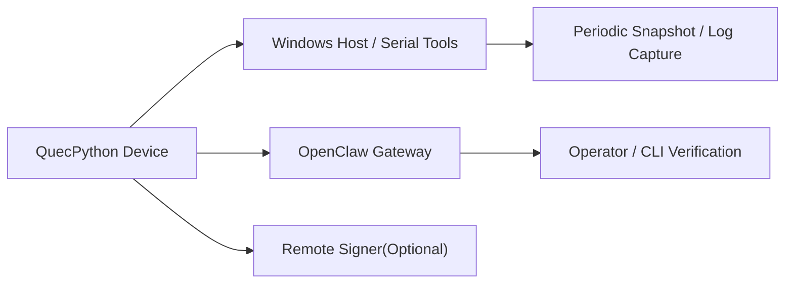

# 72h Soak 验证方案

> 适用对象：`lcc-claw-node-qpy`  
> 目标：为稳定版 `v1.0.0` 提供连续 `72` 小时稳定性门禁

## 1. 验证目标

本方案用于验证以下关键问题：

1. 设备能否持续在线 `72` 小时
2. 心跳、主动事件、命令回执是否持续稳定
3. Gateway 或网络抖动后是否能自动恢复
4. `remote_signer_http` 路径是否在长时间运行下保持稳定

## 2. 验证拓扑

## 3. 验证范围

| 类别 | 范围 |
|---|---|
| 在线稳定性 | 持续在线、heartbeat 正常、重连后自动恢复 |
| 双向命令 | `qpy.runtime.status`、`qpy.device.status`、`qpy.tools.catalog` 周期性调用 |
| 主动事件 | `heartbeat`、`telemetry`、`lifecycle`、异常 `alert` |
| 远程签名 | 如启用 signer，则验证 signer 长稳与异常恢复 |
| 安全与证据 | 全程脱敏，保留日志、截图、命令摘要 |

非目标：

1. 不在本轮验证高风险写操作工具
2. 不在本轮验证海量设备并发

## 4. 验证节奏

| 时间点 | 动作 | 预期结果 |
|---|---|---|
| `T0` | 启动设备、Gateway、signer | 设备上线成功 |
| `T0+1h` | 调用 `qpy.runtime.status` | 返回成功，在线状态正常 |
| `T0+4h` | 调用 `qpy.device.status` | 返回成功，关键字段完整 |
| `T0+12h` | 检查 telemetry / heartbeat | 持续上报，无异常堆积 |
| `T0+24h` | 人工复核一次截图与日志 | 无明显异常 |
| `T0+36h` | 人为重启 Gateway 或断网一次 | 设备能自动重连 |
| `T0+48h` | 调用 `qpy.tools.catalog` | 工具目录仍正常 |
| `T0+72h` | 汇总日志、截图、结论 | 达到发布门禁或形成问题单 |

## 5. 核心监控指标

| 指标 | 通过门槛 |
|---|---|
| 在线时长 | `>= 72h` 连续运行 |
| 关键命令成功率 | `>= 99%` |
| 断线恢复时间 | `<= 30s` |
| 重复执行错误 | `0` |
| 敏感信息泄露 | `0` |

## 6. 证据清单

| 证据 | 形式 |
|---|---|
| 设备运行时快照 | 周期性保存 `qpy.runtime.status` 结果 |
| Gateway 调用结果 | CLI/界面截图或命令摘要 |
| 设备状态结果 | `qpy.device.status` 结果摘要 |
| 工具目录结果 | `qpy.tools.catalog` 结果摘要 |
| 异常恢复证据 | Gateway 重启或网络抖动后的恢复记录 |
| 总结报告 | 成功/失败结论与问题列表 |

## 7. 失败分级

| 等级 | 定义 | 处理方式 |
|---|---|---|
| `P0` | 无法接入、频繁掉线、命令闭环失效 | 阻塞稳定版发布 |
| `P1` | 某类工具间歇失败、恢复慢 | 视情况继续 `rc` 迭代 |
| `P2` | 日志、告警、文档问题 | 可在稳定版前补齐 |

## 8. 结论门禁

只有在以下条件同时满足时，才建议将 `v1.0.0-rc1` 升格为稳定版 `v1.0.0`：

1. `72h soak` 通过
2. 关键命令成功率达标
3. Gateway 重启或网络抖动后自动恢复达标
4. 无 `P0` / 未关闭 `P1` 问题

## 9. 下一步

1. 将本方案作为独立任务执行，不与日常功能迭代混跑
2. 执行完成后产出单独验证报告
3. 通过后再进行稳定版标签发布
