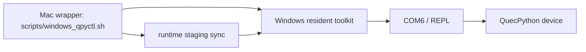
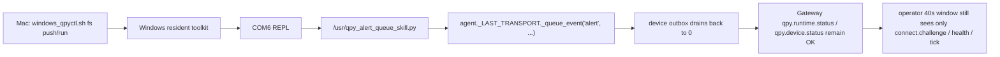

# Windows 常驻 Toolkit 验证记录

> 日期：`2026-03-14`  
> 范围：`Mac -> Windows -> QuecPython device` 常驻 toolkit 收敛验证

## 1. 验证目标

本轮只回答一个问题：

`quecpython-dev skill` 的高频 Windows 侧动作，能不能从“每轮同步零散脚本”收敛成“Windows 固定目录常驻 toolkit + 固定 SSH 入口”？

## 2. 验证拓扑

## 3. 固定目录

| 组件 | 目录 | 作用 |
|---|---|---|
| Windows toolkit | `D:/litechiptech/embedded/tools/lcc-qpy-host-tools` | 常驻 `host_tools/*.py` 与 `windows_qpyctl.ps1` |
| Windows runtime staging | `D:/litechiptech/embedded/staging/lcc-claw-node-qpy/usr_mirror` | 保存待下发到设备的运行时代码 |
| 设备运行目录 | `/usr` | 真正执行的设备侧运行时 |

## 4. 实测动作

| 动作 | 命令 | 结果 |
|---|---|---|
| 安装常驻 toolkit | `./scripts/windows_qpyctl.sh install --no-runtime` | 通过 |
| 读取运行时快照 | `./scripts/windows_qpyctl.sh snapshot --port COM6` | 通过 |
| 小文件增量部署 | `./scripts/windows_qpyctl.sh deploy --file app/tools/tool_runtime_status.py --config-mode skip --json --port COM6` | 通过 |
| 中等文件增量部署 | `./scripts/windows_qpyctl.sh deploy --file app/runtime_state.py --config-mode skip --json --port COM6` | 通过 |
| 大文件增量部署 | `./scripts/windows_qpyctl.sh deploy --file app/command_worker.py --config-mode skip --json --port COM6` | 通过 |
| 更大文件增量部署 | `./scripts/windows_qpyctl.sh deploy --file app/tools/tool_probe.py --config-mode skip --json --port COM6 --timeout 120` | 通过 |
| 多轮部署后快照 | `./scripts/windows_qpyctl.sh snapshot --port COM6` | 通过 |
| 历史 tmp 残留扫描 | `./scripts/windows_qpyctl.sh cleanup-tmp --port COM6 --json` | 通过（report-only） |
| 清洁态残留复核 | `./lcc-platform/scripts/windows-control/winctl.sh ps "<resident toolkit> cleanup-tmp --port COM6 --json"` | 通过（`delete_candidates=0`） |
| 清洁态 apply 空操作验证 | `./lcc-platform/scripts/windows-control/winctl.sh ps "<resident toolkit> cleanup-tmp --port COM6 --apply --json"` | 通过（`deleted=0`、`delete_failed=0`） |
| 清理后运行时快照复核 | `./lcc-platform/scripts/windows-control/winctl.sh ps "<resident toolkit> snapshot --port COM6"` | 通过（`online=true`、`protocol=3`） |
| 公网 Gateway operator 复核 | `python3 tools/gateway_soak_probe.py node-invoke ...` | 阻塞（`AUTH_TOKEN_MISMATCH`） |
| live 设备 token 提取与比对 | `COM6 REPL -> /usr/app/config.py` | 已完成（live token 与本地 `gateway-token.txt` 不同） |
| 公网专用 token 复核 | `python3 tools/gateway_soak_probe.py node-invoke --token-file credentials/gateway-token-public.txt ...` | 仍阻塞（`AUTH_TOKEN_MISMATCH`） |
| 公网主机 `openclaw.json` 只读核对 | `ssh -> /home/openclaw/.openclaw/openclaw.json` | 已完成（`gateway.auth.token` 存在，`gateway.remote.token` 未显式配置） |
| 主机 token 同步后 operator burn-in | `python3 tools/gateway_soak_probe.py node-invoke --token-file credentials/gateway-token-public.txt ...` | 通过（`runtime/device/catalog` 全成功） |
| 公网 Gateway 受控重启 recovery-check | `python3 tools/gateway_soak_probe.py recovery-check --command qpy.runtime.status ...` | 通过（约 `11.592s` 从 restart 请求恢复，`pidChanged=true`） |

## 5. 关键结果

| 检查项 | 结果 | 说明 |
|---|---|---|
| Windows 常驻 toolkit 可安装 | 通过 | 不再依赖 `C:/Users/kingd/qpy_*.py` 临时散文件 |
| `snapshot` 入口可用 | 通过 | 返回 `online=true`、`protocol=3` |
| 小文件 deploy 入口可用 | 通过 | `tool_runtime_status.py` 远端大小 `358 -> 358`，校验通过 |
| 中等文件 deploy 稳定性 | 通过 | `runtime_state.py` 远端大小 `6707 -> 6707` |
| 大文件 deploy 稳定性 | 通过 | `command_worker.py` 远端大小 `3886 -> 3886` |
| 更大文件 deploy 稳定性 | 通过 | `tool_probe.py` 远端大小 `12814 -> 12814`，但需要更高 timeout 预算 |
| live 文件保护 | 通过 | 新 `push` 提交流程不会在 commit 前删除 live 文件 |
| 多轮部署后在线状态 | 通过 | 多轮 deploy 结束后 `online=true`、`protocol=3` |
| 历史 `.tmp` 残留扫描 | 通过 | 新增 report-only `cleanup-tmp` 入口，可稳定给出 paired live file 清单 |
| `cleanup-tmp --apply` 路径 | 通过（清洁态 no-op） | 当前设备已无残留候选，显式执行 `--apply` 不会引入新错误 |
| 设备运行态复核 | 通过 | `logical_device_id=qpy-win-lab-01`、`protocol=3`、`last_exec_status=succeeded` |
| live 设备 token 与本地库存比对 | 已确认不一致 | 设备 live `OPENCLAW_AUTH_TOKEN` 长度 `44`，本地 `gateway-token.txt` 长度 `48` |
| 公网 Gateway operator 复核 | 阻塞 | 本地库存 token 与设备 live token 都无法通过 CLI/operator 鉴权，说明问题不只是“本地 token 过旧” |
| 公网主机 token 面核对 | 通过 | `/home/openclaw/.openclaw/openclaw.json` 中 `gateway.auth.token` 长度 `21`，`gateway.remote.token` 未显式配置 |
| 主机 token 同步后公网 operator 复核 | 通过 | `qpy.runtime.status=2ms`、`qpy.device.status=18917ms`、`qpy.tools.catalog=2ms` |
| 公网 Gateway 重启恢复门槛 | 通过 | 受控 restart 后前两次 `Connection refused`，第 3 次恢复成功；约 `11.592s` 从 restart 请求恢复，满足 `<=30s` |

## 6. 证据摘要

- 机器可读摘要：
  - [toolkit-summary.json](/Volumes/M2T/LiteChipTech/business/lcc-system/lcc-projects/opensource/lcc-claw-node-qpy/docs/validation/evidence/20260314-windows-toolkit/toolkit-summary.json)
  - [tmp-cleanup-report.json](/Volumes/M2T/LiteChipTech/business/lcc-system/lcc-projects/opensource/lcc-claw-node-qpy/docs/validation/evidence/20260314-windows-toolkit/tmp-cleanup-report.json)
  - [cleanup-pre.json](/Volumes/M2T/LiteChipTech/business/lcc-system/lcc-projects/opensource/lcc-claw-node-qpy/docs/validation/evidence/20260314-post-cleanup/cleanup-pre.json)
  - [cleanup-apply.json](/Volumes/M2T/LiteChipTech/business/lcc-system/lcc-projects/opensource/lcc-claw-node-qpy/docs/validation/evidence/20260314-post-cleanup/cleanup-apply.json)
  - [device-snapshot.json](/Volumes/M2T/LiteChipTech/business/lcc-system/lcc-projects/opensource/lcc-claw-node-qpy/docs/validation/evidence/20260314-post-cleanup/device-snapshot.json)
  - [public-gateway-recheck.json](/Volumes/M2T/LiteChipTech/business/lcc-system/lcc-projects/opensource/lcc-claw-node-qpy/docs/validation/evidence/20260314-post-cleanup/public-gateway-recheck.json)
  - [cleanup-and-gateway-summary.json](/Volumes/M2T/LiteChipTech/business/lcc-system/lcc-projects/opensource/lcc-claw-node-qpy/docs/validation/evidence/20260314-post-cleanup/cleanup-and-gateway-summary.json)
  - [public-gateway-token-plane-diagnosis.json](/Volumes/M2T/LiteChipTech/business/lcc-system/lcc-projects/opensource/lcc-claw-node-qpy/docs/validation/evidence/20260314-post-cleanup/public-gateway-token-plane-diagnosis.json)
  - [public-host-token-meta.json](/Volumes/M2T/LiteChipTech/business/lcc-system/lcc-projects/opensource/lcc-claw-node-qpy/docs/validation/evidence/20260314-public-host-inspection/public-host-token-meta.json)
  - [public-gateway-burnin-after-host-sync.json](/Volumes/M2T/LiteChipTech/business/lcc-system/lcc-projects/opensource/lcc-claw-node-qpy/docs/validation/evidence/20260314-public-host-inspection/public-gateway-burnin-after-host-sync.json)
  - [public-gateway-recovery-summary.json](/Volumes/M2T/LiteChipTech/business/lcc-system/lcc-projects/opensource/lcc-claw-node-qpy/docs/validation/evidence/20260314-public-host-inspection/public-gateway-recovery-summary.json)
  - [recovery-check.json](/Volumes/M2T/LiteChipTech/business/lcc-system/lcc-projects/opensource/lcc-claw-node-qpy/docs/validation/evidence/20260314-public-recovery-check/recovery-check.json)
  - [recovery-summary.json](/Volumes/M2T/LiteChipTech/business/lcc-system/lcc-projects/opensource/lcc-claw-node-qpy/docs/validation/evidence/20260314-public-recovery-check/recovery-summary.json)
  - [post-recovery-burnin.json](/Volumes/M2T/LiteChipTech/business/lcc-system/lcc-projects/opensource/lcc-claw-node-qpy/docs/validation/evidence/20260314-public-recovery-check/post-recovery-burnin.json)

## 6.1 tmp residue 报告摘要

| 路径 | 候选数 | 说明 |
|---|---|---|
| `/usr/app` | 3 | `command_worker.py.upload_*`、`runtime_state.py.tmp`、`transport_ws_openclaw.py.tmp` 均已找到配对 live 文件 |
| `/usr/app/tools` | 4 | `tool_probe.py.tmp` 与 3 个 `tool_probe.py.upload_*` 均已找到配对 live 文件 |

补充说明：
1. 这一轮只验证“能稳定识别 delete candidate”，没有执行真实删除。
2. 清理动作保留为显式 `--apply`，避免把“发现残留”和“删除残留”耦合到同一步。

## 6.2 2026-03-14 补充复核

| 检查项 | 结果 | 说明 |
|---|---|---|
| `cleanup-tmp --json` | 通过 | 当前 `delete_candidates=0`，设备侧已处于 clean state |
| `cleanup-tmp --apply --json` | 通过 | 在 clean state 下执行 no-op apply，`deleted=0`、`delete_failed=0` |
| `snapshot` | 通过 | `online=true`、`protocol=3`、`last_exec_status=succeeded` |
| 公网 Gateway `node-invoke` | 阻塞 | Operator 入口被 `AUTH_TOKEN_MISMATCH` 拦截，无法用本地凭证库存完成复核 |
| live 设备 token 提取 | 通过 | 已安全提取设备 live `OPENCLAW_AUTH_TOKEN` 到公网专用凭证文件 |
| 公网专用 token `node-invoke` | 仍阻塞 | 即使使用设备 live token，CLI/operator 仍返回 `AUTH_TOKEN_MISMATCH` |

补充说明：
1. 本次补充复核证明 resident toolkit 已可以从 Mac 侧通过 SSH 固定入口稳定执行 `cleanup-tmp` 与 `snapshot`，不需要回退到临时散文件同步。
2. 当前无法证明“历史残留一定由本次 `--apply` 删除”，因为进入补充复核时设备已经是 clean state；因此这里只把 `--apply` 记为“路径验证通过”，不把它记为“已完成历史残留删除归因”。
3. 设备侧恢复与 Gateway operator 侧可复核性是两个不同层面：前者已恢复，后者仍被公网 token 漂移阻塞。
4. 最新证据表明“设备 live token”与“CLI/operator token”不能直接画等号；更准确的说法是：公网 Gateway 的 operator 鉴权面尚未收口，疑似 `gateway.remote.token` 与 `gateway.auth.token` 错配，或存在未入库的独立 operator token。

## 6.3 2026-03-14 主机侧核对后补充复核

| 检查项 | 结果 | 说明 |
|---|---|---|
| 公网主机 `openclaw.json` 读取 | 通过 | 已只读核对 `/home/openclaw/.openclaw/openclaw.json` |
| `gateway.auth.token` 指纹 | 通过 | 长度 `21`，`sha256_12=705e109633bf` |
| `gateway.remote.token` 指纹 | 通过 | 当前未显式配置 |
| 公网专用 token 文件回填 | 通过 | `credentials/gateway-token-public.txt` 已同步为主机当前生效 `gateway.auth.token` |
| operator burn-in | 通过 | `qpy.runtime.status=2ms`、`qpy.device.status=18917ms`、`qpy.tools.catalog=2ms` |

补充说明：
1. 这次主机侧核对证明：**公网 operator 正确使用的不是设备 live `OPENCLAW_AUTH_TOKEN`，而是公网主机当前的 `gateway.auth.token`。**
2. `gateway.remote.token` 当前并未显式配置，因此这次阻塞的直接原因不是“远端 token 单独错配”，而是我们本地公网专用 operator token 文件长期未与主机当前 `gateway.auth.token` 对齐。
3. 回填 `gateway-token-public.txt` 后，公网 operator 入口立即恢复，说明此前的 `AUTH_TOKEN_MISMATCH` 已得到闭环解释。

## 6.4 2026-03-14 公网 Gateway 受控重启 recovery-check

| 检查项 | 结果 | 说明 |
|---|---|---|
| `openclaw-gateway.service` 重启请求 | 通过 | 以 `openclaw` 用户 `systemd --user` 服务方式执行 `restart --no-block` |
| Gateway 进程 PID 切换 | 通过 | `86354 -> 114535` |
| `qpy.runtime.status` 恢复 | 通过 | `recovery-check` 第 3 次成功 |
| `<=30s` 门槛 | 通过 | 脚本内测 `10.338s`，按 restart 请求近似计 `11.592s` |
| 重启后 burn-in | 通过 | `qpy.runtime.status=2ms`、`qpy.device.status=17098ms`、`qpy.tools.catalog=1ms` |

补充说明：
1. 这次 `recovery-check` 的前两次尝试都是 `Connection refused`，说明我们确实覆盖到了 Gateway 重启窗口，而不是只是在服务未重启时误判成功。
2. 设备侧运行时在恢复后表现为：`connect_attempts=3`、`connect_successes=2`、`reconnect_count=1`，与“经历过一次真实 Gateway 重启”相吻合。
3. 这意味着“公网 Gateway 重启后 `<=30s` 内恢复可调用”这一门槛，在修正 token 面之后已经通过。

## 6.5 2026-03-14 corrected token plane 下的 short-soak 回归

新增证据：

- [soak_summary.json](/Volumes/M2T/LiteChipTech/business/lcc-system/lcc-projects/opensource/lcc-claw-node-qpy/docs/validation/evidence/20260314-phase4-short-soak/soak_summary.json)
- [phase4-short-summary.json](/Volumes/M2T/LiteChipTech/business/lcc-system/lcc-projects/opensource/lcc-claw-node-qpy/docs/validation/evidence/20260314-phase4-short-soak/phase4-short-summary.json)
- [failed-sample-0002](/Volumes/M2T/LiteChipTech/business/lcc-system/lcc-projects/opensource/lcc-claw-node-qpy/docs/validation/evidence/20260314-phase4-short-soak/samples/0002-qpy_runtime_status.json)

| 检查项 | 结果 | 说明 |
|---|---|---|
| short-soak 完整窗口 | 通过 | `900s` 跑满，`26` 个样本 |
| `qpy.runtime.status` | 通过 | `13/13` 成功，`p95=504ms` |
| `qpy.device.status` | 通过 | `9/9` 成功，`p95=19.245s` |
| `qpy.tools.catalog` | 通过 | `5/5` 成功，`p95=496ms` |
| 孤立 operator 异常 | 已识别 | 仅 `1` 次 `WsError: websocket closed: 1000:`，未扩散成 `connected=false` |
| `connected=false` 回退 | 未复现 | 整个 short-soak 窗口内未出现 Phase 2 同类退化 |
| `node.event` 可见性 | 未通过 | operator 仍只观察到 `connect.challenge / health / tick` |

补充说明：
1. 这一轮 short-soak 证明：在 corrected token plane 下，Mac 控制面可以稳定驱动公网 operator 采样，而 Windows resident toolkit 暂时不需要介入即可完成基础长稳验证。
2. Windows resident toolkit 仍然是下一步 `alert` 注入实验的必要执行面，因为只有它能稳定落到 `COM6 REPL` 对设备侧运行时做定向动作。
3. 当前剩余问题已经从“Windows 能不能稳定控制设备”收敛成“如何补齐事件链证据”和“如何进一步 harden 部署路径”。

## 6.6 2026-03-14 受控 alert 注入验证

新增证据：

- [alert-visibility-summary.json](/Volumes/M2T/LiteChipTech/business/lcc-system/lcc-projects/opensource/lcc-claw-node-qpy/docs/validation/evidence/20260314-alert-injection/alert-visibility-summary.json)
- [windows-alert-inject.txt](/Volumes/M2T/LiteChipTech/business/lcc-system/lcc-projects/opensource/lcc-claw-node-qpy/docs/validation/evidence/20260314-alert-injection/windows-alert-inject.txt)
- [windows-alert-inject-retry.txt](/Volumes/M2T/LiteChipTech/business/lcc-system/lcc-projects/opensource/lcc-claw-node-qpy/docs/validation/evidence/20260314-alert-injection/windows-alert-inject-retry.txt)
- [operator-event-window-retry.json](/Volumes/M2T/LiteChipTech/business/lcc-system/lcc-projects/opensource/lcc-claw-node-qpy/docs/validation/evidence/20260314-alert-injection/operator-event-window-retry.json)

| 检查项 | 结果 | 说明 |
|---|---|---|
| 第一次注入 | 未完全成功 | REPL 进入续行提示 `...`，说明首版 payload 组织方式不稳 |
| 第二次注入 | 通过 | REPL 明确输出 `queue_called`、`flush_called`、`alert_injected_retry` |
| 注入前在线状态 | 通过 | `before_online=True`、`transport=ok` |
| 注入后在线状态 | 通过 | 后续 snapshot 仍为 `online=true`、`outbox_depth=0` |
| operator 对测试 alert 的观察 | 未通过 | retry 窗口仍只见 `connect.challenge / health / tick / health` |
| 设备 transport 错误线索 | 未通过 | 注入后 snapshot 记录 `OUTBOX_SEND_FAILED / pop from empty list` |

补充说明：
1. Windows resident toolkit 已证明可以稳定完成“打开 REPL -> 定向执行运行时代码 -> 回收文本证据”的闭环，这一点已经成立。
2. 本轮失败点不在 Windows SSH 或 COM6 控制面，而在更靠里的两层：`Gateway operator 不可见 node.event` 与 `QuecPython transport 的 node.event 发送错误路径`。
3. 因此，Windows 执行面现在已经从 blocker 变成了稳定的实验执行器，后续可以继续承担 `alert`、`lifecycle`、`telemetry` 等定向验证动作。

## 6.7 2026-03-14 transport outbox 修复后的再验证

新增证据：

- [after-fix-transport-summary.json](/Volumes/M2T/LiteChipTech/business/lcc-system/lcc-projects/opensource/lcc-claw-node-qpy/docs/validation/evidence/20260314-alert-injection-after-fix/after-fix-transport-summary.json)
- [device-status-after-fix.json](/Volumes/M2T/LiteChipTech/business/lcc-system/lcc-projects/opensource/lcc-claw-node-qpy/docs/validation/evidence/20260314-alert-injection-after-fix/device-status-after-fix.json)
- [device-status-after-fix-2.json](/Volumes/M2T/LiteChipTech/business/lcc-system/lcc-projects/opensource/lcc-claw-node-qpy/docs/validation/evidence/20260314-alert-injection-after-fix/device-status-after-fix-2.json)
- [operator-event-window-after-fix.json](/Volumes/M2T/LiteChipTech/business/lcc-system/lcc-projects/opensource/lcc-claw-node-qpy/docs/validation/evidence/20260314-alert-injection-after-fix/operator-event-window-after-fix.json)
- [windows-com6-open-no-dtr.txt](/Volumes/M2T/LiteChipTech/business/lcc-system/lcc-projects/opensource/lcc-claw-node-qpy/docs/validation/evidence/20260314-alert-injection-after-fix/windows-com6-open-no-dtr.txt)
- [windows-com6-open-with-dtr.txt](/Volumes/M2T/LiteChipTech/business/lcc-system/lcc-projects/opensource/lcc-claw-node-qpy/docs/validation/evidence/20260314-alert-injection-after-fix/windows-com6-open-with-dtr.txt)
- [windows-repl-echo-probe.txt](/Volumes/M2T/LiteChipTech/business/lcc-system/lcc-projects/opensource/lcc-claw-node-qpy/docs/validation/evidence/20260314-alert-injection-after-fix/windows-repl-echo-probe.txt)
- [pre-alert-snapshot.txt](/Volumes/M2T/LiteChipTech/business/lcc-system/lcc-projects/opensource/lcc-claw-node-qpy/docs/validation/evidence/20260314-alert-injection-after-fix/pre-alert-snapshot.txt)

| 检查项 | 结果 | 说明 |
|---|---|---|
| Windows host tool 串口打开顺序修复 | 通过 | `host_tools/qpy_device_fs_cli.py` 已去掉 `repl_send_lines()` 中的强制 `DTR/RTS` |
| `COM6` 无 `DTR/RTS` 打开 | 通过 | `windows-com6-open-no-dtr.txt` 返回 `OPEN_OK` |
| `COM6` 强制 `DTR/RTS` 打开 | 未通过 | `windows-com6-open-with-dtr.txt` 返回 “device not functioning” |
| REPL 回显探针 | 未通过 | `windows-repl-echo-probe.txt` 与 `pre-alert-snapshot.txt` 均为 `<empty>` |
| 修复后 runtime 第一次全量状态 | 通过 | `last_outbox_error=''`、`last_error_code=''`、`sent_frames=106`、`last_ack_ms=1909160` |
| 修复后 runtime 第二次全量状态 | 通过 | `last_outbox_error=''`、`last_error_code=''`、`sent_frames=114`、`last_ack_ms=1999750` |
| runtime 计数器前进 | 通过 | `sent_frames +8`、`received_frames +14`、`last_ack_ms` 明确前进 |
| operator 观察窗 | 未通过 | 修复后窗口仍只见 `connect.challenge / health / tick`，无 `node.event` / `alert` |

补充说明：
1. 这一轮没有再复现旧的 `OUTBOX_SEND_FAILED / pop from empty list`；相反，Gateway 侧两次 `qpy.device.status.runtime` 都显示 `last_outbox_error=''`、`last_error_code=''`，且 `sent_frames` 与 `last_ack_ms` 持续前进。
2. 这说明 `transport outbox` 的核心修复已经生效，设备侧仍在稳定发送并收到 ack；当前“operator 看不到 `node.event`”不能再简单归因为旧的 outbox 并发错误。
3. 但设备重新上下电后，Windows SSH 场景下出现了新的 `REPL-silent` 现象：`COM6` 可以打开，但 `snapshot` 和手工 `print()` 探针都只返回 `<empty>`。
4. 因此，本轮 live `alert` 再注入没有继续强推，避免把“Windows REPL 静默”与“设备 transport 回归”混在一起误判。
5. 当前 Windows resident toolkit 的结论应更新为：固定 SSH 控制链依然成立，且新的 `DTR/RTS` 驱动兼容问题已被识别并修补；但要恢复设备侧定向注入，还需要先把 `REPL-silent` 状态重新拉回到“可回显”。

## 6.8 2026-03-14 使用 `quecpython-dev` skill 标准工具复核

新增证据：

- [device-smoke-skill.json](/Volumes/M2T/LiteChipTech/business/lcc-system/lcc-projects/opensource/lcc-claw-node-qpy/docs/validation/evidence/20260314-alert-injection-after-fix/device-smoke-skill.json)
- [device-smoke-skill.log](/Volumes/M2T/LiteChipTech/business/lcc-system/lcc-projects/opensource/lcc-claw-node-qpy/docs/validation/evidence/20260314-alert-injection-after-fix/device-smoke-skill.log)
- [device-info-probe-skill.json](/Volumes/M2T/LiteChipTech/business/lcc-system/lcc-projects/opensource/lcc-claw-node-qpy/docs/validation/evidence/20260314-alert-injection-after-fix/device-info-probe-skill.json)
- [device-fs-skill-ls.json](/Volumes/M2T/LiteChipTech/business/lcc-system/lcc-projects/opensource/lcc-claw-node-qpy/docs/validation/evidence/20260314-alert-injection-after-fix/device-fs-skill-ls.json)

| skill 工具 | 结果 | 说明 |
|---|---|---|
| `device_smoke_test.py --risk-mode safe --auto-ports` | 未通过 | `AT probe`、`REPL probe`、`REPL env snapshot`、`REPL ls /usr` 全部在 `Open()` 时报相同驱动错误 |
| `qpy_device_info_probe.py --at-port COM7 --repl-port COM6 --json` | 未通过 | 标准 AT batch 也在 `Open()` 即失败，未进入设备信息采集阶段 |
| `qpy_device_fs_cli.py --json --port COM6 --ls-via repl ls --path /usr` | 未通过 | skill 标准 `/usr` REPL 列目录入口直接返回同一 `Open()` 错误 |

补充说明：
1. 这一轮明确使用了 `quecpython-dev` skill 自带的标准脚本，而不是手写串口探针。
2. 结论很关键：**官方 skill 工具链也复现了同一个 Windows 驱动级 `Open()` 失败**，因此当前问题不能再归因于“自定义 PowerShell 探针写法偏差”。
3. 同时 `device_smoke_test.py` 的自动探测只拿到了 `COM4/COM5/COM6/COM7`，没有拿到 Quectel 友好名，这也说明当前 Windows 端的串口描述层并不稳定。
4. 所以当前正确的判断是：
   - transport 主链路回归已经收口；
   - `REPL-silent / Open()` 异常是独立的 Windows 现场问题；
   - 后续恢复设备侧定向注入，必须继续以 skill 工具链为主，而不是回到 ad hoc 串口脚本。

## 6.9 2026-03-14 使用正式 `windows_qpyctl.sh fs` 路径复做 alert queue 注入

新增证据：

- [skill-alert-queue-summary.json](/Volumes/M2T/LiteChipTech/business/lcc-system/lcc-projects/opensource/lcc-claw-node-qpy/docs/validation/evidence/20260314-alert-injection-after-fix/skill-alert-queue-summary.json)
- [alert-queue-skill-push.json](/Volumes/M2T/LiteChipTech/business/lcc-system/lcc-projects/opensource/lcc-claw-node-qpy/docs/validation/evidence/20260314-alert-injection-after-fix/alert-queue-skill-push.json)
- [alert-queue-skill-run.json](/Volumes/M2T/LiteChipTech/business/lcc-system/lcc-projects/opensource/lcc-claw-node-qpy/docs/validation/evidence/20260314-alert-injection-after-fix/alert-queue-skill-run.json)
- [runtime-status-pre-inject-2.json](/Volumes/M2T/LiteChipTech/business/lcc-system/lcc-projects/opensource/lcc-claw-node-qpy/docs/validation/evidence/20260314-alert-injection-after-fix/runtime-status-pre-inject-2.json)
- [runtime-status-after-skill-queue-2.json](/Volumes/M2T/LiteChipTech/business/lcc-system/lcc-projects/opensource/lcc-claw-node-qpy/docs/validation/evidence/20260314-alert-injection-after-fix/runtime-status-after-skill-queue-2.json)
- [device-status-after-skill-queue-2.json](/Volumes/M2T/LiteChipTech/business/lcc-system/lcc-projects/opensource/lcc-claw-node-qpy/docs/validation/evidence/20260314-alert-injection-after-fix/device-status-after-skill-queue-2.json)
- [operator-event-window-after-skill-queue-2.json](/Volumes/M2T/LiteChipTech/business/lcc-system/lcc-projects/opensource/lcc-claw-node-qpy/docs/validation/evidence/20260314-alert-injection-after-fix/operator-event-window-after-skill-queue-2.json)

| 检查项 | 结果 | 说明 |
|---|---|---|
| 正式 toolkit 推送脚本 | 通过 | `alert-queue-skill-push.json` 显示 `/usr/qpy_alert_queue_skill.py` 成功落盘，`1373B` 与本地一致 |
| 设备侧 queue 脚本执行 | 通过 | `before_online=True`、`transport=ok`、`queue_called`、`after_outbox=1` |
| 注入后 runtime 状态 | 通过 | `online=true`、`outbox_depth=0`、`last_outbox_error=''`、`last_error_code=''` |
| 注入后 device 状态 | 通过 | `sent_frames=237`、`last_ack_ms=3807949`、`outbox_depth=0` |
| operator 40s 观察窗 | 未通过 | 仍只看到 `connect.challenge / health / tick`，没有 `node.event` / `alert` |

补充说明：
1. 这一轮使用的是仓库正式入口 `windows_qpyctl.sh fs`，不是临时 PowerShell 探针，也不是散落在 Windows 临时目录里的 ad hoc 脚本。
2. 设备侧证据已经足够说明 `alert` 的 queue 路径是健康的：脚本执行时 `transport=ok`，随后 Gateway 侧 `runtime/device status` 仍然稳定，且 `outbox_depth` 已回落到 `0`。
3. 与旧证据不同，这一轮**没有再复现** `OUTBOX_SEND_FAILED / pop from empty list`；当前 blocker 进一步收敛为 `node.event` 在 operator 侧的观测面缺失。
4. 因此，Windows resident toolkit 现阶段已经从“需要先证明能不能控制设备”完全转成“稳定实验执行器”，可以继续承担 `alert / telemetry / lifecycle` 这类定向验证任务。

## 6.10 2026-03-14 官方 Gateway 源码对齐结论

新增证据：

- [gateway-source-alignment.json](/Volumes/M2T/LiteChipTech/business/lcc-system/lcc-projects/opensource/lcc-claw-node-qpy/docs/validation/evidence/20260314-alert-injection-after-fix/gateway-source-alignment.json)

| 检查项 | 结果 | 说明 |
|---|---|---|
| operator 是否可直接调用 `node.event` | 否 | `openclaw/src/gateway/role-policy.test.ts` 明确断言 `operator` 对 `node.event` 未授权 |
| `node.event` 是否只是节点到 Gateway 的入口方法 | 是 | `openclaw/src/gateway/server-methods/nodes.ts` 只把请求转给 `handleNodeEvent()` |
| 官方 Gateway 是否有 `alert` 消费器 | 否 | `openclaw/src/gateway/server-node-events.ts` 没有 `alert / heartbeat / telemetry / lifecycle` case |
| 官方 Gateway 当前明确支持的 `node.event` 类型 | 已确认 | `agent.request / voice.transcript / notifications.changed / chat.subscribe / chat.unsubscribe / exec.* / push.apns.register` |

补充说明：
1. 这次源码对齐把“operator 为什么看不到 `alert`”从经验判断变成了源码级结论：**不是 operator 漏看，而是官方 Gateway 本来就不消费 raw `alert`。**
2. 这也解释了为什么设备侧 `queue_called`、`outbox_depth` 回落、`runtime/device status` 持续健康，但 operator 观察窗仍然没有 `node.event`。
3. 因此，开源版的 stock Gateway 兼容策略应调整为：业务主动上报默认走 `agent.request`；原始 `heartbeat / telemetry / lifecycle / alert` 只保留为可选扩展路径。

## 6.11 2026-03-14 `agent.request` stock Gateway 兼容闭环验证

新增证据：

- [agent-request-validation-summary.json](/Volumes/M2T/LiteChipTech/business/lcc-system/lcc-projects/opensource/lcc-claw-node-qpy/docs/validation/evidence/20260314-agent-request-validation/agent-request-validation-summary.json)
- [host-precheck-lowlevel.json](/Volumes/M2T/LiteChipTech/business/lcc-system/lcc-projects/opensource/lcc-claw-node-qpy/docs/validation/evidence/20260314-agent-request-validation/host-precheck-lowlevel.json)
- [host-postcheck-lowlevel.json](/Volumes/M2T/LiteChipTech/business/lcc-system/lcc-projects/opensource/lcc-claw-node-qpy/docs/validation/evidence/20260314-agent-request-validation/host-postcheck-lowlevel.json)
- [public-runtime-before.json](/Volumes/M2T/LiteChipTech/business/lcc-system/lcc-projects/opensource/lcc-claw-node-qpy/docs/validation/evidence/20260314-agent-request-validation/public-runtime-before.json)
- [public-runtime-after.json](/Volumes/M2T/LiteChipTech/business/lcc-system/lcc-projects/opensource/lcc-claw-node-qpy/docs/validation/evidence/20260314-agent-request-validation/public-runtime-after.json)

| 检查项 | 结果 | 说明 |
|---|---|---|
| Windows 正式 `fs push/run` 执行 low-level probe | 通过 | 使用 `windows_qpyctl.sh fs` 将 `/usr/qpy_agent_request_lowlevel_probe.py` 下发并执行 |
| 设备侧 `agent.request` 入队能力 | 通过 | `transport=ok`、`has_enqueue=True`，说明当前 live transport 具备底层 `node.event` 入队能力 |
| 设备侧即时 `flush_outbox(1)` 返回 | 未通过 | probe 当场返回 `flush_called=False`，`after_last_outbox_error=socket timeout` |
| Gateway session store 观测 | 通过 | 主机侧已出现新 session，匹配键为 `agent:main:qpy-stock-proof-20260314t165136` |
| Gateway transcript marker 命中 | 通过 | marker `TEST_AGENT_REQUEST_LOWLEVEL_20260314T165136` 命中 `5f9abe63-1a9a-4ab6-8bb3-2f2e8c0db9db.jsonl` |
| 注入后设备运行态 | 通过但有告警 | `qpy.runtime.status` 仍为 `online=true`，但 `last_error_code=OUTBOX_SEND_FAILED` |

补充说明：
1. 这次验证已经把“官方 Gateway 是否真的能消费设备侧 `agent.request`”从设计推断推进到实机证据：**答案是能。**
2. Gateway 落库时把 session key 规范化成了小写形式，因此主机侧取证必须按 `case-insensitive` 方式匹配，而不能只按原始大小写字符串做精确比较。
3. 当前 live 设备仍存在一个尚未收口的实现问题：即使 Gateway 已经成功写入 transcript，设备侧这次即时 `flush` 仍返回 `socket timeout` 并把 `last_error_code` 记成 `OUTBOX_SEND_FAILED`。这说明 stock 路径已经被证明可达，但设备侧 helper/flush 行为还需要继续 harden。

## 6.12 2026-03-14 live transport 对齐后的 helper 路径验证

新增证据：

- [runtime-capability-after-align.json](/Volumes/M2T/LiteChipTech/business/lcc-system/lcc-projects/opensource/lcc-claw-node-qpy/docs/validation/evidence/20260314-agent-request-validation/runtime-capability-after-align.json)
- [helper-precheck.json](/Volumes/M2T/LiteChipTech/business/lcc-system/lcc-projects/opensource/lcc-claw-node-qpy/docs/validation/evidence/20260314-agent-request-validation/helper-precheck.json)
- [helper-probe-summary.json](/Volumes/M2T/LiteChipTech/business/lcc-system/lcc-projects/opensource/lcc-claw-node-qpy/docs/validation/evidence/20260314-agent-request-validation/helper-probe-summary.json)
- [public-runtime-after-helper.json](/Volumes/M2T/LiteChipTech/business/lcc-system/lcc-projects/opensource/lcc-claw-node-qpy/docs/validation/evidence/20260314-agent-request-validation/public-runtime-after-helper.json)

| 检查项 | 结果 | 说明 |
|---|---|---|
| live runtime helper 能力 | 通过 | `agent_has_emit_business_alert=true`、`transport_has_queue_business_alert=true`、`transport_has_queue_agent_request=true` |
| helper 预检 | 通过 | 执行前未命中同名 session，排除了旧 transcript 干扰 |
| 高层 helper 调用 | 通过 | `emit_business_alert(...)` 返回 `emit_ok=true`，调用后 `after_outbox=1` |
| Gateway transcript 命中 | 通过 | 新增 session `agent:main:qpy-helper-proof-20260314t171959`，命中 `cf1f6671-90c9-4c2d-a689-bd03f37a8b90.jsonl` |
| helper 后 runtime 健康度 | 通过 | `online=true`、`last_error_code=''`、`last_outbox_error=''`、`outbox_depth=0` |

补充说明：
1. 补充排查确认，之前 low-level probe 遗留的 `OUTBOX_SEND_FAILED` 与 live 设备上的旧版 `transport_ws_openclaw.py` 有直接关系；把当前仓库版本重新下发后，helper 相关能力已经在 live runtime 中对齐。
2. 这一轮验证把 Windows resident toolkit 的价值进一步坐实了：它不只是“能推文件、能跑 REPL”，而是已经能稳定承担 `live runtime 对齐 -> helper 调用 -> Gateway 取证 -> runtime 回读` 这条闭环。
3. 到这个阶段，Windows 执行面的重点不再是“证明能不能控制设备”，而是“把 current repo runtime 稳定投产到 live device，并为更长的 soak 窗口提供固定执行面”。

## 6.13 2026-03-14 QPYcom 快速重部署与公网复核

新增证据：

- [qpycom-redeploy-summary.json](/Volumes/M2T/LiteChipTech/business/lcc-system/lcc-projects/opensource/lcc-claw-node-qpy/docs/validation/evidence/20260314-qpycom-redeploy-recovery/qpycom-redeploy-summary.json)
- [public-gateway-recheck-after-foreground-run.json](/Volumes/M2T/LiteChipTech/business/lcc-system/lcc-projects/opensource/lcc-claw-node-qpy/docs/validation/evidence/20260314-qpycom-redeploy-recovery/public-gateway-recheck-after-foreground-run.json)

| 检查项 | 结果 | 说明 |
|---|---|---|
| `QPYcom.exe` 自动发现 | 通过 | `host_tools/qpy_tool_paths.py` 已补充 VSCode 扩展与 Codex skill 工具目录搜索 |
| QPYcom `/usr` 枚举 | 通过 | 显式使用 `C:/Users/kingd/.vscode/extensions/quectel.qpy-ide-1.1.15/scripts/QPYcom.exe` 可稳定列目录 |
| stopped-state `runtime_state.py` 重部署 | 通过 | `/usr/app/runtime_state.py` 已对齐到 `7439` |
| stopped-state `tool_runner.py` 重部署 | 通过 | `/usr/app/tool_runner.py` 已对齐到 `4853` |
| Windows staging 漂移纠偏 | 通过 | 发现 `D:/.../tool_probe.py` 仍为 `12814`，重新 `sync-runtime` 后更新到 `13633` |
| stopped-state `tool_probe.py` 重部署 | 通过 | `/usr/app/tools/tool_probe.py` 已对齐到 `13633` |
| 前台执行 `/usr/_main.py` 后公网 operator 复核 | 通过 | `qpy.runtime.status=2ms`、`qpy.device.status=21739ms`、`qpy.tools.catalog=1ms` |
| 新诊断字段对外可见 | 通过 | `qpy.device.status.runtime` 已出现 `last_probe_tool / last_probe_duration_ms / last_probe_timings` |

补充说明：
1. stopped-state 下的 REPL `push` 超时，根因已经明确为“总体超时预算低于当前保守分片策略所需时长”，不是 fresh OOM；`runtime_state.py` 的 `150s` 超时只是先暴露了这个预算缺口。
2. 因为 Windows 侧已安装标准 `QPYcom.exe`，所以这次恢复不必再继续依赖慢速 REPL 大文件推送；对 `tool_probe.py` 这类更大文件，`QPYcom` 已经成为更优的常驻 toolkit 快速路径。
3. 这一步把“Windows 执行面失控”重新收口成“Windows 执行面可控、runtime 已重新对齐、Gateway 外部可复核”，后续 blocker 不再是设备控制，而是重新打开针对 `qpy.device.status` 的长窗定位。

## 7. 结论

1. `Windows resident toolkit` 这条路已经成立，后续 `snapshot/start/fs` 不需要再重复同步 host tools。
2. `deploy` 入口已经完成三档样本验证：`358`、`3886`、`6707`、`12814` 均已实机通过。
3. 当前 hardening 的关键点是：自适应分批、远端尺寸校验、live 文件保护、以及更高的 timeout 预算。
4. `tool_probe.py` 说明“更大文件仍可通过”，但默认部署时长预算需要更宽松。
5. 旧失败批次遗留的 `.tmp` 已可稳定识别，这已经从“传输正确性”问题转变为“恢复卫生”问题。
6. 当前补充复核已证明设备处于 clean state，且 `cleanup-tmp --apply` 在 clean state 下是安全的 no-op。
7. 公网 Gateway operator 复核已经恢复；当前正确的公网 operator token 来源是公网主机 `gateway.auth.token`，而不是设备侧 live `OPENCLAW_AUTH_TOKEN`。
8. 这次问题的根因不是设备离线，也不是 `gateway.remote.token` 显式错配，而是**本地公网专用 operator token 文件漂移**。
9. 公网 Gateway 重启后的恢复门槛也已在修正 token 面后通过，约 `11.592s` 从 restart 请求恢复。
10. corrected token plane 下的 `15min short-soak` 已通过，说明“operator 可复核”不再只是一组单点 burn-in 结果，而是已经具备短窗连续性。
11. 当前“设备可运行”“operator 可复核”“Gateway 重启恢复”“short-soak 连续性”四个层面都已恢复；后续剩余工作重新回到事件链验证和部署 hardening。
12. `alert` 受控注入已经证明 Windows resident toolkit 可以稳定执行设备侧定向动作；通过正式 `windows_qpyctl.sh fs` 路径，`alert` 已成功入队并被 transport 清空队列。
13. 当前真实 blocker 已进一步收敛为 `stock Gateway` 对 raw `node.event(alert/heartbeat/telemetry/lifecycle)` 的消费缺口；这不是 operator 漏看，而是官方 Gateway 的既有设计边界。
14. `quecpython-dev` skill 的标准工具链曾经复现过驱动级 `Open()` 问题，但当前分支携带的正式 `qpy_device_fs_cli.py` 修复已经恢复 `fs push/run` 能力，后续诊断可以直接围绕这条正式工具链推进。
15. 开源版后续应默认提供 `agent.request` 主动上行 helper，而不是继续把 raw `alert` 当成 stock Gateway 的默认能力。
16. `2026-03-14` 的实机验证已经证明 stock Gateway 会真实消费设备侧 `agent.request`，并把 marker 落到 Gateway session transcript；因此“官方 Gateway 兼容的主动业务上行”这一目标已经被证实可行。
17. 在把 live `transport_ws_openclaw.py` 对齐到当前仓库版本后，高层 helper 路径也已经完成实机闭环：`emit_business_alert(...)` 可触发 Gateway transcript，且 helper 后 `runtime` 保持 clean。
18. 当前剩余未收口项已经从“helper/flush 是否可用”切换成“长时间连续窗口里能否持续保持 clean runtime 与稳定调用”。
19. `QPYcom` 自动发现与快速重部署路径已经完成实机闭环，Windows 侧大文件更新不应再默认走慢速 REPL `push`。
20. 这一轮恢复已经把 `qpy.runtime.status / qpy.device.status / qpy.tools.catalog` 从公网 operator 侧重新打通，并把新的 `last_probe_*` 诊断字段带到了对外结果里；当前最强结论是“设备控制已恢复，下一步应回到长窗回归定位”。

## 8. 下一步

| 步骤 | 动作 | 预期 |
|---|---|---|
| 1 | 把 Windows toolkit 的大文件部署默认切到 `QPYcom`，REPL `push` 仅保留给小文件与应急修复 | 缩短恢复时间并减少 timeout 误判 |
| 2 | 把当前 live runtime 版本冻结为本仓库已验证版本，并把 capability probe 纳入后续 preflight | 避免再次出现 helper 与 live transport 版本错配 |
| 3 | 把 `cleanup-tmp` 与 `snapshot` 固化进后续 soak / recovery 流程 | 避免未来再走临时脚本同步 |
| 4 | 把这次 `agent.request` low-level + helper probe 一起固化成回归用例 | 后续第三方 Gateway / 新设备可直接复跑 stock 兼容路径 |
| 5 | 保留 raw `heartbeat / telemetry / lifecycle` 为扩展路径，并在文档里明确默认关闭 | 避免社区用户误判官方 Gateway 能力 |
| 6 | 以当前 clean helper 路径为基线，重开更长的 soak 窗口 | 为正式 `72h soak` 重开做准备 |
| 7 | 在开源说明中明确“大文件优先 QPYcom、REPL `push` 需要更高 `--timeout`” | 降低用户首次部署成本 |
