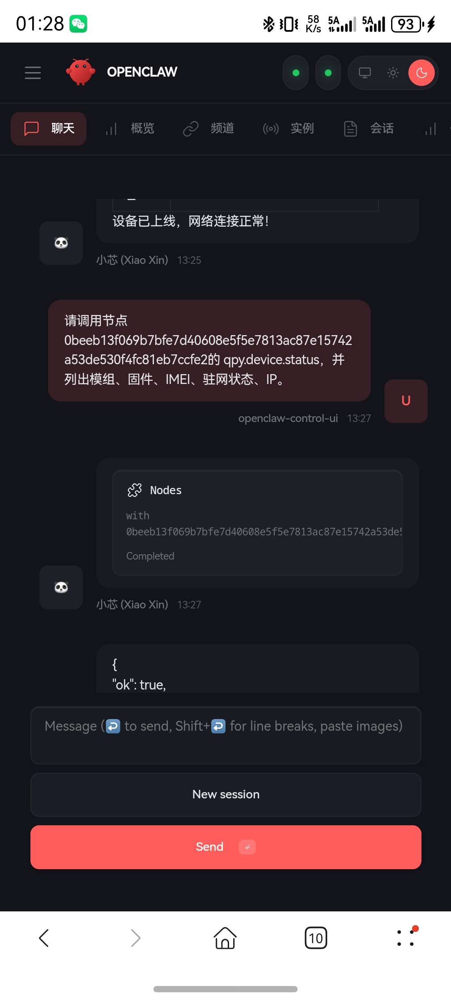
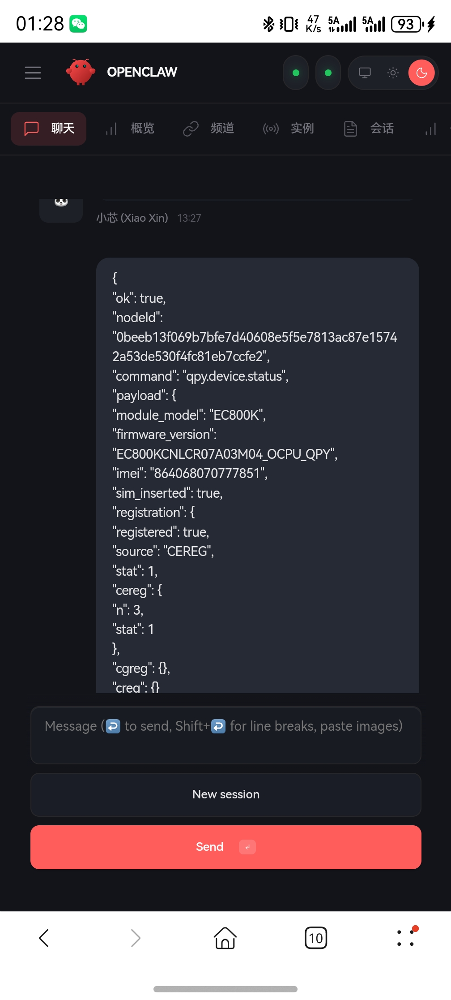
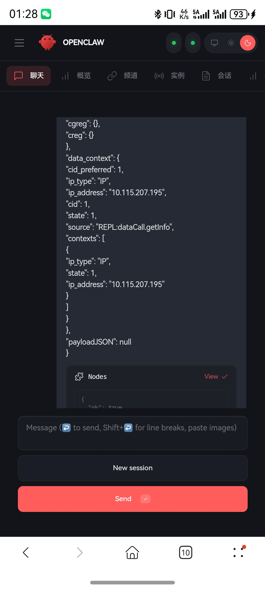
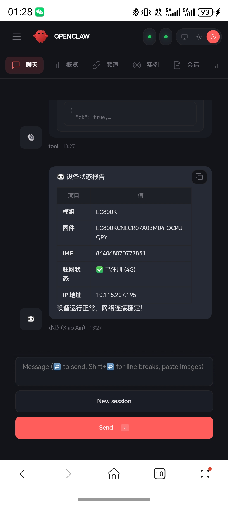

# 2026-03-21 OpenClaw Device Status Mobile Evidence

## 1. Purpose

This note archives the mobile-side OpenClaw screenshots captured on `2026-03-21`.

The goal is to preserve a directly reviewable proof that:

- `@pydevice.status` can be invoked from the OpenClaw session
- the device returns structured status data
- the result can also be rendered as a card on the client side

## 2. Evidence Flow

## 3. Evidence Files

| File | What it shows | Key observation |
|---|---|---|
| `openclaw-device-status-mobile-01-request.jpg` | request + invoke path | mobile session triggers `@pydevice.status` for the live node |
| `openclaw-device-status-mobile-02-json-top.jpg` | top half of JSON result | module, firmware, IMEI, SIM inserted, registration fields are present |
| `openclaw-device-status-mobile-03-json-bottom.jpg` | bottom half of JSON result | `data_context` includes IP details |
| `openclaw-device-status-mobile-04-card.jpg` | rendered status card | OpenClaw displays a summarized device-status report |

## 4. Observed Result

| Check item | Result | Notes |
|---|---|---|
| OpenClaw session can trigger device-status tool | Pass | the request is visible in the client session |
| Device-status JSON returns successfully | Pass | screenshot shows `ok: true` |
| Module identity is visible | Pass | image shows `EC800K` |
| Firmware identity is visible | Pass | image shows `EC800KCNLC...QPY` firmware string |
| Registration state is visible | Pass | screenshots show registered state |
| IP address is visible | Pass | screenshots show `10.115.207.195` |
| Card-style summary is visible | Pass | final screenshot shows a formatted status card |

Masked summary for quick review:

- node id: `0beeb13f...e2`
- module: `EC800K`
- firmware: `EC800KCNLC...QPY`
- IMEI: `8640680***7851`
- registration: `registered (4G)`
- IP: `10.115.207.195`

## 5. Boundary

This evidence is useful, but it is not the whole story.

What it proves:

- the OpenClaw-facing `qpy.device.status` path was reachable at capture time
- the live node returned structured device metadata
- the mobile UI could render both raw JSON and a card summary

What it does not prove:

- physical hardware custody or storage location
- local USB/serial debug reachability
- long-duration runtime stability
- full DTU bring-up completeness

## 6. Images

### 6.1 Request

### 6.2 JSON Top

### 6.3 JSON Bottom

### 6.4 Card View

## 7. Note

These screenshots contain raw device identifiers and should be treated as internal validation evidence.
